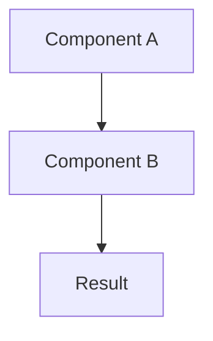

# Pattern Schema

This document defines the schema for pattern files in this repository. All patterns MUST follow this schema to ensure consistent validation, parsing, and rendering.

---

## File Location

Patterns are stored as Markdown files in the `patterns/` directory at the repository root:

```
patterns/
  pattern-slug.md
  another-pattern.md
  TEMPLATE.md
```

---

## File Structure

Each pattern file consists of:

1. **YAML front matter** (metadata)
2. **Markdown body** (content sections)

---

## Front Matter Schema

### Required Fields

Every pattern MUST include these fields:

| Field | Type | Description | Example |
|-------|------|-------------|---------|
| `title` | string | Human-readable pattern name | `Reflection Loop` |
| `status` | enum | Maturity status (see values below) | `established` |
| `authors` | array of strings | Contributors with GitHub handles | `["Nikola Balic (@nibzard)"]` |
| `category` | enum | Primary category (see values below) | `Feedback Loops` |
| `source` | string (URL) | Primary reference/origin | `https://arxiv.org/abs/2303.11366` |
| `tags` | array of strings | Keywords for discovery | `[self-feedback, iterative-improvement]` |

#### Status Values

```yaml
status: "proposed"                # New pattern, not yet implemented
status: "emerging"                # Early adoption, experimental
status: "established"             # Known and used in practice
status: "validated-in-production" # Proven in real systems
status: "best-practice"           # Widely accepted as optimal
status: "experimental-but-awesome" # Cutting edge, high risk/reward
status: "rapidly-improving"       # Evolving quickly
```

#### Category Values

```yaml
category: "Orchestration & Control"
category: "Context & Memory"
category: "Feedback Loops"
category: "Learning & Adaptation"
category: "Reliability & Eval"
category: "Security & Safety"
category: "Tool Use & Environment"
category: "UX & Collaboration"
category: "Uncategorized"
```

#### Authors Format

```yaml
authors: ["Full Name (@githubusername)"]
# Multiple authors:
authors: ["Alice (@alice)", "Bob (@bob)"]
```

### Optional Fields

These fields MAY be included to enhance pattern metadata:

| Field | Type | Description | Example |
|-------|------|-------------|---------|
| `based_on` | array of strings | Originators/inspiration | `["Shinn et al. (2023)"]` |
| `summary` | string | One-sentence description | `Improves outputs via iterative self-feedback` |
| `slug` | string | URL identifier (auto-generated if omitted) | `reflection-loop` |
| `maturity` | enum | Development phase | `maturing` |
| `complexity` | enum | Implementation difficulty | `medium` |
| `effort` | enum | Time to implement | `days` |
| `impact` | enum | Potential benefit | `high` |
| `signals` | array of strings | When this pattern helps | `["Quality-critical output", "Iterative refinement possible"]` |
| `anti_signals` | array of strings | When to avoid | `["Single-pass generation", "Tight latency budget"]` |
| `prerequisites` | array of strings | Required setup | `["Evaluation metric", "Iterative loop support"]` |
| `related` | array of strings | Related pattern IDs | `["self-critique-evaluator-loop"]` |
| `anti_patterns` | array of strings | Opposing patterns | `["one-shot-generation"]` |
| `tools` | array of strings | Required tool types | `["evaluator", "loop-controller"]` |
| `domains` | array of strings | Use cases | `["coding", "writing", "research"]` |
| `updated_at` | string (date) | Last update (YYYY-MM-DD) | `2025-01-13` |

#### Maturity Values

```yaml
maturity: "early"      # Initial concept
maturity: "maturing"   # Active development
maturity: "mature"     # Stable and proven
```

#### Complexity Values

```yaml
complexity: "low"      # Simple implementation
complexity: "medium"   # Moderate complexity
complexity: "high"     # Complex or challenging
```

#### Effort Values

```yaml
effort: "hours"        # < 1 day
effort: "days"         # 1-5 days
effort: "weeks"        # > 5 days
```

#### Impact Values

```yaml
impact: "low"      # Minor benefit
impact: "medium"   # Moderate benefit
impact: "high"     # Significant benefit
```

---

## Body Structure (Markdown Sections)

### Required Sections

Every pattern MUST include these sections (in order):

1. **Problem** - What challenge does this pattern solve?
2. **Solution** - How does the pattern address the problem?
3. **How to use it** - Practical implementation guidance
4. **Trade-offs** - Pros and cons
5. **References** - Source links and further reading

#### Section Format

```markdown
## Section Name

Section content goes here. Use:
- Bullet points for lists
- Code blocks for examples
- Tables where appropriate
- Mermaid diagrams for visualizations
```

### Optional Sections

These sections MAY be added after required sections:

- **When to use** - Specific scenarios where this pattern shines
- **When not to use** - Situations to avoid this pattern
- **Signals** - Indicators this pattern is a good fit
- **Implementation checklist** - Step-by-step guidance
- **Variations** - Adaptations and alternatives
- **Pitfalls** - Common mistakes to avoid
- **Benchmarks** - Performance data if available

### Code Blocks

Use fenced code blocks with language identifiers:

````markdown
```pseudo
for attempt in range(max_iters):
    draft = generate(prompt)
    score = evaluate(draft)
```
````

Supported languages: `pseudo`, `python`, `javascript`, `typescript`, `bash`, etc.

### Mermaid Diagrams

Use Mermaid for architectural visualizations:

````markdown

````

---

## Complete Example

```yaml
---
title: Reflection Loop
status: established
authors: ["Nikola Balic (@nibzard)"]
based_on: ["Shinn et al. (2023)"]
category: Feedback Loops
source: "https://arxiv.org/abs/2303.11366"
tags: [self-feedback, iterative-improvement, evaluation]
summary: Improves model outputs via iterative self-feedback and evaluation
maturity: mature
complexity: medium
effort: days
impact: high
signals: ["Quality-critical output", "Iterative refinement possible"]
anti_signals: ["Single-pass generation", "Tight latency budget"]
prerequisites: ["Evaluation metric", "Iterative loop support"]
related: ["self-critique-evaluator-loop"]
domains: ["coding", "writing", "research"]
updated_at: "2025-01-13"
---
```

## Problem
Generative models may produce subpar output if they never review or critique their own work.

## Solution
After generating a draft, have the model grade it against a given metric and refine the response using that feedback.

```pseudo
for attempt in range(max_iters):
    draft = generate(prompt)
    score, critique = evaluate(draft, metric)
    if score >= threshold:
        return draft
    prompt = incorporate(critique, prompt)
```

## How to use it
Use when you care about quality or adherence to explicit criteria—writing, reasoning, or code. Loop until the score meets your bar or max iterations are reached.

## Trade-offs
* **Pros:** Improves outputs with little supervision.
* **Cons:** Extra compute; may stall if the metric is poorly defined.

## References
* [Self-Refine: Improving Reasoning in Language Models via Iterative Feedback](https://arxiv.org/abs/2303.11366)
```

---

## Validation

Patterns are validated automatically by:

1. **Zod schema** - Type-safe front matter validation (TypeScript)
2. **Section checker** - Ensures required headings exist
3. **Section order validator** - Enforces correct heading sequence

Validation runs during:
- Pre-commit hooks (optional)
- CI/CD pipeline
- Astro build process

---

## Migration from Old Schema

Patterns using the old schema (missing `id`, `summary`, `slug`) will be automatically migrated:

- `id`: Auto-generated from `title` (kebab-case)
- `summary`: Extracted from first paragraph if missing
- `slug`: Auto-generated from `title` if missing

---

## Schema Version

Current version: `1.0.0`

Last updated: 2025-01-13
