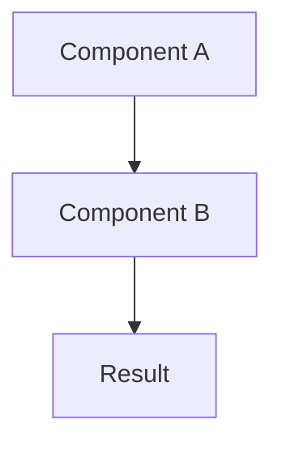

## Problem

Clearly state the problem this pattern solves. What challenge or limitation does it address? Be specific about the context where this problem occurs.

## Solution

Describe the core approach or technique this pattern uses. Include:

- Key components or roles
- How they interact
- The mechanism that solves the problem
- Inputs, outputs, and control points

If helpful, include a code snippet or pseudocode:

```pseudo
example_function() {
    // Show the pattern in action
}
```

For complex patterns, include a Mermaid diagram:



## Evidence

Summarize only high-confidence findings from research. Keep this section short.

- **Evidence Grade:** `high | medium | low | mixed | unknown`
- **Most Valuable Findings:** 1-3 concise bullets
- **Unverified / Unclear:** what requires follow-up before treating as core truth

## How to use it

Provide practical guidance on when and how to implement this pattern. Include:

- Specific use cases or scenarios
- Prerequisites or requirements
- Implementation considerations

## Trade-offs

Be honest about the pros and cons:

- **Pros:** List the benefits and advantages
- **Cons:** List the drawbacks, complexity, or limitations

## References

- Link to original source, papers, or implementations
- Additional reading or related work
