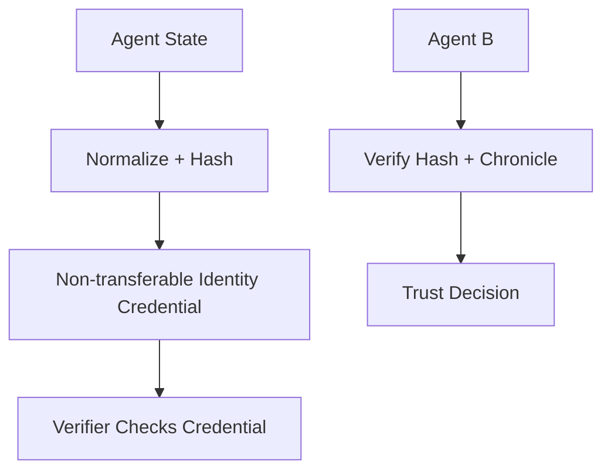

## Problem

As autonomous agents start interacting across networks, it becomes harder to verify identity and detect prompt/operator drift. Without durable identity and change history, an agent can impersonate another agent or silently diverge from its authorized configuration.

## Solution

Bind agent identity and mutable metadata to a non-transferable credential and record identity-bearing state transitions in a tamper-resistant log.

**Pattern flow:**

1. Compute a stable hash of the normalized system prompt/state and commit it at registration.
2. Issue a non-transferable identity credential (for example an SBT-style token).
3. Record meaningful changes (prompt updates, operator changes, policy updates) as signed events.
4. Require verifiers to check both credential validity and state continuity before trusting outputs.

## When to use

- Before delegating work to another agent.
- In agent marketplaces or multi-org delegations.
- For compliance workflows requiring auditable agent-state continuity.

## Trade-offs

- Requires an external registry and on-chain/append-only logging trust model.
- Hash commitments verify state integrity but not necessarily semantic correctness.
- Operational overhead for issuing/rotating identity claims.
- Latency and integration cost can be non-trivial.

## Known Implementations

- [Chitin](https://chitin.id)
- [Chitin MCP Server](https://www.npmjs.com/package/chitin-mcp-server)
- [Chitin Contracts](https://github.com/chitin-id/chitin-contracts)

## How to use it

- Use this when tool access, data exposure, or action authority must be tightly controlled.
- Start with deny-by-default policy and minimal required privileges.
- Continuously audit logs for attempted policy bypass and anomalous behavior.

## References

- Primary source: https://eips.ethereum.org/EIPS/eip-5192
