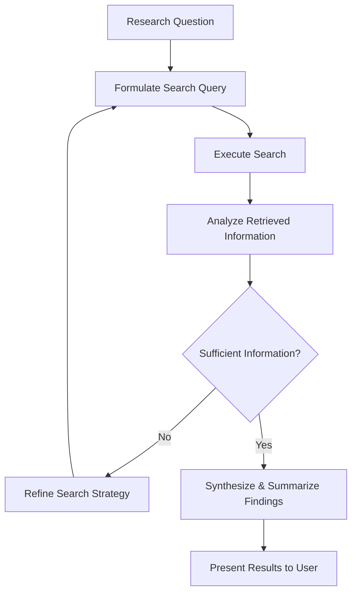

## Problem
Traditional research methods often lack the ability to adapt search strategies based on emerging results, limiting efficiency and potential discoveries.

## Solution
Allow AI agents to independently conduct the entire research process. Given a research question, the agent:

- Creates its own search queries.
- Executes the searches.
- Examines the data.
- Adjusts its search strategy using new data.
- Repeats until it gathers enough information or meets specified criteria.
- Finally, compiles and presents a summary to the user.

## Example (flow)

## References
- "How AI Agents Are Reshaping Creation": "That question goes to the agent, the agent formulates the searches in the form of tool calls. So it'll search the Web, it'll search some existing index or what have you, and it'll iterate until it's sort of satisfied with the amount of information that it gets, and then summarizes the output for you."