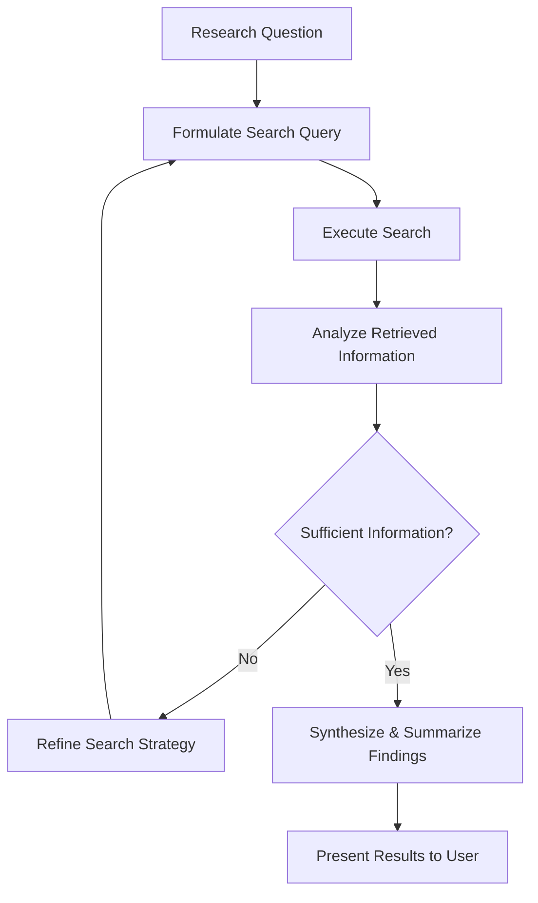

## Problem

Traditional research methods often lack the ability to adapt search strategies based on emerging results, limiting efficiency and potential discoveries.

## Solution

Allow AI agents to independently conduct the entire research process. Given a research question, the agent:

- Creates its own search queries.
- Executes the searches.
- Examines the data.
- Adjusts its search strategy using new data.
- Repeats until it gathers enough information or meets specified criteria.
- Finally, compiles and presents a summary to the user.

## Example (flow)

```mermaid
flowchart TD
    A[Research Question] --> B[Formulate Search Query]
    B --> C[Execute Search]
    C --> D[Analyze Retrieved Information]
    D --> E{Sufficient Information?}
    E -->|No| F[Refine Search Strategy]
    F --> B
    E -->|Yes| G[Synthesize & Summarize Findings]
    G --> H[Present Results to User]
```

## How to use it

- Use this when tasks need explicit control flow between planning, execution, and fallback.
- Start with one high-volume workflow before applying it across all agent lanes.
- Define ownership for each phase so failures can be routed and recovered quickly.

## Trade-offs

* **Pros:** Improves coordination across multi-step workflows and reduces hidden control flow.
* **Cons:** Adds orchestration complexity and more states to debug.

## References

- "How AI Agents Are Reshaping Creation": "That question goes to the agent, the agent formulates the searches in the form of tool calls. So it'll search the Web, it'll search some existing index or what have you, and it'll iterate until it's sort of satisfied with the amount of information that it gets, and then summarizes the output for you."

- Primary source: https://www.youtube.com/watch?v=u85G2aV_5rQ
