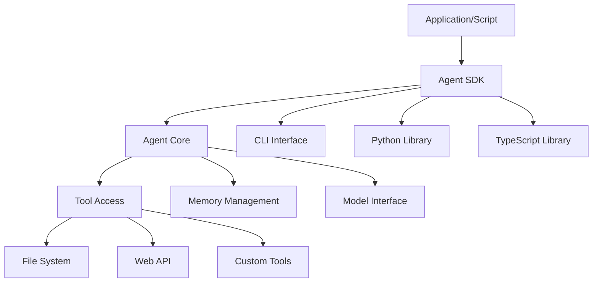

## Problem
Interactive terminal or chat interfaces are suitable for many agent tasks, but not for all. Integrating agent capabilities into automated workflows (e.g., CI/CD pipelines, scheduled jobs, batch processing) or building more complex applications on top of core agent functionalities requires a programmatic interface.

## Solution
Provide a Software Development Kit (SDK) that exposes the agent's core functionalities for programmatic access. This SDK allows developers to:

-   Invoke agent actions (e.g., process a prompt, use a tool, access memory) from code (e.g., Python, TypeScript).
-   Configure agent behavior and tool access in a non-interactive manner.
-   Integrate agent logic into larger software systems.
-   Automate repetitive tasks that involve the agent.
-   Build custom user interfaces or applications powered by the agent's backend.

The SDK typically includes libraries, command-line interfaces (CLIs) for scripting, and documentation for headless or embedded use of the agent.

## Example (SDK integration)


## Example CLI Usage (Conceptual, from Claude Code SDK info):
```bash
$ claude -p "what did i do this week?" \
  --allowedTools Bash(git log:*) \
  --output-format json
```

## References
-   Based on the description of the Claude Code SDK in "Mastering Claude Code: Boris Cherny's Guide & Cheatsheet," section VI.

[Source](https://www.nibzard.com/claude-code)