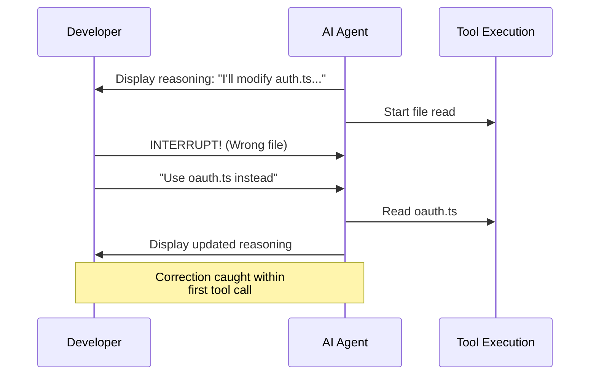

## Problem

AI agents can pursue misguided reasoning paths for extended periods before producing final outputs. By the time developers realize the approach is wrong, significant time and tokens have been wasted on a fundamentally flawed direction. Traditional "fire and forget" agent execution provides no opportunity for early course correction.

## Solution

Implement active surveillance of the agent's intermediate reasoning steps with the capability to interrupt and redirect before completing full execution sequences. Monitor chain-of-thought outputs, tool calls, and intermediate results in real-time, maintaining a "finger on the trigger" to catch wrong directions early.

**Key mechanisms:**

**Real-time reasoning visibility:**

- Expose agent's thinking process as it unfolds
- Display tool use decisions and intermediate results
- Show planning steps before code execution

**Low-friction interruption:**

- Enable quick halt capability (keyboard shortcuts, UI controls)
- Preserve partial work when interrupting
- Allow mid-execution context injection

**Early detection signals:**

- Wrong file selections
- Flawed assumptions in initial tool calls
- Misunderstanding of requirements evident in first reasoning steps

## How to use it

**When to apply:**

- Complex refactoring where wrong file choices are costly
- Tasks requiring deep codebase understanding
- High-stakes operations (database migrations, API changes)
- When agent might misinterpret ambiguous requirements
- Development workflows where iteration speed matters

**Implementation approaches:**

**UI-level implementation:**

- Show streaming agent reasoning in real-time
- Provide prominent interrupt/stop controls
- Display tool use before execution when possible
- Allow inline corrections without restarting

**CLI-level implementation:**

- Stream verbose output showing reasoning
- Ctrl+C to interrupt with context preservation
- Ability to redirect with additional context
- Resume capability after corrections

**Best practices:**

1. **Monitor first tool calls closely** - First actions reveal understanding
2. **Watch for assumption declarations** - "Based on X, I'll do Y" statements
3. **Interrupt early** - Don't wait for completion of flawed sequences
4. **Provide specific corrections** - Help agent understand what went wrong
5. **Use clarifying questions** - Sometimes better to pause and clarify than redirect

## Trade-offs

**Pros:**

- Prevents wasted time on fundamentally wrong approaches
- Maximizes value from expensive model calls
- Enables collaborative human-AI problem solving
- Reduces frustration from watching preventable mistakes
- Catches misunderstandings within initial tool calls

**Cons:**

- Requires active human attention (not fully autonomous)
- Can interrupt productive exploration if triggered prematurely
- May create dependency on human oversight for routine tasks
- Adds cognitive load to monitor agent reasoning
- Risk of over-correcting and preventing valid creative approaches

## References

- [Building Companies with Claude Code](https://claude.com/blog/building-companies-with-claude-code) - Tanner Jones (Vulcan) advises: "Have your finger on the trigger to escape and interrupt any bad behavior."
- Related patterns: [Spectrum of Control / Blended Initiative](spectrum-of-control.md), [Verbose Reasoning Transparency](verbose-reasoning-transparency.md)
