## Problem

Traditional Model Context Protocol (MCP) approaches of directly exposing tools to Large Language Models create significant token waste and complexity issues. We've moved from telling LLMs what to do, to teaching them to write instructions for themselves—it's **turtles writing code all the way down**[^1] for all domains.

### Token Waste in Multi-Step Operations
Classic MCP forces this inefficient pattern:
```
LLM → tool #1 → large JSON response → LLM context
LLM → tool #2 → large JSON response → LLM context
LLM → tool #3 → large JSON response → LLM context
→ final answer
```

Every intermediate result must ride back through the model's context, burning tokens and adding latency at each step. For complex workflows requiring 5-10 tool calls, this becomes extremely expensive.

### Fan-Out Inefficiency at Scale
The traditional approach breaks down dramatically with bulk operations:

**Processing 100 emails for personalized outreach:**

- Traditional MCP: 100 separate tool calls, each requiring round-trip through LLM context
- Each email fetch dumps potentially 1000+ tokens of metadata into context
- Total context bloat: 100k+ tokens before any actual work begins
- Result: Context overflow, degraded performance, or outright failure

**Code Mode alternative:** Simple `for` loop over 100 entries, processing entirely within the sandbox with only final results surfaced to LLM context.

### Core Interface Limitations
- LLMs struggle to effectively use complex tool interfaces
- Limited training data on "tool calls" compared to abundant code training
- Multi-step tool interactions become cumbersome with direct API calls
- Complex tool compositions require multiple back-and-forth exchanges
- Fan-out scenarios (processing many items) exceed context limits or become prohibitively expensive

The fundamental insight: **LLMs are better at writing code to orchestrate MCP tools than calling MCP tools directly.**

## Solution

Code Mode complements (not replaces) MCP servers by adding an ephemeral execution layer that eliminates token-heavy round-trips:

### The Division of Responsibilities

**MCP Servers Handle (Persistent Layer):**

- Credential management and authentication
- Rate limiting and quota enforcement
- Webhook subscriptions and real-time events
- Connection pooling and persistent state
- API secrets and security policies

**Code Mode Handles (Ephemeral Layer):**

- Multi-step tool orchestration in a single execution
- Complex data transformations and business logic
- Eliminating intermediate JSON bloat from LLM context
- "Write once, vaporize immediately" execution model

### Core Architecture

1. **Schema Discovery**: Agents SDK fetches MCP server schemas dynamically at runtime
2. **API Transformation**: Convert MCP tool schemas into TypeScript API interfaces with doc comments
3. **LLM Tool Awareness**: LLM receives complete TypeScript API documentation for available tools
4. **Ephemeral Code Generation**: LLM generates code that orchestrates multiple tool calls in one script
5. **V8 Isolate Execution**: Lightweight, secure sandbox that dies after execution (no persistent state)
6. **Controlled Bindings**: Secure bridges to MCP servers that own the real credentials and logic

**Key Insight**: The LLM knows what code to write because it receives the complete TypeScript API generated from MCP server schemas, not because it guesses - it's provided with strongly-typed interfaces and documentation.

### Enhanced Capabilities

- **Verification**: Compile-time validation catches errors before execution
- **Semantic Caching**: Reuse successful workflows via typed API signatures
- **Idempotency**: Checkpoint/resume patterns using KV stores for partial failure recovery

This creates a "best of both worlds" approach: MCP servers handle the operational complexity while Code Mode eliminates the chatty, token-expensive parts of multi-step workflows.

## When to Use Code Mode

### Ideal Use Cases

**Workflow-like Problems with Known Flow:**

Code Mode excels when you have clear sequences of operations:

- **Infrastructure provisioning**: "Please provision an EC2 instance of m4 class that I can SSH to, place that in public SG and attach an IPGW, make sure it's tagged nicely"
- **Data pipeline orchestration**: Extract from API A, transform according to rules B, load into system C
- **Bulk operations**: Processing 100+ items where traditional MCP would exceed context limits

**Fan-Out Scenarios:**

Much easier to one-shot code with a `for` loop over 100 entries instead of expecting an LLM to nail 100 tool calls, either in parallel or sequentially. Performance only gets worse with bigger N, but Code Mode stays fast.

**CaMeL-Style Self-Debugging:**

Agents debug their own homework with built-in error handling, logging, and retry logic.

**Typed API Benefits:**

- Compile-time verification before execution
- Semantic caching of successful workflows
- Clear interfaces reducing execution errors

### Anti-Patterns (When Not to Use)

**Open-Ended Research Loops:**

Code Mode struggles with problems where you decide at each step what to even do next. You can try to account for each edge case, but it defeats the purpose.

**Intelligence Required Mid-Execution:**

Right now, Code Mode especially fails at cases where intelligence needs to be _inserted in the middle of code_. Example: A spreadsheet with 100 emails where you want to write a *personalized* email for each entry. The `body` argument for that `send_email` call must be computed using LLM for personalization.

**Highly Dynamic Workflows:**

When the sequence of operations depends heavily on intermediate results in unpredictable ways, traditional MCP's step-by-step approach may be more appropriate.

## Example: EC2 Infrastructure Provisioning

**User Request:** "Please provision an EC2 instance of m4 class that I can SSH to, place that in public SG and attach an IPGW, make sure it's tagged nicely"

This demonstrates Code Mode's strength with workflow-like problems:

```mermaid
sequenceDiagram
    participant User
    participant LLM
    participant V8Isolate as V8 Isolate<br/>(Ephemeral)
    participant Bindings as Secure Bindings
    participant MCPServer as MCP Server<br/>(AWS Tools)
    participant AWS as AWS APIs

    User->>LLM: "Provision EC2 m4 instance with SSH access"

    Note over LLM,V8Isolate: Code Generation & Execution Phase
    LLM->>V8Isolate: Generate TypeScript workflow:<br/>createVPC() → createIGW() → createSG() → launchEC2()

    Note over V8Isolate: // Generated code orchestrates full workflow<br/>const vpc = await createVPC({name: "demo-vpc"})<br/>const igw = await createInternetGateway(vpc.id)<br/>const sg = await createSecurityGroup(vpc.id, sshRules)<br/>const instance = await launchEC2Instance({<br/>  type: "m4.large", vpcId: vpc.id, sgId: sg.id<br/>})<br/>await tagResources([vpc, igw, sg, instance])

    V8Isolate->>Bindings: Execute createVPC()
    Bindings->>MCPServer: Create VPC request
    MCPServer->>AWS: vpc_create API call (with creds)
    AWS-->>MCPServer: VPC created
    MCPServer-->>Bindings: VPC details
    Bindings-->>V8Isolate: Return vpc object

    V8Isolate->>Bindings: Execute createInternetGateway()
    Bindings->>MCPServer: Create IGW + attach
    MCPServer->>AWS: igw_create + attach API calls
    AWS-->>MCPServer: IGW attached
    MCPServer-->>Bindings: IGW details
    Bindings-->>V8Isolate: Return igw object

    V8Isolate->>Bindings: Execute remaining workflow
    Note over Bindings,AWS: Security Group creation<br/>EC2 instance launch<br/>Resource tagging
    AWS-->>V8Isolate: All resources provisioned

    V8Isolate-->>LLM: {vpcId, instanceId, publicIP, sshCommand}
    Note over V8Isolate: 💀 Isolate destroyed<br/>Workflow state cleared
    LLM-->>User: "Infrastructure ready! SSH: ssh -i key.pem ec2-user@54.x.x.x"

    Note over LLM: 🎯 Single workflow execution<br/>6 AWS API calls → 1 condensed result
```



## Counter-Example: Personalized Email Campaign

This shows where Code Mode struggles—when intelligence is needed mid-execution:

**Problem:** Generate personalized emails for 100 contacts based on their profiles.

```typescript
// This approach defeats Code Mode benefits:
for (const contact of contacts) {
  // ❌ Requires LLM call inside loop
  const personalizedBody = await callLLM(`Write personalized email for ${contact.name}
    who works at ${contact.company} in ${contact.industry}`);

  await sendEmail({
    to: contact.email,
    subject: "Partnership Opportunity",
    body: personalizedBody  // Intelligence needed here
  });
}
```

**Why it fails:** You're back to traditional agenting, just wrapped in TypeScript. Each `callLLM()` requires context round-trips, eliminating Code Mode's token efficiency benefits.

## How to use it

1. **Design Tool APIs**: Create TypeScript interfaces for your tools that are intuitive for code generation
2. **Implement Bindings**: Develop secure bindings that control access to external resources
3. **Sandbox Setup**: Configure V8 isolates with appropriate security constraints
4. **Code Execution Flow**:
   
- LLM generates TypeScript code using the provided APIs
   - Code runs in isolated V8 environment
   - Bindings provide controlled access to tools
   - Results return to the agent for further processing

## Traditional MCP vs Code Mode Comparison

### Traditional MCP Flow
```
User Request → LLM
↓
Tool Call #1 → JSON Response (1000+ tokens) → LLM Context
↓
Tool Call #2 → JSON Response (1000+ tokens) → LLM Context
↓
Tool Call #3 → JSON Response (1000+ tokens) → LLM Context
↓
Final Answer (Context bloated with intermediate data)
```

**Cost:** High token usage, multiple round-trips, latency accumulation

### Code Mode Flow
```
User Request → LLM → Generated Code → V8 Isolate
                                    ↓
                                    All tool calls internally
                                    ↓
                                    Condensed results → LLM
                                    ↓
                                    Final Answer
```

**Cost:** Single round-trip, minimal token usage, faster execution

## Trade-offs

**Pros:**

- **Dramatic token savings** on multi-step workflows (10x+ reduction)
- **Dramatic fan-out efficiency** - for loops over 100+ entries vs 100+ tool calls (speed + reliability at scale)
- **Faster execution** through elimination of round-trips
- **Enhanced security** - credentials stay in MCP servers, never in LLM
- **Complex orchestration** - LLMs excel at writing orchestration code
- **CaMeL-style self-debugging** - agents can debug their own homework with error handling and retry logic
- **Typed verification and semantic caching** - compile-time validation and workflow reuse opportunities
- **Maintained MCP benefits** - existing servers work without modification
- **Natural idempotency patterns** - checkpoint/resume capabilities with state stores

**Cons/Considerations:**

- **Infrastructure complexity** - requires V8 isolate runtime infrastructure
- **Code quality dependency** - execution success depends on LLM's code generation
- **Poor fit for dynamic research loops** - struggles when next steps are decided dynamically at each stage
- **Intelligence-in-the-middle challenge** - cases requiring LLM calls mid-execution defeat the purpose
- **Debugging challenges** - runtime errors in generated code need handling
- **API design overhead** - need intuitive TypeScript interfaces for code generation
- **Partial failure complexity** - requires careful design of state management and recovery patterns

## Implementation Guidance

### Decision Tree: Code Mode vs Traditional MCP

**Use Code Mode when:**

- ✅ **Clear workflow sequence** - You can map out the steps upfront
- ✅ **Fan-out operations** - Processing 10+ items in bulk
- ✅ **Known API interactions** - Well-defined tool chains
- ✅ **Performance critical** - Token costs or latency matter
- ✅ **Error handling needs** - Benefit from retry/checkpoint patterns

**Use Traditional MCP when:**

- ❌ **Dynamic exploration** - Next steps depend on unpredictable intermediate results
- ❌ **Intelligence mid-flow** - Need LLM reasoning between each tool call
- ❌ **Simple single calls** - One-off tool usage doesn't need orchestration
- ❌ **Rapid prototyping** - Quick testing without infrastructure setup

## References

- [Cloudflare Code Mode Blog Post](https://blog.cloudflare.com/code-mode/) - Original announcement and technical details
- [Model Context Protocol](https://modelcontextprotocol.io/) - Background on traditional tool calling approaches
- [Rafal Wilinski's Code Mode Analysis](https://x.com/rafalwilinski/status/1972362720579035146) - Real-world insights on Code Mode strengths and limitations

[^1]: Phrase coined by Rafal Wilinski in his Code Mode analysis