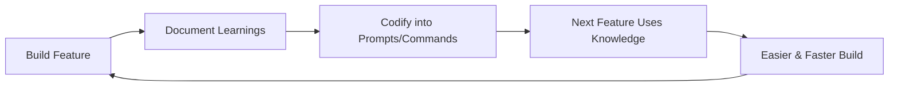

## Problem

Traditional software engineering has **diminishing returns**: each feature added increases complexity, making subsequent features harder to build. Technical debt accumulates, onboarding takes longer, and new team members struggle to be productive.

With AI coding agents, this problem is amplified—agents make the same mistakes repeatedly because learnings aren't systematically captured and codified.

## Solution

Flip the equation: make each feature **compound** by codifying all learnings into reusable agent instructions. When you complete a feature, document:

1. **What worked in the plan** and what needed adjustment
2. **Issues discovered during testing** that weren't caught earlier
3. **Common mistakes** the agent made
4. **Patterns and best practices** that should be reused

Then embed these insights into:

- **Claude MD / system prompts**: Global coding standards
- **Slash commands**: Repeatable workflows (e.g., `/test-with-validation`)
- **Subagents**: Specialized validators (e.g., security review agent)
- **Hooks**: Automated checks that prevent regressions

**Result**: Each feature makes the next easier because the codebase becomes increasingly "self-teaching."

## How to use it

**During feature development:**

1. Track what the agent got wrong initially
2. Note which parts of the plan needed revision
3. Document edge cases discovered during testing
4. Identify questions you had to answer repeatedly

**After completion:**

1. Update `CLAUDE.md` with new coding standards or patterns
2. Create slash commands for workflows you'll repeat
3. Build subagents for specialized validation tasks
4. Add hooks to prevent common mistakes automatically
5. Write tests that encode requirements

**Example from Every:**

> "We have this engineering paradigm called compounding engineering where your goal is to make the next feature easier to build... We codify all the learnings from everything we've done. When we started testing, what issues did we find? What things did we miss? And we codify them back into all the prompts and subagents and slash commands."

This allows non-experts to be productive immediately:

> "I can hop into one of our code bases and start being productive even though I don't know anything about how the code works because we have this built up memory system."

## Trade-offs

**Pros:**

- **Accelerating productivity**: Each feature genuinely makes the next faster
- **Knowledge preservation**: Learnings don't depend on individual memory
- **Better onboarding**: New team members (human or AI) leverage accumulated knowledge
- **Reduced repetition**: Agent stops making the same mistakes
- **Living documentation**: Instructions stay current because they're used daily

**Cons:**

- **Upfront time investment**: Requires discipline to document after each feature
- **Maintenance overhead**: Prompts and commands need updates as patterns change
- **Over-specification risk**: Too many rules can make agents inflexible
- **Requires tooling**: Needs extensible agent system (slash commands, hooks, etc.)
- **Prompt bloat**: System prompts can grow large over time

## References

* Dan Shipper: "In normal engineering, every feature you add, it makes it harder to add the next feature. In compounding engineering, your goal is to make the next feature easier to build from the feature that you just added."
* Dan Shipper: "We codify all the learnings... how did we make the plan, what parts needed to be changed, when we started testing it what issues did we find, what are the things that we missed, and then we codify them back into all the prompts and all the subagents and all the slash commands."
* [AI & I Podcast: How to Use Claude Code Like the People Who Built It](https://every.to/podcast/transcript-how-to-use-claude-code-like-the-people-who-built-it)
