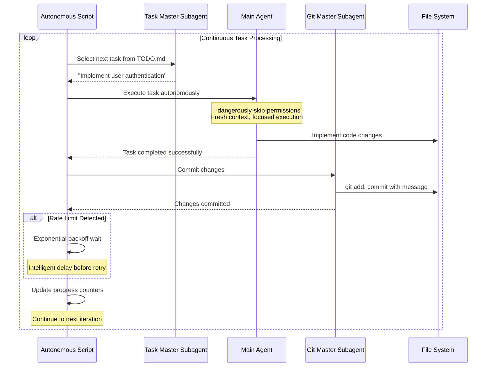

## Problem

Traditional development workflows require constant human intervention for task management:

- **Manual Task Selection**: Developers spend time deciding what to work on next from todo lists
- **Context Switching Overhead**: Moving between different types of tasks interrupts flow state
- **Rate Limit Interruptions**: API rate limits break development momentum and require manual waiting
- **Repetitive Git Operations**: Each task completion requires manual staging, committing, and status checking
- **Error Recovery**: Failed tasks need manual diagnosis and restart

This manual orchestration reduces overall productivity and prevents developers from focusing on higher-level problem solving.

## Solution

Implement a continuous autonomous loop that handles task selection, execution, and completion without human intervention:

1. **Fresh Context Per Iteration**: Each task starts with a clean context to avoid contamination
2. **Autonomous Task Selection**: Use specialized subagents to pick the next appropriate task
3. **Automated Git Management**: Handle commits and status updates through dedicated subagents
4. **Intelligent Rate Limit Handling**: Detect rate limits and implement exponential backoff
5. **Stream-Based Progress Tracking**: Real-time feedback through JSON streaming
6. **Configurable Execution Limits**: Safety bounds to prevent runaway execution

The pattern operates in a continuous loop until stopped manually or reaching iteration limits.

## Example



## How to use it

### Prerequisites
- CLI agent tool (Claude Code, etc.) with autonomous execution capabilities
- Git repository with TODO.md or similar task file
- JSON parsing tools (jq) for stream processing

### Implementation Steps

1. **Task File Setup**: Create structured todo file with discrete, actionable tasks
2. **Configure Loop Script**: Set iteration limits and rate limit handling parameters
3. **Subagent Configuration**: Define specialized agents for task selection and git operations
4. **Safety Configuration**: Set appropriate permission levels and monitoring
5. **Launch Loop**: Start autonomous execution with configured parameters

### Key Configuration Options
```bash
# Example configuration
MAX_ITERATIONS=50           # Safety limit
CLAUDE_CLI="claude"         # CLI tool choice
RATE_LIMIT_BACKOFF=300     # Seconds to wait on rate limit
STREAM_JSON=true           # Real-time progress tracking
```

### Safety Considerations
- Always set maximum iteration limits
- Use version control for rollback capability
- Monitor execution logs for unexpected behavior
- Start with small task batches to validate behavior

## Trade-offs

**Pros:**
- **Complete Autonomy**: Eliminates manual task orchestration overhead
- **Continuous Progress**: Maintains development momentum without human intervention
- **Fresh Context**: Each task gets clean reasoning context
- **Intelligent Error Handling**: Automated recovery from common failure modes
- **Git Automation**: Maintains clean commit history automatically
- **Rate Limit Resilience**: Handles API constraints gracefully

**Cons/Considerations:**
- **Reduced Human Oversight**: Less control over individual task decisions
- **Permission Requirements**: Needs elevated execution permissions for autonomy
- **Runaway Risk**: Potential for unintended extensive execution
- **Task Quality Dependency**: Effectiveness depends on well-structured task definitions
- **Limited Complex Problem Solving**: Best for discrete, well-defined tasks
- **Resource Consumption**: Continuous execution uses computational resources

## References

- [Original Autonomous Task Processing Script](https://gist.github.com/nibzard/a97ef0a1919328bcbc6a224a5d2cfc78) - Complete implementation example
- [Claude Code Documentation](https://docs.anthropic.com/en/docs/claude-code) - CLI agent capabilities