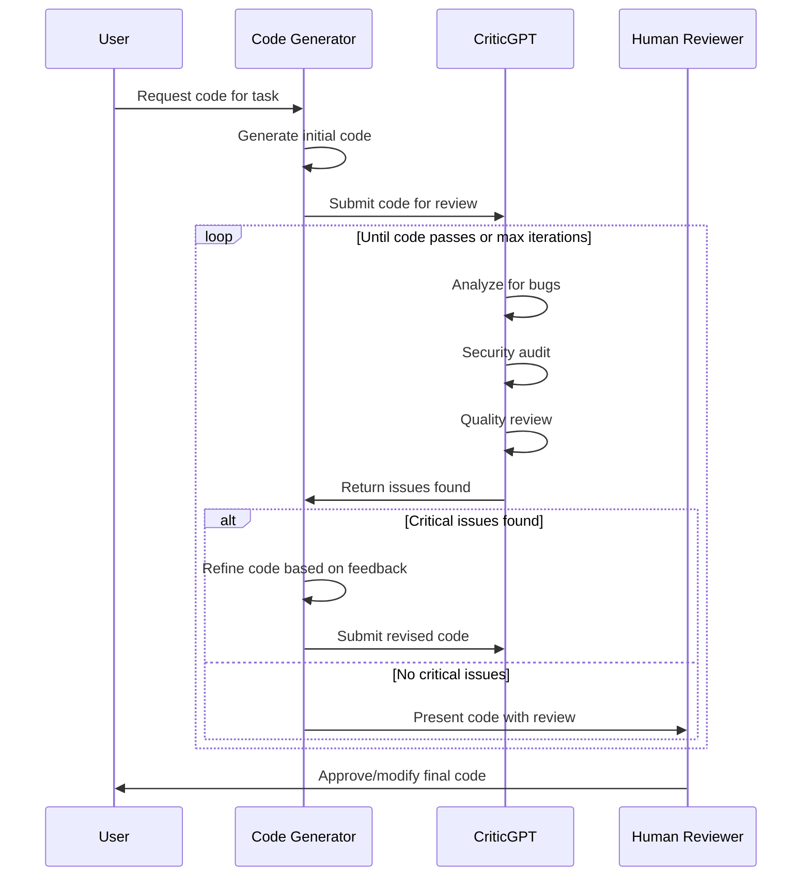

## Problem

As AI-generated code becomes more sophisticated, it becomes increasingly difficult for human reviewers to catch subtle bugs, security issues, or quality problems. Traditional code review processes may miss issues in AI-generated code because:
- The volume of generated code can overwhelm human reviewers
- Subtle bugs may appear correct at first glance
- Security vulnerabilities may be non-obvious
- Style and best practice violations may be inconsistent

## Solution

Deploy specialized AI models trained specifically for code critique and evaluation. These models act as automated code reviewers that can:

1. **Identify bugs** that human reviewers might miss
2. **Detect security vulnerabilities** in generated code
3. **Suggest improvements** for code quality and efficiency
4. **Verify correctness** of implemented solutions
5. **Check adherence** to coding standards and best practices

The critic model works alongside code generation models, providing an additional layer of quality assurance before code reaches human review or production.

## Example

```python
class CriticGPTReviewer:
    def __init__(self, critic_model, severity_threshold=0.7):
        self.critic = critic_model
        self.severity_threshold = severity_threshold
        
    def review_code(self, code, context=None, language="python"):
        """Comprehensive code review using specialized critic model"""
        
        reviews = {
            'bugs': self.check_for_bugs(code, context, language),
            'security': self.security_audit(code, language),
            'quality': self.quality_review(code, language),
            'performance': self.performance_analysis(code, language),
            'best_practices': self.best_practices_check(code, language)
        }
        
        # Aggregate findings
        all_issues = []
        for category, findings in reviews.items():
            for issue in findings:
                issue['category'] = category
                all_issues.append(issue)
        
        # Sort by severity
        all_issues.sort(key=lambda x: x['severity'], reverse=True)
        
        return {
            'issues': all_issues,
            'summary': self.generate_summary(all_issues),
            'recommended_action': self.recommend_action(all_issues)
        }
    
    def check_for_bugs(self, code, context, language):
        prompt = f"""
        Review this {language} code for bugs:
        
        Context: {context or 'General purpose code'}
        
        Code:
        ```{language}
        {code}
        ```
        
        Identify any bugs including:
        - Logic errors
        - Off-by-one errors  
        - Null/undefined reference errors
        - Type mismatches
        - Resource leaks
        - Race conditions
        - Edge case handling
        
        For each bug found, provide:
        1. Line number(s)
        2. Description of the bug
        3. Severity (0-1)
        4. Suggested fix
        """
        
        response = self.critic.analyze(prompt)
        return self.parse_bug_findings(response)
    
    def security_audit(self, code, language):
        prompt = f"""
        Perform security analysis on this {language} code:
        
        ```{language}
        {code}
        ```
        
        Check for vulnerabilities including:
        - SQL injection
        - XSS vulnerabilities
        - Command injection
        - Path traversal
        - Insecure cryptography
        - Hardcoded secrets
        - Authentication/authorization issues
        - Input validation problems
        
        Report format: [line, vulnerability type, severity, fix]
        """
        
        response = self.critic.analyze(prompt)
        return self.parse_security_findings(response)
    
    def quality_review(self, code, language):
        prompt = f"""
        Review code quality for this {language} code:
        
        ```{language}
        {code}
        ```
        
        Evaluate:
        - Code clarity and readability
        - Function/variable naming
        - Code organization
        - Documentation completeness
        - DRY principle violations
        - Coupling and cohesion
        - Error handling quality
        """
        
        response = self.critic.analyze(prompt)
        return self.parse_quality_findings(response)
    
    def suggest_fixes(self, code, issue):
        """Generate specific fix for identified issue"""
        prompt = f"""
        Code with issue:
        ```
        {code}
        ```
        
        Issue: {issue['description']}
        Location: Line {issue['line']}
        
        Provide a corrected version of the relevant code section.
        """
        
        return self.critic.generate(prompt)

class IntegratedCodeGeneration:
    """Example of critic integration with code generation"""
    
    def __init__(self, generator, critic):
        self.generator = generator
        self.critic = CriticGPTReviewer(critic)
        
    def generate_and_review(self, task_description, max_iterations=3):
        # Initial generation
        code = self.generator.generate_code(task_description)
        
        for i in range(max_iterations):
            # Review generated code
            review = self.critic.review_code(
                code, 
                context=task_description
            )
            
            # If no critical issues, we're done
            critical_issues = [
                issue for issue in review['issues'] 
                if issue['severity'] > 0.8
            ]
            
            if not critical_issues:
                break
                
            # Otherwise, regenerate with feedback
            feedback = self.format_feedback(critical_issues)
            refinement_prompt = f"""
            Original task: {task_description}
            
            Generated code has these issues:
            {feedback}
            
            Generate improved code addressing these issues:
            """
            
            code = self.generator.generate_code(refinement_prompt)
        
        return {
            'code': code,
            'final_review': review,
            'iterations': i + 1
        }
```



## Benefits

- **Catches More Bugs**: Specialized training helps identify subtle issues
- **Consistent Reviews**: No fatigue or oversight like human reviewers
- **Fast Feedback**: Near-instantaneous review of generated code
- **Learning Tool**: Helps developers understand potential issues
- **Reduces Security Risks**: Proactive vulnerability detection

## Trade-offs

**Pros:**
- Scalable code review process
- Consistent quality standards
- Catches issues early in development
- Can review code 24/7 without breaks
- Improves over time with more training

**Cons:**
- May have false positives requiring human verification
- Training specialized critic models is resource-intensive
- Cannot understand full business context like humans
- May miss novel vulnerability types
- Requires integration into existing workflows

## References

- [OpenAI's CriticGPT Announcement (July 2024)](https://openai.com/research/criticgpt)
- [Using LLMs for Code Review - Microsoft Research](https://www.microsoft.com/en-us/research/)
- [Automated Code Review with AI - Google Research](https://research.google/)