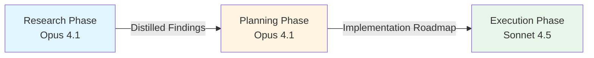

## Problem

When AI agents attempt to simultaneously research, plan, and implement solutions, context contamination occurs. Competing priorities within a single conversation degrade output quality as the agent struggles to balance exploration, strategic thinking, and execution. This results in incomplete research, unclear plans, and suboptimal implementations.

## Solution

Break development workflows into isolated phases with clean handoffs between them. Each phase runs in a separate conversation with a fresh context window, focusing exclusively on its objective:

**Research Phase (Opus 4.1):**

- Deep exploration of requirements, existing code, and constraints
- Comprehensive background investigation
- No implementation concerns

**Planning Phase (Opus 4.1):**

- Create structured implementation roadmap
- Define clear steps and dependencies
- No coding distractions

**Implementation Phase (Sonnet 4.5):**

- Execute each plan step systematically
- Focus purely on code quality and functionality
- Leverage the distilled outputs from previous phases

**Key principle:** Pass only distilled conclusions between phases, not full conversation history. This prevents context pollution while maintaining necessary information flow.

## How to use it

**When to apply:**

- Complex features requiring significant background research
- Refactoring projects where understanding existing code is critical
- New codebases where architectural decisions need careful consideration
- Any task where mixing research and implementation degrades quality

**Implementation approach:**

1. **Research phase** - Start fresh conversation with Opus 4.1:
   
- "Research the authentication system and document all OAuth flows"
   - Compile findings into a structured document
   - Close conversation

2. **Planning phase** - New conversation with Opus 4.1:
   
- Provide distilled research findings (not full transcript)
   - "Create implementation plan for adding Google OAuth support"
   - Generate step-by-step roadmap
   - Close conversation

3. **Execution phase** - New conversation with Sonnet 4.5:
   
- Provide the implementation plan
   - "Implement step 1: Create OAuth configuration module"
   - Execute systematically through each step

**Prerequisites:**

- Clear handoff documents between phases
- Discipline to resist combining phases
- Understanding of which model strengths to leverage

## Trade-offs

**Pros:**

- Higher quality outputs in each phase due to focused attention
- Prevents context contamination from competing objectives
- Leverages model-specific strengths (Opus for reasoning, Sonnet for execution)
- Clearer mental model for complex projects
- Easier to debug which phase introduced issues

**Cons:**

- Requires more explicit phase management and handoffs
- May feel slower for simple tasks where single-pass is sufficient
- Requires discipline to maintain phase boundaries
- Information loss risk if handoffs are poorly structured
- Higher total token usage across multiple conversations

## References

- [Building Companies with Claude Code](https://claude.com/blog/building-companies-with-claude-code) - Sam Stettner (Ambral) emphasizes: "Don't make Claude do research while it's trying to plan, while it's trying to implement."
- Related patterns: [Sub-Agent Spawning](sub-agent-spawning.md), [Plan-Then-Execute Pattern](plan-then-execute.md)
