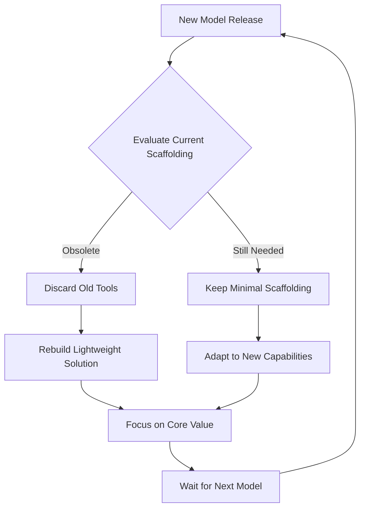

## Problem

In a field where foundation models improve dramatically every few months, investing significant engineering effort into building complex, durable features *around* the model is extremely risky. A feature that takes three months to build, such as a sophisticated context compression or a custom tool-chain for code editing, could be rendered obsolete overnight by the next model generation that performs the task natively.

## Solution

Adopt a "scaffolding" mindset when building tooling and workflows for an agent. Treat most of the code written around the core model as temporary, lightweight, and disposable—like wooden scaffolding around a building under construction.

- **Embrace "The Bitter Lesson":** Acknowledge that a lot of complex scaffolding will eventually "fall into the model" as its capabilities grow.
- **Prioritize Speed:** Build the simplest possible solution that works *now*, with the assumption that it will be thrown away later. This maximizes the team's ability to react to new models.
- **Avoid Over-Engineering:** Resist the urge to build scalable, robust, long-term solutions for problems that a better model could solve inherently. Focus engineering efforts on the unique value proposition that isn't directly tied to compensating for a model's current weaknesses.

This approach keeps the product nimble and ensures that development resources are focused on adapting to the frontier of AI capabilities, rather than maintaining features that are destined for obsolescence.

## Example

## References

- Described by Thorsten Ball: "What you want is... a scaffolding. Like you want to build a scaffolding around the model, a wooden scaffolding that if the model gets better or you have to switch it out, the scaffolding falls away. You know, like the bitter lesson like embrace that a lot of stuff might fall into the model as soon as the model gets better."