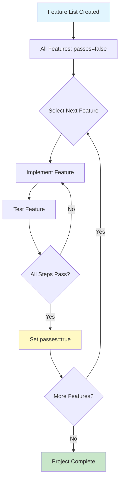

## Problem

Long-running agents exhibit several failure modes when tasked with building complete applications:

- **Premature victory declaration**: Agent declares "done" after implementing a fraction of requirements
- **Scope creep via test deletion**: Agent "passes" tests by deleting or weakening them rather than fixing code
- **Hallucinated completeness**: Agent loses track of what was actually implemented versus planned
- **Feature drift**: Without a fixed specification, agents may substitute easier features for harder ones
- **Progress amnesia**: Across sessions, agents forget what's done vs. pending

## Solution

Define all features upfront in a structured, immutable format that agents can read but cannot meaningfully game:

**1. Comprehensive Feature Specification**

Create a JSON file with ALL required features before any implementation begins:

```json
{
  "features": [
    {
      "id": "auth-001",
      "category": "functional",
      "description": "New chat button creates fresh conversation",
      "steps": [
        "Click 'New Chat' button in sidebar",
        "Verify URL changes to new conversation ID",
        "Verify message input is empty and focused",
        "Verify no previous messages are displayed"
      ],
      "passes": false
    },
    {
      "id": "auth-002",
      "category": "functional",
      "description": "User can log out and session is cleared",
      "steps": [
        "Click user profile menu",
        "Click 'Log out' option",
        "Verify redirect to login page",
        "Verify protected routes are inaccessible"
      ],
      "passes": false
    }
  ]
}
```

**2. Immutability Constraints**

Enforce through prompt instructions:

- Agent MAY set `passes: true` after verification
- Agent MAY NOT delete features from the list
- Agent MAY NOT modify acceptance criteria/steps
- Agent MAY NOT mark features as "not applicable"

**3. Verification Requirements**

Features are only marked passing after:

- Implementation is complete
- Manual or automated testing confirms all steps pass
- Agent has actually exercised the feature (not just written code)



## How to use it

**Creating effective feature lists:**

- Include 100-200+ features for complex applications
- Be specific in acceptance criteria (observable behaviors, not implementation details)
- Group by category (functional, UI, performance, security)
- Include edge cases and error handling as separate features
- Write features as a human tester would verify them

**Prompt enforcement:**

```
CRITICAL RULES:
1. You MUST NOT delete or modify any feature in feature-list.json
2. You MUST NOT edit the "steps" or "description" fields
3. You MAY ONLY change "passes" from false to true
4. You MUST actually test the feature before marking it passing
5. If a feature seems impossible, ask the user - do NOT skip it
```

**Verification tooling:**

- Use browser automation (Puppeteer, Playwright) for E2E verification
- Run features as a user would, not just unit tests
- Capture evidence (screenshots, logs) when marking features passing

## Trade-offs

**Pros:**

- Prevents premature victory declaration with clear completion criteria
- Creates immutable record of requirements that survives session boundaries
- Makes agent progress measurable (X of Y features passing)
- Eliminates "pass by deletion" attack vector
- Provides natural work queue for incremental sessions

**Cons:**

- Requires significant upfront investment in feature specification
- Not suitable for exploratory or research-oriented work
- May miss emergent requirements discovered during implementation
- Rigid format doesn't accommodate changing requirements
- Large feature lists can overwhelm agent context

**When to use:**

- Building complete applications with known requirements
- Projects spanning many agent sessions
- When agent accountability is important
- Replicable workflows (same feature list for multiple similar projects)

**When to avoid:**

- Exploratory prototyping
- Research tasks with unclear scope
- Small, single-session tasks
- Rapidly evolving requirements

## References

* [Anthropic Engineering: Effective Harnesses for Long-Running Agents](https://www.anthropic.com/engineering/effective-harnesses-for-long-running-agents)
* Related: [Initializer-Maintainer Dual Agent Architecture](initializer-maintainer-dual-agent.md)
* Related: [Spec-as-Test Feedback Loop](spec-as-test-feedback-loop.md)
