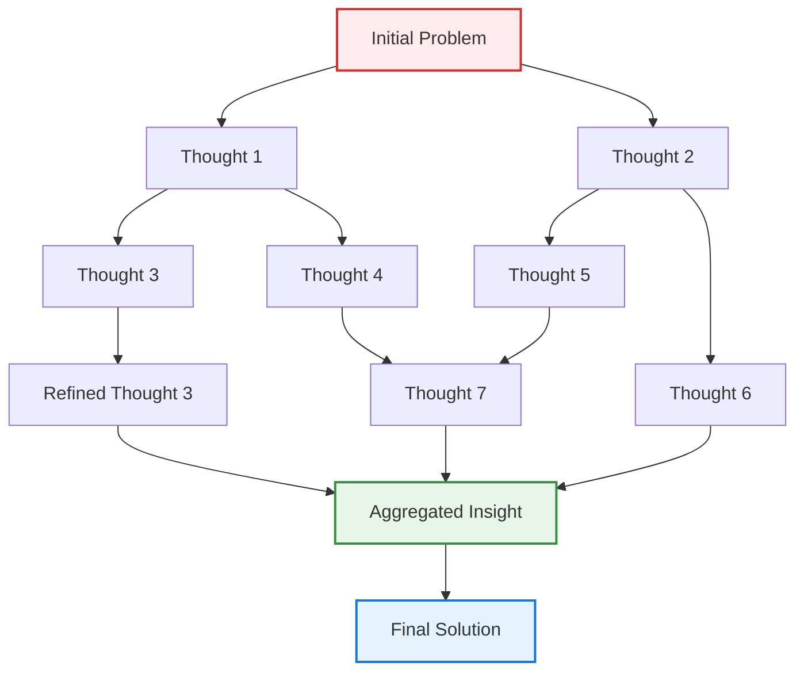

## Problem

Linear reasoning approaches like Chain-of-Thought (CoT) and even tree-based methods like Tree-of-Thoughts (ToT) have limitations when dealing with problems that require complex interdependencies between reasoning steps. Many real-world problems involve reasoning paths that merge, split, and recombine in ways that don't fit neatly into linear or tree structures. These problems need a more flexible approach that can represent arbitrary relationships between thoughts.

## Solution

Graph of Thoughts (GoT) extends reasoning frameworks by representing the thought process as a directed graph where:

- **Nodes** represent individual thoughts or reasoning states
- **Edges** represent transformations or reasoning steps between thoughts
- **Multiple paths** can lead to and from each node
- **Aggregation operations** can combine multiple thoughts
- **Backtracking** allows revisiting and refining previous thoughts

This enables operations like:
1. **Branching**: Generate multiple thoughts from one
2. **Aggregation**: Combine insights from multiple reasoning paths
3. **Refinement**: Improve thoughts based on later insights
4. **Looping**: Revisit and refine thoughts iteratively

## Example

```python
class GraphOfThoughts:
    def __init__(self, llm, max_thoughts=50):
        self.llm = llm
        self.max_thoughts = max_thoughts
        self.thought_graph = nx.DiGraph()
        self.thought_scores = {}
        
    def solve(self, problem):
        # Initialize with root thought
        root = self.generate_initial_thought(problem)
        self.add_thought(root, score=1.0)
        
        # Iteratively expand the graph
        while len(self.thought_graph) < self.max_thoughts:
            # Select promising thoughts to expand
            thoughts_to_expand = self.select_thoughts_for_expansion()
            
            for thought in thoughts_to_expand:
                # Generate new thoughts through different operations
                self.branch_thought(thought, problem)
                self.aggregate_related_thoughts(thought)
                self.refine_thought(thought, problem)
        
        # Find best solution path through the graph
        return self.extract_best_solution()
    
    def branch_thought(self, thought, problem):
        """Generate multiple new thoughts from current thought"""
        prompt = f"""
        Problem: {problem}
        Current thought: {thought.content}
        
        Generate 2-3 different ways to continue or branch this reasoning:
        """
        branches = self.llm.generate(prompt).split('\n')
        
        for branch in branches:
            new_thought = Thought(branch)
            self.add_thought(new_thought)
            self.add_edge(thought, new_thought, operation='branch')
    
    def aggregate_related_thoughts(self, thought):
        """Combine insights from multiple related thoughts"""
        # Find thoughts that could be meaningfully combined
        related = self.find_related_thoughts(thought)
        
        if len(related) >= 2:
            prompt = f"""
            Combine insights from these thoughts:
            {[t.content for t in related]}
            
            Create a unified thought that incorporates the best of each:
            """
            aggregated = self.llm.generate(prompt)
            new_thought = Thought(aggregated)
            self.add_thought(new_thought)
            
            # Add edges from all source thoughts
            for source in related:
                self.add_edge(source, new_thought, operation='aggregate')
    
    def refine_thought(self, thought, problem):
        """Improve a thought based on graph context"""
        # Get neighboring thoughts for context
        context = self.get_thought_context(thought)
        
        prompt = f"""
        Problem: {problem}
        Current thought: {thought.content}
        Related context: {context}
        
        Refine this thought to be more accurate/useful:
        """
        refined = self.llm.generate(prompt)
        
        if self.is_improvement(refined, thought.content):
            new_thought = Thought(refined)
            self.add_thought(new_thought)
            self.add_edge(thought, new_thought, operation='refine')
    
    def evaluate_thought(self, thought, problem):
        """Score a thought's quality and relevance"""
        prompt = f"""
        Problem: {problem}
        Thought: {thought.content}
        
        Rate this thought on:
        1. Relevance to problem (0-1)
        2. Logical correctness (0-1)
        3. Novelty/insight (0-1)
        4. Progress toward solution (0-1)
        
        Overall score (0-1):
        """
        evaluation = self.llm.generate(prompt)
        return self.parse_score(evaluation)
    
    def extract_best_solution(self):
        """Find the highest-scoring path through the graph"""
        # Use graph algorithms to find optimal path
        terminal_thoughts = [n for n in self.thought_graph.nodes() 
                           if self.thought_graph.out_degree(n) == 0]
        
        best_path = None
        best_score = -1
        
        for terminal in terminal_thoughts:
            paths = nx.all_simple_paths(
                self.thought_graph, 
                source=self.get_root(), 
                target=terminal
            )
            for path in paths:
                score = self.score_path(path)
                if score > best_score:
                    best_score = score
                    best_path = path
        
        return self.format_solution(best_path)
```



## Benefits

- **Flexibility**: Can represent complex, non-linear reasoning patterns
- **Reusability**: Thoughts can be referenced and built upon multiple times
- **Robustness**: Multiple paths to solution increase success probability
- **Insight Aggregation**: Combines best aspects of different reasoning paths

## Trade-offs

**Pros:**
- Handles complex problems with interdependent reasoning steps
- Can discover non-obvious connections between ideas
- Supports iterative refinement and backtracking
- More expressive than linear or tree-based approaches

**Cons:**
- Significantly higher computational cost
- Complex to implement and debug
- May generate many redundant thoughts
- Requires sophisticated scoring and path-finding algorithms
- Can be overkill for simple problems

## References

- [Graph of Thoughts: Solving Elaborate Problems with Large Language Models (AAAI 2024)](https://arxiv.org/abs/2308.09687)
- [Presentation at AAAI '24 Vancouver](https://aaai.org/aaai-conference/)
- [Code Implementation](https://github.com/spcl/graph-of-thoughts)