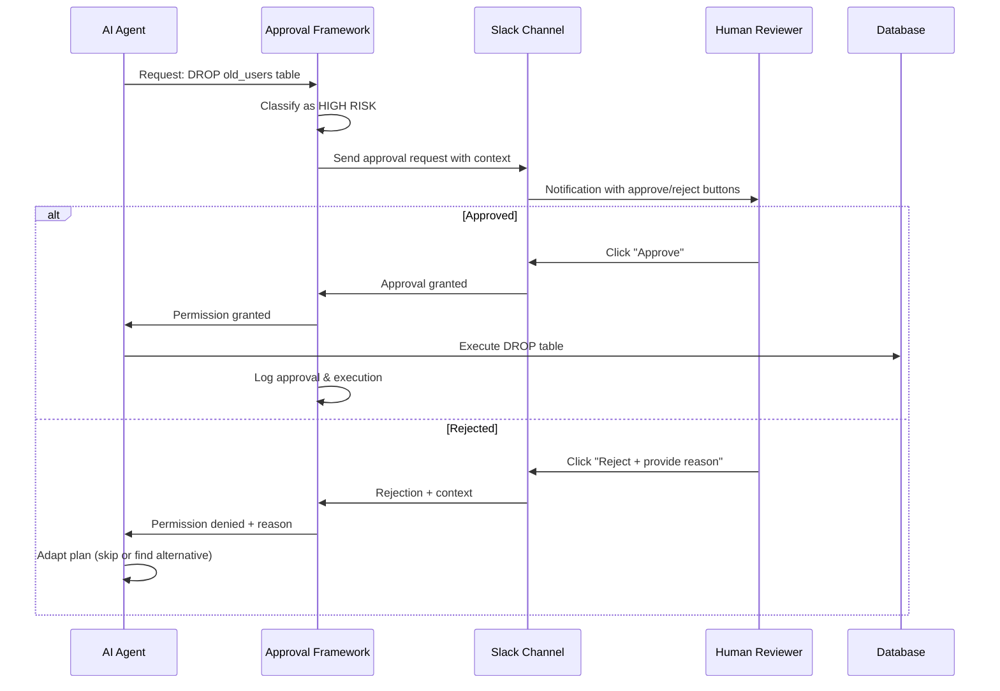

## Problem

Autonomous AI agents need to execute high-risk or irreversible operations (database modifications, production deployments, system configurations, API calls) but allowing unsupervised execution creates unacceptable safety and compliance risks. Blocking all such operations defeats the purpose of agent automation.

## Solution

Systematically insert human approval gates for designated high-risk functions while maintaining agent autonomy for safe operations. Create lightweight feedback loops that enable time-sensitive human decisions without blocking the entire agent workflow.

**Core components:**

**Risk classification:**

- Identify functions that require human approval
- Define approval criteria (cost thresholds, data sensitivity, reversibility)
- Categorize operations by risk level

**Multi-channel approval interface:**

- Slack integration for real-time notifications
- Email for asynchronous approvals
- SMS for urgent/critical operations
- Web dashboard for batch reviews

**Approval workflow:**

- Agent requests permission before executing risky function
- Human receives context-rich approval request
- Quick approve/reject/modify decision
- Agent proceeds or adapts based on response

**Audit trail:**

- Log all approval requests and responses
- Track who approved what and when
- Enable compliance and debugging



## How to use it

**When to apply:**

- Production database operations (DELETE, DROP, ALTER)
- External API calls with side effects (payments, emails, webhooks)
- System configuration changes (firewall rules, permissions)
- Destructive file operations (bulk deletes, overwrites)
- Compliance-sensitive operations (GDPR, HIPAA, SOC2)

**Implementation example (HumanLayer approach):**

**1. Instrument risky functions:**

```python
from humanlayer import HumanLayer

hl = HumanLayer()

@hl.require_approval(channel="slack")
def delete_user_data(user_id: str):
    """Delete all data for user - requires approval"""
    return db.users.delete(user_id)

# Agent calls function normally
delete_user_data("user_123")
# Execution pauses, approval request sent to Slack
# Resumes after human approval/rejection
```

**2. Configure approval channels:**

```yaml
approval_channels:
  high_risk:
    
- slack: "#agent-approvals"
    - sms: "+1234567890"  # For urgent
  medium_risk:
    
- slack: "#agent-review"
  low_risk:
    
- email: "team@company.com"
```

**3. Set context requirements:**

- Why is the operation needed?
- What data will be affected?
- Is it reversible?
- What are the alternatives?

**Prerequisites:**

- Integration with communication platforms (Slack, email, SMS)
- Clear risk classification criteria
- Fast human response time for time-sensitive operations
- Fallback strategies when approval is denied

## Trade-offs

**Pros:**

- Enables safe autonomous execution of risky operations
- Maintains human oversight where it matters most
- Lightweight integration (Slack buttons, not complex UIs)
- Audit trail for compliance and debugging
- Reduces agent anxiety about mistakes
- Allows gradual trust expansion over time

**Cons:**

- Requires human availability and responsiveness
- Can bottleneck agent workflows if approvals are slow
- Infrastructure complexity (notification systems, state management)
- Risk of approval fatigue leading to rubber-stamping
- Requires clear classification of what needs approval
- May interrupt human focus with frequent requests

## References

- [Building Companies with Claude Code](https://claude.com/blog/building-companies-with-claude-code) - HumanLayer's core product coordinates agent actions with "human approval steps" via Slack
- [HumanLayer Documentation](https://docs.humanlayer.dev/) - Framework and examples for human-in-the-loop agent workflows
- [12-Factor Agents](https://github.com/humanlayer/12-factor-agents) - Principles for production agent systems including human oversight patterns
- Related patterns: [Spectrum of Control / Blended Initiative](spectrum-of-control.md), [Chain-of-Thought Monitoring & Interruption](chain-of-thought-monitoring-interruption.md)
