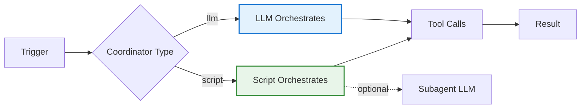

## Problem

LLM-driven workflows are **non-deterministic**—even well-crafted prompts can produce unpredictable results. For some tasks (e.g., adding emoji to Slack messages based on PR status), occasional errors are unacceptable. But LLM workflows are fast to prototype and work well for many cases. You need both: **flexibility when experimenting** and **determinism when it matters**.

## Solution

Support both LLM-driven and code-driven workflows via a **configurable coordinator** parameter. Start with LLM for rapid prototyping, then migrate to code when you need determinism.

**Coordinator configuration:**

```yaml
# LLM-driven (default, fastest to iterate)
coordinator: llm

# Code-driven (deterministic, goes through code review)
coordinator: script
coordinator_script: scripts/pr_merged.py
```

**When `coordinator: llm`:**
- Handler selects configuration based on trigger
- Loads prompt, tools, virtual files
- LLM decides which tools to call
- Handler coordinates tool calls based on LLM responses

**When `coordinator: script`:**
- Custom Python script controls workflow
- Same access to tools, trigger data, virtual files as LLM
- Can invoke LLM via subagent tool when explicitly needed
- Goes through code review like any other software

**Progressive enhancement approach:**

1. **Start with LLM** - Fast to prototype, works for many cases
2. **Observe failures** - Track where non-determinism causes problems
3. **Rewrite to script** - Use Claude Code to one-shot rewrite prompt → code
4. **Ship with confidence** - Code goes through review, deterministic behavior



## How to use it

**Implementation:**

```python
# Handler that supports both coordinators
def execute_workflow(trigger, config):
    if config.get("coordinator") == "script":
        # Code-driven: deterministic, goes through review
        script = config["coordinator_script"]
        return run_python_script(script, trigger)
    else:
        # LLM-driven: flexible, fast iteration
        prompt = load_prompt(config["prompt"])
        tools = load_tools(config["tools"])
        return llm_orchestrate(trigger, prompt, tools)
```

**Script has same capabilities as LLM:**

```python
# scripts/pr_merged.py
def handler(trigger, tools, virtual_files, subagent):
    # Same tools, trigger data, virtual files as LLM
    messages = tools.slack.get_messages(limit=10)

    pr_urls = extract_pr_urls(messages)
    statuses = [tools.github.get_status(url) for url in pr_urls]

    for msg, status in zip(messages, statuses):
        if status in ["merged", "closed"]:
            tools.slack.add_reacji(msg, "merged")

    # Can use LLM selectively if needed
    # summary = subagent.summarize(statuses)
```

**When to use each:**

| Use **LLM-driven** when... | Use **Code-driven** when... |
|----------------------------|----------------------------|
| Prototyping new workflow | Errors are unacceptable |
| Logic may change frequently | Determinism required |
| Happy to tolerate occasional failures | Workflow is stable |
| Fast iteration matters | Need code review process |

**Migration path:**

1. Prototype with `coordinator: llm`
2. Deploy and observe failure modes
3. When failures are problematic, ask Claude Code: "Rewrite this workflow as a script"
4. Update config to `coordinator: script`
5. PR goes through review, merge with confidence

## Trade-offs

**Pros:**

- **Best of both worlds**: LLM flexibility when prototyping, code determinism when mature
- **Easy migration**: One-shot rewrite from prompt → script
- **Same capabilities**: Scripts have access to all tools, can still use LLM via subagent
- **Code review**: Critical workflows go through standard review process
- **Progressive enhancement**: Don't over-engineer from the start

**Cons:**

- **Two code paths**: Need to maintain both LLM and script handlers
- **Rewrite cost**: Time investment to migrate from LLM → script
- **Less dynamic**: Scripts are harder to change than prompts

**When NOT to use:**

- Purely deterministic tasks (just use code from start)
- Highly exploratory tasks where LLM is always needed

## References

* [Building an internal agent: Code-driven vs LLM-driven workflows](https://lethain.com/agents-coordinators/) - Will Larson (Imprint, 2025)
* Related: Code Mode MCP Tool Interface, Deterministic Security Scanning Build Loop
