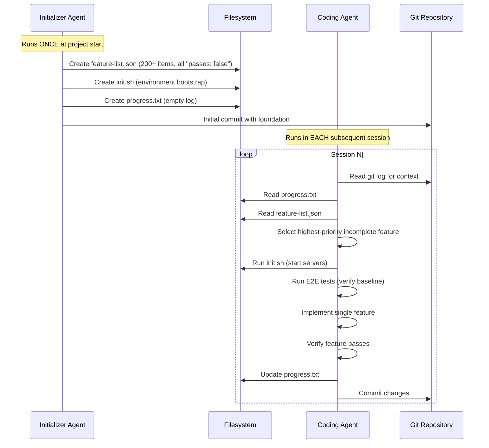

## Problem

Long-running agent projects face distinct failure modes at different lifecycle stages:

- **Project initialization** requires comprehensive setup: environment configuration, feature specification, test infrastructure, and progress tracking systems
- **Incremental development** requires reading prior context, selecting the next task, implementing, and verifying—repeatedly across many sessions
- Single-agent approaches either over-engineer each session (wasting setup time) or under-invest in foundations (leading to drift and confusion)
- Session boundaries create context loss, causing agents to restart from scratch or lose track of project state

## Solution

Implement a two-agent architecture with lifecycle-specialized responsibilities:

**1. Initializer Agent** (runs once at project start):

- Creates comprehensive feature list with all requirements
- Establishes progress tracking artifacts (e.g., `progress.txt`)
- Sets up environment bootstrap scripts (e.g., `init.sh`)
- Configures testing infrastructure
- Makes first git commit with foundational structure

**2. Maintainer/Coding Agent** (runs in subsequent sessions):

- Executes session bootstrapping ritual:
  1. Verify working directory (`pwd`)
  2. Read git logs and progress files
  3. Read feature list and select next incomplete feature
  4. Run bootstrap script to start services
  5. Run existing tests before implementing new features
- Works on one feature at a time
- Commits after each verified feature
- Updates progress artifacts



## How to use it

**Best for:**

- Projects requiring many sessions to complete (days/weeks of agent work)
- Complex applications with 50+ discrete features
- Scenarios where context loss between sessions is costly
- Teams using agents for sustained development, not one-shot tasks

**Implementation steps:**

1. **Design the Initializer prompt**: Focus on comprehensive upfront planning
   - Feature list with detailed acceptance criteria
   - Environment setup automation
   - Progress tracking file structure

2. **Design the Coding Agent prompt**: Focus on incremental progress
   - Session bootstrapping ritual (read context first)
   - Single-feature focus
   - Mandatory testing before marking complete
   - Commit discipline

3. **Define the handoff artifacts**:
   ```
   project/
   ├── feature-list.json    # All features with pass/fail status
   ├── progress.txt         # Running log of decisions and work
   ├── init.sh              # One-command environment startup
   └── .git/                # Descriptive commits as context
   ```

## Trade-offs

**Pros:**

- Clear separation of concerns between setup and execution
- Session bootstrapping ritual prevents context loss
- Mirrors effective human team practices (shift handoffs)
- Initializer creates consistent foundation for all future sessions
- Git history + progress files provide rich context for new sessions

**Cons:**

- Requires upfront investment in comprehensive feature specification
- Two different prompts/configurations to maintain
- Initializer must anticipate needs of Coding Agent
- Not suitable for exploratory or research-oriented projects
- Overhead is wasteful for small, single-session tasks

## References

* [Anthropic Engineering: Effective Harnesses for Long-Running Agents](https://www.anthropic.com/engineering/effective-harnesses-for-long-running-agents)
* Related: [Filesystem-Based Agent State](filesystem-based-agent-state.md)
* Related: [Proactive Agent State Externalization](proactive-agent-state-externalization.md)
