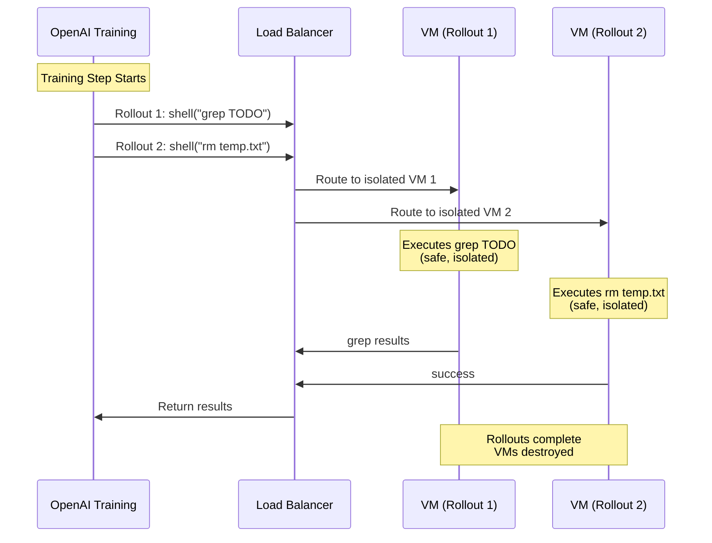

## Problem

During reinforcement learning training with tool-using agents, multiple rollouts execute simultaneously and may call destructive or stateful tools:

- **Cross-contamination**: One rollout's actions affect another rollout's environment
- **Destructive commands**: Agent might run `rm -rf`, corrupting shared state
- **State leakage**: File system changes persist across rollouts, creating inconsistent training data
- **Reward corruption**: If rollout B sees rollout A's side effects, reward signals become meaningless
- **Debugging nightmares**: Non-deterministic failures due to race conditions

Cognition faced this when training Devon's file planning agent: the agent had access to a `shell` tool that could run arbitrary commands like `grep`, `find`, or even `rm`. Running 32 parallel rollouts on shared infrastructure would cause chaos.

## Solution

**Spin up an isolated virtual machine (or container) for each RL rollout, ensuring complete environment isolation.**

**Architecture:**

1. **Rollout ID Tracking**: OpenAI's Agent RFT platform assigns unique IDs to each rollout
2. **VM/Container Mapping**: Your infrastructure maps rollout ID → dedicated VM
3. **Clean State**: Each VM starts fresh with identical filesystem, packages, and configuration
4. **Cleanup**: VMs are destroyed after rollout completes (success or failure)

**Key Components:**

- **VM Provisioning**: Fast VM creation (typically cloud instances or containers)
- **Bursty Scaling**: Handle 100s-500s of simultaneous VM requests at training step boundaries
- **State Isolation**: No shared filesystems or databases between VMs
- **Timeout Handling**: VMs auto-destroy after timeout to prevent resource leaks

```python
# Infrastructure setup (Cognition's approach)
from modal import Image, App, method
import uuid

# Base VM image with all dependencies
base_image = (
    Image.debian_slim()
    .apt_install("git", "build-essential")
    .pip_install("pandas", "numpy", "openai")
    .copy_local_dir("./corpus", "/workspace/corpus")  # Training data
)

app = App("agent-rft-tool-server")

@app.cls(
    image=base_image,
    cpu=2,
    memory=4096,
    timeout=600,  # 10 min per rollout max
)
class IsolatedToolExecutor:
    """
    Each instance gets its own isolated VM
    Spun up per-rollout during RL training
    """

    def __init__(self):
        """Initialize fresh state for this rollout"""
        self.rollout_id = None
        self.workspace = "/workspace"
        self.history = []

    @method()
    def initialize_rollout(self, rollout_id: str):
        """
        Called first when rollout starts
        Sets up isolated state for this specific rollout
        """
        self.rollout_id = rollout_id
        print(f"[{rollout_id}] Initialized isolated VM")

        # Create isolated working directory
        import os
        self.work_dir = f"{self.workspace}/rollout_{rollout_id}"
        os.makedirs(self.work_dir, exist_ok=True)

        return {"status": "ready", "rollout_id": rollout_id}

    @method()
    def execute_shell(self, rollout_id: str, command: str):
        """
        Execute shell command in isolated environment
        Safe because this VM is dedicated to this rollout
        """
        if rollout_id != self.rollout_id:
            raise ValueError(f"Rollout ID mismatch: {rollout_id} != {self.rollout_id}")

        import subprocess

        print(f"[{rollout_id}] Executing: {command}")

        # Even destructive commands are safe in isolated VM
        result = subprocess.run(
            command,
            shell=True,
            cwd=self.work_dir,
            capture_output=True,
            text=True,
            timeout=60
        )

        self.history.append({
            "command": command,
            "returncode": result.returncode,
            "stdout": result.stdout[:1000],  # Limit output
            "stderr": result.stderr[:1000]
        })

        return {
            "stdout": result.stdout,
            "stderr": result.stderr,
            "returncode": result.returncode
        }

    @method()
    def read_file(self, rollout_id: str, filepath: str):
        """Read file from corpus or workspace"""
        if rollout_id != self.rollout_id:
            raise ValueError(f"Rollout ID mismatch")

        # Files are isolated to this VM
        full_path = f"{self.workspace}/{filepath}"

        try:
            with open(full_path, 'r') as f:
                content = f.read()
            return {"content": content, "error": None}
        except Exception as e:
            return {"content": None, "error": str(e)}

    @method()
    def search_corpus(self, rollout_id: str, query: str):
        """Semantic search over documents"""
        if rollout_id != self.rollout_id:
            raise ValueError(f"Rollout ID mismatch")

        # Search implementation here...
        # Corpus is read-only, copied into VM at startup

        return {"results": [...]}

    @method()
    def cleanup(self, rollout_id: str):
        """
        Optional cleanup (Modal handles VM destruction automatically)
        """
        print(f"[{rollout_id}] Rollout complete, VM will be destroyed")
        return {"history": self.history}


# Tool endpoint configuration for OpenAI Agent RFT
tools_config = [
    {
        "name": "shell",
        "url": "https://your-app.modal.run/execute_shell",
        "headers": {"Authorization": "Bearer YOUR_TOKEN"}
    },
    {
        "name": "read_file",
        "url": "https://your-app.modal.run/read_file",
        "headers": {"Authorization": "Bearer YOUR_TOKEN"}
    },
    {
        "name": "search",
        "url": "https://your-app.modal.run/search_corpus",
        "headers": {"Authorization": "Bearer YOUR_TOKEN"}
    }
]
```

**Request Flow:**



## How to use it

**Phase 1: Infrastructure Setup**

Choose your isolation technology:

- **Modal/Lambda**: Serverless functions with container isolation (easiest)
- **Docker**: Containers per rollout (good balance)
- **Cloud VMs**: EC2/GCP instances per rollout (maximum isolation, slower)
- **Kubernetes Jobs**: K8s pods per rollout (production-grade)

**Phase 2: Implement Rollout ID Tracking**

```python
# All tool endpoints must accept and validate rollout_id
@app.post("/tool/{tool_name}")
async def execute_tool(tool_name: str, rollout_id: str, params: dict):
    # Get or create isolated environment for this rollout
    vm = get_or_create_vm(rollout_id)

    # Execute in isolated context
    result = vm.execute(tool_name, params)

    return result
```

**Phase 3: Handle Bursty Traffic**

Agent RFT sends traffic in bursts:

- **Training step boundary**: 100-500 simultaneous rollout requests
- **Tool call latency**: Brief pauses while agent thinks
- **Cleanup phase**: Mass VM destruction

Configure auto-scaling:

```python
# Modal example
@app.cls(
    image=base_image,
    concurrency_limit=500,  # Max concurrent VMs
    container_idle_timeout=60,  # Cleanup after 1 min idle
)
```

**Phase 4: Monitor Infrastructure**

Critical metrics:

- **VM provisioning time**: Should be <5 seconds
- **Failure rate**: Infrastructure errors → zero reward → training collapse
- **Resource leaks**: VMs not cleaning up properly
- **Cost**: 500 VMs * training duration can get expensive

Sam's advice from Cognition:

> "Sometimes like let's say there's infrastructure error and the VMs fail... that does lead to the training kind of collapsing because even the model might have done something good, it got a zero reward."

**Set up monitoring:**

```python
import logging

logger = logging.getLogger("rollout-infra")

@method()
def execute_tool(self, rollout_id: str, tool: str, params: dict):
    try:
        result = self._execute(tool, params)

        # Log success
        logger.info(f"rollout={rollout_id} tool={tool} status=success")

        return result

    except Exception as e:
        # Log failure - critical for debugging training collapse
        logger.error(
            f"rollout={rollout_id} tool={tool} status=error error={str(e)}"
        )

        # Return error to model (don't give zero reward for infra issues)
        return {
            "error": "Infrastructure error, please retry",
            "retryable": True
        }
```

## Real-World Example: Cognition Devon

**Challenge**: Train Devon's file planning agent with shell tool access

**Requirements:**

- Agent uses `shell` tool to run `grep`, `find`, `ls`, etc.
- Need to prevent one rollout from affecting others
- Must handle potentially destructive commands safely

**Solution:**

1. **Modal Infrastructure**: Used Modal for fast VM provisioning
2. **Isolation**: Each rollout gets dedicated VM with fresh filesystem
3. **Corpus Replication**: Copied entire repository corpus into each VM
4. **Scaling**: Handled 500+ simultaneous VMs during training bursts

**Results:**

- Safe training despite shell access
- No cross-contamination between rollouts
- Deterministic behavior for reward calculation
- Successfully trained agent to reduce planning from 8-10 tool calls → 4 tool calls

**Infrastructure Lessons Learned:**

- **Bursty traffic is real**: "At the beginning of every rollout they would send us like 500 new rollout requests"
- **Monitor failures**: Infrastructure errors causing zero rewards can collapse training
- **Reuse production code**: "We use VMs because we could reuse the production Devon VM info"

## Trade-offs

**Pros:**

- **Complete isolation**: No cross-contamination between rollouts
- **Safety**: Destructive commands can't affect other rollouts or host system
- **Determinism**: Consistent environment for reliable reward signals
- **Production parity**: Can use exact same environment as production

**Cons:**

- **Cost**: 100s of VMs running simultaneously can be expensive
- **Provisioning time**: VM startup adds latency (containers are faster)
- **Complexity**: Requires robust infrastructure and monitoring
- **Scaling limits**: Cloud provider quotas may limit concurrent VMs
- **Failure modes**: Infrastructure issues can cause training collapse

## Alternatives

**Shared Infrastructure with Namespacing:**

- Use filesystem namespacing (chroot, Docker volumes)
- Cheaper but less isolation
- Risk of leakage through shared resources

**Database-Backed State:**

- Store state in database keyed by rollout ID
- Simpler infrastructure
- Doesn't work for filesystem-based tools

**Optimistic Isolation:**

- Let rollouts share infrastructure
- Detect and discard contaminated rollouts
- Wastes compute on discarded rollouts

## References

- [OpenAI Build Hour: Agent RFT - Cognition Case Study (November 2025)](https://youtu.be/1s_7RMG4O4U)
- [Modal Documentation](https://modal.com/docs)
- [Docker Isolation Best Practices](https://docs.docker.com/engine/security/)
- Related patterns: Agent Reinforcement Fine-Tuning, Virtual Machine Operator Agent
