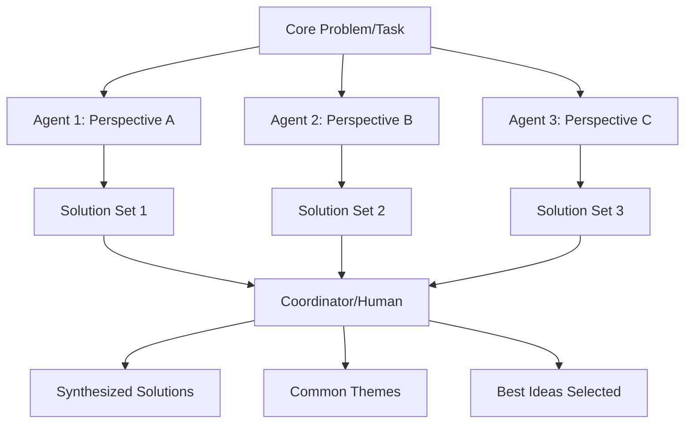

## Problem
For complex problems or creative ideation, a single AI agent instance might get stuck in a local optimum or fail to explore a diverse range of solutions. Generating a breadth of ideas can be challenging for a sequential, monolithic process.

## Solution
Employ a multi-agent approach for brainstorming and idea generation. This involves:
1.  Defining a core problem or task.
2.  Spawning multiple independent (or semi-independent) AI agent instances.
3.  Assigning each agent the same initial task or slightly varied perspectives on the task.
4.  Allowing each agent to work in parallel to generate ideas, solutions, or approaches.
5.  Collecting the outputs from all agents.
6.  Optionally, a coordinating agent or a human user can then synthesize these diverse outputs, identify common themes, or select the most promising ideas for further development.

This pattern leverages parallelism to explore a wider solution space and can lead to more creative or robust outcomes than a single agent might produce alone.

## Example (parallel brainstorming)

## Example
-   "Use 3 parallel agents to brainstorm ideas for how to clean up `@services/aggregator/feed_service.cpp`." (from Claude Code examples)

## References
-   Inspired by the example of using parallel agents for brainstorming in "Mastering Claude Code: Boris Cherny's Guide & Cheatsheet," section III.

[Source](https://www.nibzard.com/claude-code)