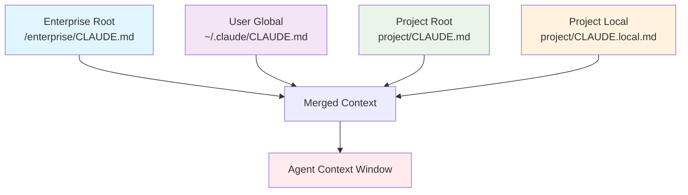

## Problem
AI agents require relevant context to perform effectively. Providing this context manually in every prompt is cumbersome, and a one-size-fits-all global context is often too broad or too narrow. Different projects, users, and organizational policies may require different baseline information for the agent.

## Solution
Implement a system of layered configuration files (e.g., named `CLAUDE.md` or a similar convention) that the agent automatically discovers and loads based on their location in the file system hierarchy. This allows for:

-   **Enterprise/Organizational Context:** A root-level file (`/<enterprise_root>/CLAUDE.md`) for policies or information shared across all projects in an organization.
-   **User-Specific Global Context:** A file in the user's home directory (`~/.claude/CLAUDE.md`) for personal preferences, common tools, or notes shared across all their projects.
-   **Project-Specific Context:** A file within the project's root directory (`<project_root>/CLAUDE.md`), typically version-controlled, for project-specific instructions, architectural overviews, or key file descriptions.
-   **Project-Local Context:** A local, non-version-controlled file (`<project_root>/CLAUDE.local.md`) for individual overrides, temporary notes, or secrets relevant to the project for that user.

The agent intelligently merges or prioritizes these context layers, providing a rich, tailored baseline of information without manual intervention in each query.

## Example (configuration hierarchy)

## References
- Based on the `CLAUDE.md` system described in "Mastering Claude Code: Boris Cherny's Guide & Cheatsheet," section IV.

[Source](https://www.nibzard.com/claude-code)