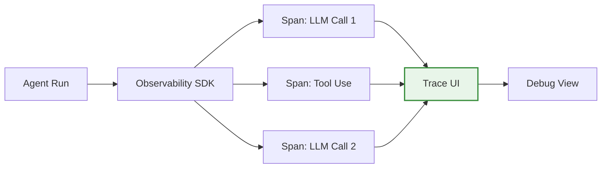

## Problem

Agents introduce **non-determinism**—the same input can produce different outputs. When agents do something sub-optimal, users flag it as a "bug" even if it's just prompt ambiguity. Debugging these issues requires tracing through complex multi-step workflows, but standard logging (CloudWatch, Lambda logs) is painful to navigate. Engineers need easy access to workflow execution details to debug quickly, or agents won't get adopted.

## Solution

Integrate **LLM observability platforms** (Datadog LLM Observability, LangSmith, etc.) that provide **span-level tracing** of agent workflows. Instead of spelunking through raw logs, get a visual UI showing each step of the agent's execution.

**Key capabilities:**

- **Span visualization**: See each LLM call, tool use, and intermediate result
- **Workflow linking**: Trace from user input through all sub-steps to final output
- **Dashboarding**: Aggregate metrics on cost, latency, success rates
- **Accessible debugging**: Non-engineers can debug without log access

**Evolution from standard logging:**

1. **Print to stdout** → Captured in Lambda logs (hard to access)
2. **Slack channel** → Post run summary + AWS log link (better, still spelunking)
3. **LLM observability** → Visual span tracing, easy navigation



## How to use it

**Integration steps:**

1. **Choose observability platform**: Datadog LLM Observability, LangSmith, Arize, etc.
2. **Install SDK**: Add to your agent code (often 1-2 lines)
3. **Configure tracing**: Tag workflows, users, environments
4. **Access controls**: Give broader team access (not just engineers)

**Example with Datadog:**

```python
from ddtrace import tracer

# Automatically traces LLM calls
@tracer.wrap("agent_workflow")
def run_agent(query):
    result = agent.run(query)
    # Each LLM call, tool use becomes a span
    return result
```

**Best practices:**

- **Tag everything**: Workflow name, user ID, environment (prod/staging)
- **Link to dashboards**: Make observability UI discoverable from chat
- **Share access**: Don't restrict to eng org; workflow creators need visibility
- **Monitor aggregate metrics**: Track success rates, latency, costs over time

## Trade-offs

**Pros:**

- **Fast debugging**: Navigate complex workflows visually
- **Accessible**: Non-engineers can debug without log permissions
- **Aggregated metrics**: See patterns across many runs
- **Span-level detail**: Drill into any step of execution

**Cons:**

- **Vendor dependency**: Locked into observability platform
- **Cost**: Enterprise observability can be expensive
- **Overhead**: Adds latency (usually minimal)
- **Access control**: Balancing visibility with security

**When NOT to use:**

- Simple, deterministic tools (no agent behavior)
- Single-step operations (standard logs suffice)
- Budget constraints preventing observability spend

## References

* [Building an internal agent: Logging and debugability](https://lethain.com/agents-logging/) - Will Larson (Imprint, 2025)
* Datadog LLM Observability documentation
* LangSmith documentation
* Related: Agent-First Tooling and Logging, Chain-of-Thought Monitoring & Interruption
