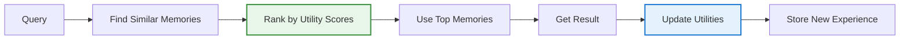

## Problem

LLMs struggle with **runtime self-evolution** due to the stability-plasticity dilemma:

- **Fine-tuning**: Computationally expensive and prone to catastrophic forgetting
- **RAG/memory systems**: Rely on semantic similarity that retrieves noise
- **No utility learning**: Can't distinguish high-value strategies from semantically similar but ineffective ones

Standard retrieval assumes "similar implies useful," but that's often wrong. A semantically relevant past solution might actually be a bad approach for the current task.

## Solution

**MemRL** adds learned "utility scores" to episodic memory, so agents learn from experience which memories actually lead to success—without modifying the model.

**Core idea:** Instead of just retrieving by similarity, rank memories by how well they've worked in the past.

**Memory triplet structure:**

- **Intent**: What the user asked for (embedded)
- **Experience**: What the agent tried (solution trace)
- **Utility**: How well it worked (learned score, updated over time)

**Two-phase retrieval:**

1. **Phase A - Semantic filter**: Find semantically similar memories
2. **Phase B - Utility ranking**: Re-rank by learned utility scores

This filters out "distractor" memories that look relevant but historically lead to poor outcomes.



## How to use it

**Basic implementation:**

1. **Store experiences with utility scores**

   ```python
   memory_bank.append({
       "intent": embed(query),
       "experience": solution_trace,
       "utility": 0.5  # initial score, learned over time
   })
   ```

2. **Retrieve with utility ranking**

   ```python
   # First: filter by similarity
   candidates = similar_memories(query, threshold=0.7)

   # Then: re-rank by utility
   ranked = sorted(candidates, key=lambda m: m.utility, reverse=True)
   context = ranked[:k]
   ```

3. **Update utilities based on outcomes**

   ```python
   reward = 1 if success else 0
   for mem in retrieved_contexts:
       mem.utility += learning_rate * (reward - mem.utility)
   ```

**Why this works:**
- Successful memories get higher scores, retrieved more often
- Failed memories get downranked, even if semantically similar
- Frozen LLM stays stable; only memory utilities evolve
- Agent self-improves through runtime experience

## Trade-offs

**Pros:**

- No catastrophic forgetting (frozen LLM)
- Self-improves from experience
- Filters out "look-alike" bad solutions
- No retraining needed

**Cons:**

- Need reliable success/failure signals
- Memory overhead grows over time
- Cold start: needs episodes to learn
- More complex than basic RAG

**When to use:**
- Multi-step tasks with clear success signals
- Reusable problem-solving patterns
- Can't afford fine-tuning

**When NOT to use:**
- Single-turn queries
- No clear reward signals
- Highly diverse tasks (no patterns)

## References

* [Self-Evolving Agents via Runtime Reinforcement Learning on Episodic Memory](https://arxiv.org/html/2601.03192v1) - Shengtao Zhang, Jiaqian Wang, et al. (2025)
* Related: Episodic Memory Retrieval & Injection, Memory Synthesis from Execution Logs, Agent Reinforcement Fine-Tuning
