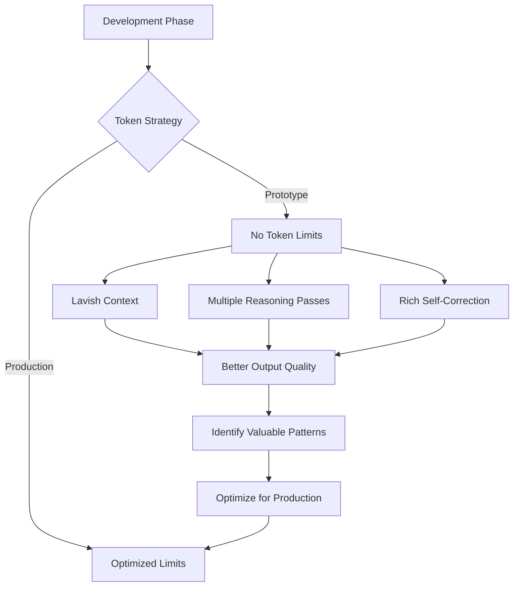

## Problem

Teams often optimize token spend too early, forcing prompts and context windows into tight constraints before they understand what high-quality behavior looks like. Early compression hides failure modes, reduces reasoning depth, and can lock in mediocre workflows that are cheap but unreliable.

## Solution

During discovery and prototyping, relax hard token limits and optimize for learning velocity. Allow richer context, deeper deliberation, and multiple critique passes to discover what a strong solution path actually requires. After the behavior is stable, measure where context can be compressed without degrading outcomes.

This pattern treats cost optimization as a second phase, not the first objective.

## Example (token budget approach)

## How to use it

- Use this during pattern discovery, architecture design, and early benchmark creation.
- Instrument token usage and quality scores from day one so later optimization has data.
- Set a temporary spend ceiling per experiment while intentionally allowing larger contexts.
- Transition to cost-tuned prompts only after quality thresholds are repeatable.

## Trade-offs

* **Pros:** Faster insight discovery, better baseline quality, and fewer premature architecture decisions.
* **Cons:** Higher short-term inference cost and risk of delaying production-grade efficiency work.

## References

- Raising An Agent - Episode 2 cost discussion—$1000 prototype spend justified by productivity.

[Source](https://www.nibzard.com/ampcode)
