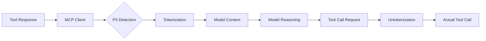

## Problem

AI agents often need to process workflows involving personally identifiable information (PII) such as emails, phone numbers, addresses, or financial data. However, sending raw PII through the model's context creates privacy risks and compliance concerns. Organizations need agents to orchestrate data workflows without exposing sensitive information to the LLM.

## Solution

Implement an interception layer in the Model Context Protocol (MCP) client that automatically tokenizes PII before it reaches the model, and untokenizes it when making subsequent tool calls.

**Architecture:**



**Flow:**

1. **Interception**: When tools return data, MCP client intercepts responses
2. **Detection**: Identify PII using pattern matching or classification models
3. **Tokenization**: Replace real values with placeholders
   - `john.doe@company.com` → `[EMAIL_1]`
   - `(555) 123-4567` → `[PHONE_1]`
   - `123-45-6789` → `[SSN_1]`
4. **Model reasoning**: Agent works with tokenized placeholders
5. **Untokenization**: When agent makes tool calls with placeholders, MCP client substitutes real values back

**Example workflow:**

```python
# Tool returns customer data
customer = get_customer(id="C123")
# Raw: {"name": "John Doe", "email": "john@example.com", "phone": "555-1234"}

# MCP client tokenizes before sending to model
# Context sees: {"name": "[NAME_1]", "email": "[EMAIL_1]", "phone": "[PHONE_1]"}

# Agent reasons with tokens
"Send welcome email to [EMAIL_1] with link for [NAME_1]"

# MCP client untokenizes for tool execution
send_email(
    to="john@example.com",  # Real value substituted
    body="Welcome John Doe, here's your link..."  # Real value substituted
)
```

## How to use it

**Best for:**

- Workflows processing customer data, HR records, medical information
- Multi-step automation involving PII
- Compliance-sensitive environments (GDPR, HIPAA, CCPA)
- Agents that coordinate data flows without needing to "see" raw PII

**Implementation requirements:**

1. **PII detection layer:**
   - Regex patterns for common PII (email, phone, SSN, credit cards)
   - Named entity recognition models for names, addresses
   - Custom rules for domain-specific sensitive data

2. **Token mapping storage:**
   - Secure mapping of tokens to real values
   - Session-scoped or request-scoped lifetime
   - Encryption at rest if persistent

3. **Untokenization in tool calls:**
   - Scan outgoing tool call parameters
   - Replace placeholders with real values before execution
   - Maintain referential integrity (same placeholder → same value)

**Integration point:**

Most effective when implemented in the MCP client layer, so it's transparent to both the agent (sees tokens) and tools (see real values).

## Trade-offs

**Pros:**

- Prevents raw PII from entering model context
- Agents can orchestrate sensitive workflows without seeing data
- Enables audit trails that don't contain PII
- Reduces compliance risk and regulatory burden
- Transparent to agent reasoning (works with placeholders)

**Cons:**

- Adds complexity to MCP client implementation
- PII detection must be accurate (false positives/negatives)
- Doesn't protect against PII inference (model might deduce sensitive info)
- Requires secure token mapping storage
- May complicate debugging (need to map tokens back for troubleshooting)
- Pattern matching can miss novel PII formats

**Limitations:**

- Doesn't prevent the model from learning patterns about PII structure
- Won't catch domain-specific sensitive data without custom rules
- Contextual PII (e.g., "my address is...") may leak before tokenization
- Not a substitute for proper access controls and encryption

## References

* Anthropic Engineering: Code Execution with MCP (2024)
* GDPR Guidelines on Pseudonymization
* NIST Privacy Framework
