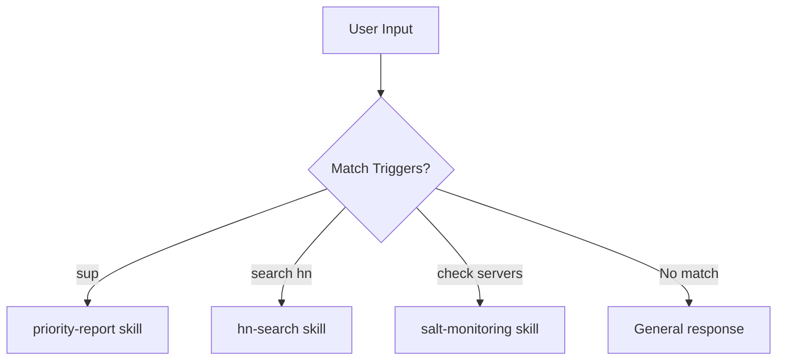

## Problem

Agents with many skills face a routing problem: given a user's natural language input, which skill should handle it? Solutions like embedding-based similarity or LLM classification work but are opaque—users don't know what phrases will activate which capabilities.

Additionally, agents may have skills that should activate *proactively* (without explicit request) when certain topics arise, but without explicit trigger lists, the agent may miss opportunities or activate inappropriately.

## Solution

Define an explicit **trigger vocabulary** for each skill: a list of phrases, keywords, and patterns that should activate that skill. Document these triggers visibly so both humans and agents know the activation criteria.

```yaml
# Skill definition with explicit triggers
skill: priority-report
description: Generate prioritized task report

triggers:
  exact: ["sup", "priority report", "standup prep"]
  contains: ["what should I work on", "what's pending", "my tasks"]
  patterns: ["what.*on my plate", "action items"]

proactive: true  # Activate without explicit request when triggers match
```



**Key components:**

1. **Trigger lists**: Explicit phrases per skill, documented in skill definitions
2. **Proactive flag**: Whether skill should auto-activate on trigger match
3. **Priority ordering**: When multiple skills match, which takes precedence
4. **User visibility**: Triggers documented so users learn the vocabulary

## How to use it

**Skill documentation format:**

```markdown
## Priority Report

Use the `priority-report` skill when user asks about:

- What they need to work on next
- Priority tasks or action items
- Outstanding reviews, PRs, or issues

**Proactive triggers:** "sup", "priority report", "what should I work on",
"task overview", "standup prep", "my tasks", "what's pending"

**Script:** `~/.claude/skills/priority-report/scripts/priority-report.sh`
```

**Implementation approaches:**

1. **Documentation-based** (simplest): List triggers in CLAUDE.md or skill docs; agent reads and matches
2. **Config-based**: YAML/JSON trigger definitions loaded at startup
3. **Hybrid**: LLM matches against documented triggers, falls back to semantic similarity

**Trigger design guidelines:**

- **Short phrases**: "sup", "check mail", "my tasks" (1-3 words)
- **Question patterns**: "what should I...", "where did..."
- **Domain keywords**: Platform names, technical terms
- **Casual variants**: "sup" alongside "priority report"
- **Avoid overlap**: Don't reuse triggers across skills

**Example trigger vocabulary:**

| Skill | Triggers |
|-------|----------|
| priority-report | "sup", "my tasks", "standup prep", "what's pending" |
| hn-search | "search hn", "hacker news", "find on hn" |
| magic-cafe | "magic trick", "what's hot in magic", "magic forum" |
| email-triage | "triage inbox", "urgent emails", "prioritize mail" |

## Trade-offs

**Pros:**

- **Transparent**: Users can learn trigger phrases, feel in control
- **Predictable**: Same input always routes to same skill
- **Debuggable**: Easy to see why a skill activated (or didn't)
- **Fast**: String matching faster than embedding lookup
- **Documentable**: Triggers become part of user-facing docs
- **Proactive**: Agent can jump in when relevant topics arise

**Cons:**

- **Rigid**: Misses paraphrases not in trigger list
- **Maintenance**: Must update triggers as vocabulary evolves
- **Conflicts**: Multiple skills may want same triggers
- **Cultural/language bias**: Triggers may not translate
- **Discovery**: Users must learn the vocabulary (or read docs)

**Hybrid approach:**

Combine explicit triggers with semantic fallback:
1. Check explicit trigger matches first (fast, predictable)
2. If no match, use embedding similarity (flexible, slower)
3. Log unmatched inputs to discover new trigger candidates

## References

* Claude Code CLAUDE.md skill documentation pattern
* Intent classification in conversational AI
* Chatbot trigger/response pattern matching
* Slack workflow triggers
