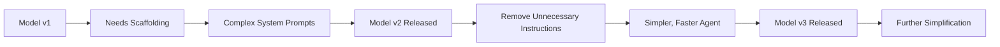

## Problem

Agent scaffolding built for older models becomes unnecessary overhead as models improve:

- **Prompt bloat**: System prompts accumulate instructions that newer models don't need
- **Over-engineered flows**: Complex orchestration for tasks models can now handle directly
- **Wasted tokens**: Paying for instructions the model already knows
- **Slower execution**: Unnecessary steps add latency
- **Maintenance burden**: More code to maintain for diminishing benefit

Models improve faster than scaffolding is removed, creating technical debt.

## Solution

**Actively remove scaffolding** as models become more capable. Regularly audit system prompts, orchestration logic, and agent architecture to eliminate what newer models have internalized.

**Core principle**: Push complexity into the model itself rather than external scaffolding.



**Example evolution:**

```pseudo
# Claude Opus 4.1 (older model)
system_prompt = """
When writing code:
1. First check if file exists
2. Read current contents
3. Plan your changes
4. Make minimal edits
5. Verify syntax
... [2000 more tokens of instructions]
"""

# Claude Sonnet 4.5 (newer model)
system_prompt = """
Write clean, tested code.
"""  # Model already knows the steps
```

## How to use it

**Regular audit process:**

1. **Track model releases**: Note when new models become available
2. **Test simplified prompts**: Remove instructions and see if quality degrades
3. **Measure token usage**: Quantify savings from prompt reduction
4. **A/B test scaffolding**: Compare outcomes with and without orchestration steps
5. **Delete what works**: If model performs equally without scaffolding, remove it

**What to look for:**

- Instructions that are "obvious" to humans (likely obvious to advanced models)
- Multi-step workflows models now handle in one turn
- Error-handling that models build in automatically
- Format specifications models infer from context
- Planning steps models do internally with extended thinking

**Real example from Claude Code:**

> "I just deleted like 2,000 tokens or something from the system prompt yesterday. Just because Sonnet 4.5 doesn't need it anymore. But Opus 4.1 did need it." —Boris Cherny

**Boundary evolution:**

> "The boundary changes with every model in a surprising way, where the newer models, they're more intelligent. So the boundary of what you need plan mode for got pushed out a little bit." —Boris Cherny

## Trade-offs

**Pros:**

- **Reduced token costs**: Shorter prompts = cheaper inference
- **Faster execution**: Less processing overhead
- **Simpler maintenance**: Less code/prompts to manage
- **Future-proof**: Embraces model capabilities rather than fighting them
- **Better performance**: Models often work better with less hand-holding

**Cons:**

- **Requires testing**: Must validate that quality doesn't degrade
- **Version management**: May need different configs for different models
- **Loss of explicit control**: Less visibility into model's internal reasoning
- **Risk of regression**: Removing too much can hurt performance
- **Documentation debt**: May lose understanding of why scaffolding was added

**Strategic considerations:**

- **When to remove**: After new model is proven stable in production
- **How much to remove**: Start conservative, measure, iterate
- **What to keep**: Domain-specific knowledge models can't know
- **Migration path**: Support multiple model versions during transition

## References

* Boris Cherny: "I just deleted like 2,000 tokens or something from the system prompt yesterday. Just because Sonnet 4.5 doesn't need it anymore. But Opus 4.1 did need it."
* Boris Cherny: "There's this frontier where you need to give the model a hard enough task to really push the limit... I think this is a general trend of stuff that used to be scaffolding with a more advanced model, it gets pushed into the model itself. The model kind of tends to subsume everything over time."
* Cat Wu: "We build most things that we think would improve Claude Code's capabilities, even if that means we'll have to get rid of it in three months. If anything, we hope that we will get rid of it in three months."
* [AI & I Podcast: How to Use Claude Code Like the People Who Built It](https://every.to/podcast/transcript-how-to-use-claude-code-like-the-people-who-built-it)
