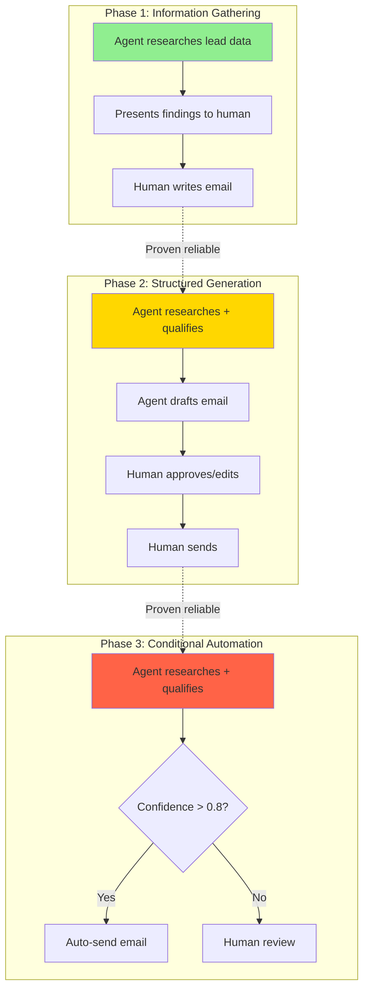

## Problem

Organizations deploy AI agents with overly ambitious capabilities from day one, leading to:

- Unreliable outputs when agents tackle tasks beyond current model capabilities
- Failed implementations that damage stakeholder confidence
- Complex reasoning tasks producing inconsistent results
- Wasted engineering effort building infrastructure for capabilities models can't yet deliver
- Safety risks from autonomous execution of high-stakes operations

The gap between theoretical agent capabilities and practical reliability creates deployment failures.

## Solution

Design agent systems to start with low-complexity, high-reliability tasks and progressively unlock more complex capabilities as models improve and trust is established. Match task complexity to current model capabilities rather than building to theoretical potential.

**Core principles:**

**Start with proven sweet spots:**

- Low cognitive load tasks with high repetition
- Tasks "too dynamic for traditional automation, but predictable enough for AI to handle reliably"
- Information gathering and synthesis over complex reasoning
- Well-defined success criteria

**Define capability tiers:**

```
Tier 1 (Deploy immediately):

- Data entry and research
- Content categorization
- Information extraction
- Template-based generation

Tier 2 (Unlock with validation):

- Multi-step workflows with human gates
- Conditional logic with structured outputs
- Integration with multiple tools
- Personalization and adaptation

Tier 3 (Future unlock):

- Autonomous decision-making
- Complex reasoning chains
- Creative problem-solving
- Novel task generalization
```

**Progressive unlock mechanisms:**

- Performance metrics trigger capability expansion
- Human review gates before promoting to higher tiers
- A/B testing new capabilities against baselines
- Gradual rollout with monitoring

**Example workflow evolution:**



## How to use it

**When to apply:**

- Deploying agents into production environments
- Building internal automation tools
- Customer-facing agent applications
- High-stakes or regulated domains
- New agent capabilities with unproven reliability

**Implementation approach:**

**1. Classify task complexity:**

```python
class TaskComplexity:
    LOW = {
        'cognitive_load': 'minimal',
        'steps': 1-3,
        'tools': 0-2,
        'reasoning_depth': 'shallow',
        'error_impact': 'low'
    }

    MEDIUM = {
        'cognitive_load': 'moderate',
        'steps': 4-8,
        'tools': 2-5,
        'reasoning_depth': 'multi-step',
        'error_impact': 'medium'
    }

    HIGH = {
        'cognitive_load': 'significant',
        'steps': '8+',
        'tools': '5+',
        'reasoning_depth': 'deep/creative',
        'error_impact': 'high'
    }
```

**2. Define promotion criteria:**

```yaml
capability_gates:
  tier1_to_tier2:
    
- accuracy_threshold: 0.95
    - human_approval_rate: 0.90
    - volume_processed: 1000
    - time_in_production: 30_days

  tier2_to_tier3:
    
- accuracy_threshold: 0.98
    - human_override_rate: 0.05
    - volume_processed: 10000
    - stakeholder_confidence: high
```

**3. Implement capability flags:**

```typescript
class AgentCapabilities {
  constructor(private tier: 1 | 2 | 3) {}

  async processLead(lead: Lead) {
    const research = await this.research(lead); // Tier 1

    if (this.tier >= 2) {
      const qualification = await this.qualify(research);
      const email = await this.generateEmail(qualification);

      if (this.tier >= 3 && qualification.confidence > 0.8) {
        return this.autoSend(email); // Autonomous execution
      }

      return this.requestApproval(email); // Human gate
    }

    return this.presentFindings(research); // Tier 1 only
  }
}
```

**4. Monitor and promote:**

- Track success metrics per tier
- Review error patterns and edge cases
- Gradually expand agent authority
- Maintain rollback capability

**Prerequisites:**

- Clear success metrics for each capability tier
- Monitoring and observability infrastructure
- Stakeholder alignment on progression plan
- Fallback mechanisms for failures

## Trade-offs

**Pros:**

- **Risk mitigation:** Limits blast radius of agent errors
- **Stakeholder confidence:** Builds trust through proven reliability
- **Focused engineering:** Resources spent on proven capabilities
- **Graceful degradation:** System remains useful even at lower tiers
- **Model evolution readiness:** Architecture prepared for capability growth
- **Realistic expectations:** Aligns deployment with actual model performance

**Cons:**

- **Delayed value:** Full automation benefits realized over time, not immediately
- **Complexity:** Requires tier management and promotion logic
- **Maintenance overhead:** Multiple capability paths to test and maintain
- **Promotion friction:** Manual review of metrics and promotion decisions
- **User confusion:** Inconsistent capabilities across deployment phases
- **Engineering investment:** Building infrastructure for future capabilities

**Balancing approaches:**

- Clearly communicate capability roadmap to stakeholders
- Automate tier promotion based on objective metrics
- Maintain simple mental model (what can the agent do today?)
- Design for capability growth from day one

## References

- [Vercel: What We Learned Building Agents](https://vercel.com/blog/what-we-learned-building-agents-at-vercel) - "Start with low-cognitive-load automation, then evolve as capabilities mature"
- [Anthropic: Building Effective Agents](https://www.anthropic.com/research/building-effective-agents) - Task complexity and model capability matching
- [OpenAI: GPT Best Practices](https://platform.openai.com/docs/guides/prompt-engineering) - Matching task complexity to model strengths
- Related patterns: [Progressive Autonomy with Model Evolution](progressive-autonomy-with-model-evolution.md), [Human-in-the-Loop Approval Framework](human-in-loop-approval-framework.md), [Spectrum of Control / Blended Initiative](spectrum-of-control-blended-initiative.md)
