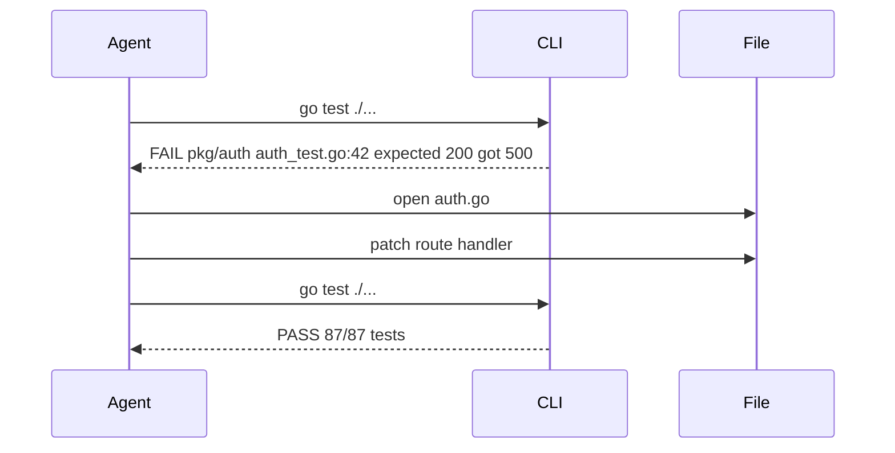

## Problem
Polishing a single prompt can't cover every edge-case; agents need ground truth to self-correct.

## Solution
Expose **iterative, machine-readable feedback**—compiler errors, test failures, linter output, screenshots—after every tool call.
The agent uses diagnostics to plan the next step, leading to emergent self-debugging.

Modern models like Claude Sonnet 4.5 are increasingly proactive in creating their own feedback loops by writing and executing short scripts and tests, even for seemingly simple verification tasks (e.g., using HTML inspection to verify React app behavior).

## Example

## References

* Raising An Agent - Episode 1 & 3 discussions on "give it errors, not bigger prompts."
* [Cognition AI: Devin & Claude Sonnet 4.5](https://cognition.ai/blog/devin-sonnet-4-5-lessons-and-challenges) - observes proactive testing behavior and custom script creation for feedback loops

[Source](https://www.nibzard.com/ampcode)