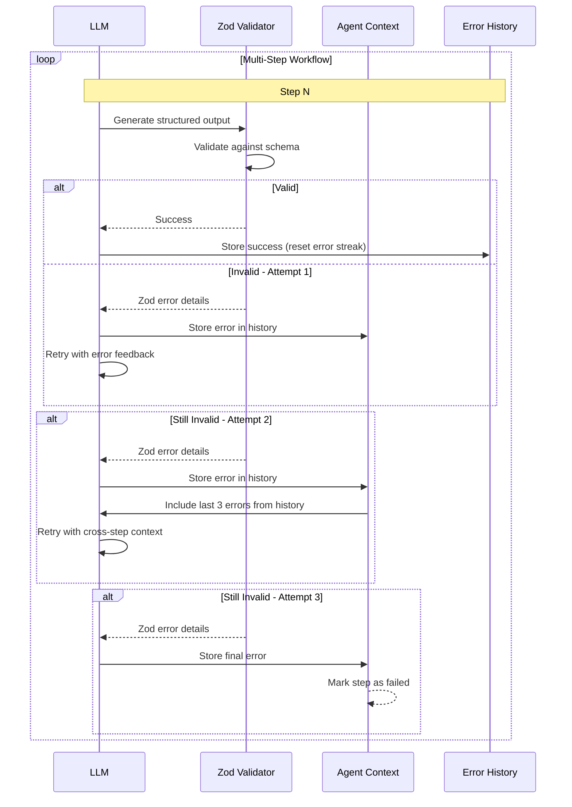

## Problem

LLMs don't always produce valid structured output matching the expected schema. Single-attempt validation leads to task failures even when retry would succeed.

The issues compound in multi-step workflows:

- **Schema violations**: LLM generates JSON that doesn't match the expected Zod/JSON Schema
- **One-and-done failure**: Single failed attempt terminates the entire workflow
- **No learning from mistakes**: Each step repeats the same errors independently
- **Wasted tokens**: Failed responses still consume context and cost money
- **Fragile workflows**: Flaky LLM outputs make agents unreliable

## Solution

Implement multi-step retry with detailed error feedback and cross-step error accumulation. The agent learns from its validation failures across the entire workflow.

### Core Mechanisms

**1. Multi-attempt retry with detailed feedback:**

```typescript
const maxAttempts = 3;

for (let attempt = 0; attempt < maxAttempts; attempt++) {
  const result = await ctx.llm.invokeStructured({ schema, options }, msgs);

  if (result.parsed) {
    return result.parsed;  // Success - exit retry loop
  }

  // Extract detailed Zod validation error
  const validationError = getZodError(result.rawText);

  // Store for cross-step learning
  ctx.schemaErrors?.push({
    stepIndex: currStep,
    error: validationError,
    rawResponse: result.rawText || "",
  });

  // Append error feedback for retry
  msgs = [
    ...msgs,
    { role: "assistant", content: result.rawText },
    { role: "user", content: `Validation errors:\n${validationError}\nPlease fix.` },
  ];
}

// If all attempts fail, throw with accumulated error context
throw new SchemaValidationError(`Failed after ${maxAttempts} attempts`, {
  stepIndex: currStep,
  errors: ctx.schemaErrors?.slice(-3)  // Last 3 errors
});
```

**2. Cross-step error accumulation:**

The agent maintains a rolling window of recent schema errors and includes them in subsequent LLM calls:

```typescript
interface AgentContext {
  schemaErrors: Array<{
    stepIndex: number;
    error: string;          // Zod validation error
    rawResponse: string;    // What the LLM actually output
    timestamp: number;
  }>;
}

// Before each step, append recent errors to guide the LLM
const recentErrors = ctx.schemaErrors
  .slice(-3)  // Keep only last 3 to avoid context bloat
  .map(e => `Step ${e.stepIndex}: ${e.error}`)
  .join('\n');

if (recentErrors) {
  msgs.push({
    role: "system",
    content: `Recent schema validation errors to avoid:\n${recentErrors}`
  });
}
```

**3. Structured feedback loop:**

Each retry iteration provides specific, actionable feedback:

```typescript
function getZodError(rawText: string): string {
  try {
    const parsed = JSON.parse(rawText);
    const result = zodSchema.safeParse(parsed);

    if (!result.success) {
      // Format Zod error clearly
      return result.error.issues
        .map(issue => {
          const path = issue.path.join('.');
          return `${path}: ${issue.message} (received: ${JSON.stringify(issue.received)})`;
        })
        .join('\n');
    }
  } catch {
    return "Failed to parse as JSON";
  }
}
```

### Architecture



## How to use it

### 1. Define Schemas with Zod

Use strict schemas with clear error messages:

```typescript
import { z } from 'zod';

const ActionSchema = z.object({
  type: z.enum(['click', 'fill', 'wait', 'scroll']),
  elementId: z.string().min(1, "elementId is required"),
  arguments: z.array(z.string()).optional(),
  confidence: z.number().min(0).max(1),
});

const StepOutputSchema = z.object({
  action: ActionSchema,
  reasoning: z.string().max(500, "Keep reasoning concise"),
});
```

### 2. Implement Retry Wrapper

```typescript
async function invokeWithRetry<T>(
  ctx: AgentContext,
  schema: z.ZodSchema<T>,
  messages: Message[],
  stepIndex: number
): Promise<T> {
  const maxAttempts = 3;

  for (let attempt = 0; attempt < maxAttempts; attempt++) {
    const result = await ctx.llm.invokeStructured({ schema }, messages);

    if (result.parsed) {
      // Success - clear errors for this step
      ctx.recentErrors = ctx.recentErrors.filter(e => e.stepIndex !== stepIndex);
      return result.parsed;
    }

    // Build detailed error message
    const error = formatZodError(result.error);
    const errorEntry = {
      stepIndex,
      error,
      rawResponse: result.rawText,
      attempt,
    };

    // Store for cross-step learning
    ctx.schemaErrors.push(errorEntry);

    // Append feedback for retry
    messages = [
      ...messages,
      { role: "assistant", content: result.rawText },
      { role: "user", content: `Validation failed:\n${error}\nPlease fix and try again.` },
    ];
  }

  throw new Error(`Schema validation failed after ${maxAttempts} attempts`);
}
```

### 3. Inject Error Context

Before each step, inject recent errors to prevent repeating mistakes:

```typescript
function prepareMessagesForStep(
  ctx: AgentContext,
  stepIndex: number,
  task: string
): Message[] {
  const messages = [
    { role: "system", content: systemPrompt },
    { role: "user", content: task },
  ];

  // Add error history
  const recentErrors = ctx.schemaErrors
    .slice(-3)  // Last 3 errors
    .filter(e => e.stepIndex < stepIndex)  // Only from previous steps
    .map(e => `Step ${e.stepIndex}: ${e.error}`)
    .join('\n');

  if (recentErrors) {
    messages.push({
      role: "system",
      content: `Avoid these previous errors:\n${recentErrors}`,
    });
  }

  return messages;
}
```

### 4. Configure Agent Context

```typescript
interface AgentConfig {
  maxValidationAttempts: number;
  errorHistorySize: number;      // How many errors to keep
  crossStepErrorCount: number;   // How many to inject per step
}

const context: AgentContext = {
  schemaErrors: [],
  config: {
    maxValidationAttempts: 3,
    errorHistorySize: 10,
    crossStepErrorCount: 3,
  },
};
```

## Trade-offs

**Pros:**

- **Higher success rate**: 3-attempt retry significantly improves structured output reliability
- **Cross-step learning**: Agent avoids repeating mistakes across workflow
- **Detailed error feedback**: Zod errors guide LLM to specific fixes
- **Better debugging**: Error history provides diagnostic information
- **Configurable balance**: Can tune attempt count vs. cost/latency

**Cons:**

- **Increased latency**: Multiple LLM calls add delay when retries occur
- **Higher cost**: Failed attempts still consume tokens
- **Context bloat**: Error history consumes tokens if not limited
- **Not guaranteed**: Some LLMs struggle to correct from errors
- **Complexity**: Additional retry logic and error management

**Mitigation strategies:**

- Limit cross-step error window (last 3 errors) to control token usage
- Use caching to skip retries for repeated workflows
- Set per-step timeout to prevent runaway retries
- Log failures to improve prompts over time
- Consider using models with better structured output adherence

## References

- [HyperAgent GitHub Repository](https://github.com/hyperbrowserai/HyperAgent) - Original implementation (see `src/agent/tools/agent.ts` lines 424-509)
- [Zod Validation Documentation](https://zod.dev/) - Schema validation library
- Related patterns: [Structured Output Specification](structured-output-specification.md), [Action Caching & Replay](action-caching-replay.md)
