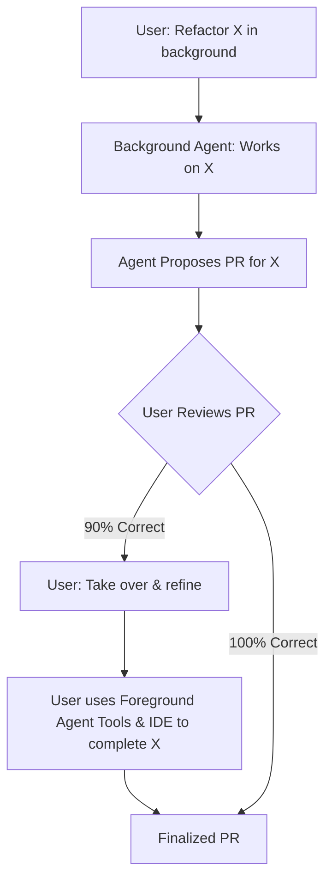

## Problem
While background agents can handle long-running, complex tasks autonomously, they might not achieve 100% correctness or perfectly match the user's nuanced intent. If an agent completes 90% of a task in the background but the remaining 10% requires human finesse, a clunky handoff process can negate the benefits of automation.

## Solution
Design the agent system to allow for a seamless transition from background (autonomous) agent work to foreground (human-in-the-loop or direct human control) work. This means:

1.  The background agent performs its task (e.g., generating a PR).
2.  The user reviews the agent's work.
3.  If the work is not entirely satisfactory (e.g., 90% correct), the user can easily "take control" or bring the task into their active foreground environment.
4.  The user can then utilize the same (or related) interactive AI tools and direct editing capabilities used in the foreground to refine, correct, or complete the remaining parts of the task.
5.  The context from the background agent's work should ideally be available to inform the foreground interaction.

This pattern ensures that developers can leverage the power of autonomous background processing while retaining the ability to easily intervene and apply their expertise for the final touches, without losing context or efficiency.

## Example

## References
- Aman Sanger (Cursor) at 0:06:52: "...if it's only 90% of the way there, you want to go in and then take control and and do the rest of it. And then you want to use, you know, the features of Cursor in order to do that. So really being able to quickly move between the background and the foreground is really important."