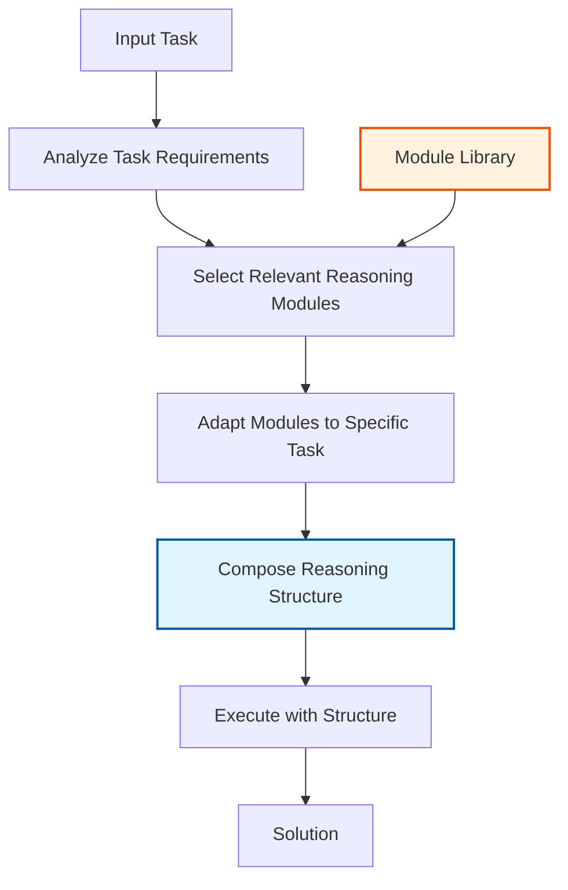

## Problem

Different reasoning tasks require different thinking strategies. While techniques like Chain-of-Thought (CoT) work well for some problems, they may be suboptimal for others. Current approaches typically use fixed reasoning patterns regardless of the specific problem at hand, leading to inefficient problem-solving and suboptimal performance on diverse tasks.

## Solution

Self-Discover enables LLMs to automatically discover and compose task-specific reasoning structures. The process involves:

1. **Task Analysis**: The LLM analyzes the problem to understand its requirements
2. **Strategy Selection**: From a set of atomic reasoning modules (like "break into steps", "think critically", "use examples"), the LLM selects relevant ones
3. **Structure Composition**: The selected modules are composed into a coherent reasoning structure tailored to the specific task
4. **Execution**: The problem is solved using the self-discovered structure

This approach allows the model to adapt its reasoning strategy to match the problem's unique characteristics, leading to significant performance improvements.

## Example

```python
class SelfDiscoverAgent:
    def __init__(self, llm):
        self.llm = llm
        self.reasoning_modules = [
            "Break the problem into smaller steps",
            "Think about similar problems you've seen",
            "Consider edge cases and exceptions",
            "Work backwards from the desired outcome",
            "Use concrete examples to test understanding",
            "Identify key constraints and requirements",
            "Consider multiple perspectives",
            "Check for logical consistency",
            "Simplify the problem first",
            "Look for patterns"
        ]
    
    def discover_reasoning_structure(self, task):
        # Step 1: Select relevant reasoning modules
        selection_prompt = f"""
        Task: {task}
        
        Available reasoning modules:
        {self.format_modules(self.reasoning_modules)}
        
        Select 3-5 most relevant modules for solving this task.
        Explain why each selected module is important for this problem.
        """
        selected_modules = self.llm.generate(selection_prompt)
        
        # Step 2: Adapt modules to the task
        adaptation_prompt = f"""
        Task: {task}
        Selected modules: {selected_modules}
        
        Adapt these generic modules into specific reasoning steps 
        tailored to this exact task. Make them concrete and actionable.
        """
        adapted_modules = self.llm.generate(adaptation_prompt)
        
        # Step 3: Compose into reasoning structure
        composition_prompt = f"""
        Task: {task}
        Adapted reasoning steps: {adapted_modules}
        
        Organize these into a coherent reasoning structure.
        Define the order of operations and how steps connect.
        Create a step-by-step reasoning plan.
        """
        reasoning_structure = self.llm.generate(composition_prompt)
        
        return reasoning_structure
    
    def solve_with_structure(self, task, reasoning_structure):
        solve_prompt = f"""
        Task: {task}
        
        Use this reasoning structure to solve the problem:
        {reasoning_structure}
        
        Follow each step carefully and show your work.
        """
        return self.llm.generate(solve_prompt)
    
    def self_discover_solve(self, task):
        # Discover optimal reasoning structure
        structure = self.discover_reasoning_structure(task)
        
        # Solve using discovered structure
        solution = self.solve_with_structure(task, structure)
        
        return {
            'reasoning_structure': structure,
            'solution': solution
        }
```



## Benefits

- **Task-Specific Optimization**: Reasoning approach matches problem requirements
- **Performance Gains**: Up to 32% improvement over Chain-of-Thought on challenging benchmarks
- **Interpretability**: Clear reasoning structure shows how the problem was approached
- **Transferability**: Discovered structures can be reused for similar problems

## Trade-offs

**Pros:**
- Significant performance improvements on diverse reasoning tasks
- More efficient than trying all reasoning strategies
- Creates reusable reasoning templates
- Adapts to novel problem types

**Cons:**
- Additional overhead for structure discovery phase
- Requires a diverse set of reasoning modules
- May over-engineer simple problems
- Structure quality depends on task analysis accuracy

## References

- [Self-Discover: Large Language Models Self-Compose Reasoning Structures (2024)](https://arxiv.org/abs/2402.03620)
- [Google DeepMind Research Blog](https://deepmind.google/research/)