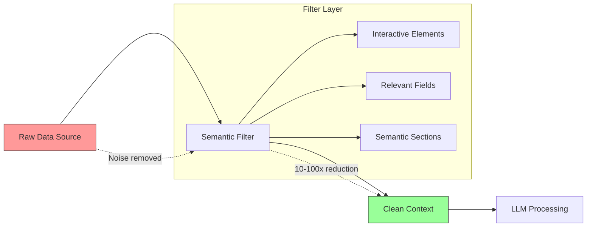

## Problem

Raw data sources are too verbose and noisy for effective LLM consumption. Full representations include invisible elements, implementation details, and irrelevant information that bloat context and confuse reasoning.

This creates several problems:

- **Token explosion**: Raw data exceeds context limits or becomes prohibitively expensive
- **Poor signal-to-noise**: LLM wastes reasoning capacity on irrelevant details
- **Slower inference**: More tokens = slower generation and higher costs
- **Confused reasoning**: Noise leads to hallucinations or wrong conclusions

The issue appears across domains:

- **Web scraping**: Full HTML DOM includes scripts, styles, tracking iframes
- **API responses**: JSON with nested metadata, internal fields, debug info
- **Document processing**: Headers, footers, navigation, boilerplate text
- **Code analysis**: Comments, whitespace, boilerplate code

## Solution

Extract only the semantic, interactive, or relevant elements from raw data. Filter out noise and provide the LLM with a clean representation that captures what matters for reasoning.

### Core Principle

**Don't send raw data to the LLM. Send semantic abstractions.**

### Example 1: Browser Accessibility Tree

Instead of full HTML DOM:

```html
<!-- Raw HTML (10,000+ tokens) -->
<html>
  <head>
    <script src="analytics.js"></script>
    <style>body { margin: 0; }</style>
  </head>
  <body>
    <div class="tracking-pixel" style="display:none"></div>
    <iframe src="ad-server.com"></iframe>
    <nav aria-label="Navigation">
      <a href="/">Home</a>
      <a href="/about">About</a>
    </nav>
    <main>
      <button id="login-button">Login</button>
      <input type="email" name="email" placeholder="Email" />
    </main>
    <footer>Copyright 2024</footer>
  </body>
</html>
```

Extract the accessibility tree (100-200 tokens):

```typescript
{
  "interactiveElements": [
    {
      "role": "link",
      "name": "Home",
      "xpath": "/html/body/nav/a[1]"
    },
    {
      "role": "link",
      "name": "About",
      "xpath": "/html/body/nav/a[2]"
    },
    {
      "role": "button",
      "name": "Login",
      "id": "login-button",
      "xpath": "/html/body/main/button"
    },
    {
      "role": "textbox",
      "name": "Email",
      "id": "email",
      "xpath": "/html/body/main/input"
    }
  ]
}
```

**Implementation:**

```typescript
// Use browser's built-in accessibility tree
const tree = await page.accessibility.snapshot({
  interestingOnly: true  // Only interactive elements
});

// Automatically filters:
// - Elements with aria-hidden="true"
// - Elements with display:none
// - Ad/tracking iframes by domain
// - Non-semantic divs and spans
```

### Example 2: API Response Filtering

Raw API responses often include internal metadata:

```json
// Raw API response (2,000 tokens)
{
  "data": {
    "users": [
      {
        "id": "123",
        "name": "Alice",
        "email": "alice@example.com",
        "internalFlags": ["vip", "beta_tester"],
        "metadata": {
          "created_at": "2024-01-01",
          "updated_at": "2024-01-15",
          "version": 42
        }
      }
    ]
  },
  "_internal": {
    "requestId": "req-abc123",
    "latency": 45,
    "cache": "HIT",
    "debug": []
  },
  "_links": {
    "self": "/users",
    "next": "/users?page=2"
  }
}
```

Filter to semantic fields only:

```typescript
function filterAPIResponse(response: any, schema: FieldSchema): any {
  const filtered = {};

  for (const field of schema.relevantFields) {
    if (response.data?.[field]) {
      filtered[field] = response.data[field];
    }
  }

  return filtered;
}

// Result (200 tokens):
{
  "users": [
    {
      "name": "Alice",
      "email": "alice@example.com"
    }
  ]
}
```

### Example 3: Document Section Extraction

Full documents include boilerplate:

```
FULL DOCUMENT:
====================
COMPANY CONFIDENTIAL [Header repeated on every page]
Copyright 2024 Acme Corp. All rights reserved.

[Legal disclaimer spanning 3 pages]

EXECUTIVE SUMMARY
====================
The Q4 revenue increased by 15%...

[Navigation menu]
- Table of Contents
- Index
- Glossary

ACTUAL CONTENT STARTS HERE
====================
Analysis of market trends shows...

[50 more pages]

APPENDIX
========
[Technical specifications]
[Legal disclaimers]
[Contact information - repeated]
```

Extract semantic sections:

```python
def extract_semantic_content(document: str) -> dict:
    # Skip headers, footers, navigation
    sections = {
        "executive_summary": extract_section(document, "EXECUTIVE SUMMARY"),
        "analysis": extract_section(document, "ANALYSIS"),
        "conclusions": extract_section(document, "CONCLUSIONS"),
    }

    # Remove boilerplate
    for section in sections.values():
        section = remove_legal_disclaimers(section)
        section = remove_navigation(section)

    return sections

# Result: Only the actual content, ~20% of original size
```

### Architecture



### Key Benefits

| Aspect | Raw Data | Semantic Filter | Improvement |
|--------|----------|-----------------|-------------|
| Token count | 10,000 | 100-1,000 | **10-100x reduction** |
| LLM reasoning | Confused by noise | Focused on signal | **Better decisions** |
| Cost | High | Low | **10-100x cheaper** |
| Latency | Slow | Fast | **2-5x faster** |
| Accuracy | Prone to errors | More reliable | **Higher success rate** |

## How to use it

### 1. Identify Semantic Elements

For your domain, determine what actually matters:

```typescript
// Web scraping: interactive elements only
const semanticElements = [
  'button', 'link', 'textbox', 'checkbox',
  'radio', 'combobox', 'slider'
];

// API responses: business data only
const relevantFields = [
  'name', 'email', 'status', 'amount'
];

// Documents: content sections only
const contentSections = [
  'executive_summary', 'analysis', 'conclusions'
];
```

### 2. Build Filter Layer

```typescript
class SemanticFilter {
  filter(data: any, domain: string): any {
    switch (domain) {
      case 'web':
        return this.filterAccessibilityTree(data);
      case 'api':
        return this.filterAPIResponse(data);
      case 'document':
        return this.filterDocumentSections(data);
    }
  }

  private filterAccessibilityTree(dom: any): any {
    // Only interactive elements with ARIA roles
    return dom
      .filter(el => el.interactive)
      .filter(el => !el.isHidden)
      .filter(el => !this.isAdIframe(el))
      .map(el => ({
        role: el.role,
        name: el.name,
        xpath: el.xpath
      }));
  }
}
```

### 3. Apply Before LLM Call

```typescript
// Wrong: Send raw data
const response = await llm.generate({
  prompt: `Analyze this page: ${rawHTML}`
});

// Right: Filter first
const filtered = semanticFilter.filter(rawHTML, 'web');
const response = await llm.generate({
  prompt: `Analyze this page: ${JSON.stringify(filtered)}`
});
```

### 4. Maintain Reference Mapping

Keep track of filtered-to-original mappings for execution:

```typescript
interface FilteredElement {
  semanticId: string;    // "login-button"
  originalRef: string;   // "frameIndex-backendNodeId"
  xpath: string;         // "/html/body/main/button"
}

// Filtered context uses semantic IDs
const filteredContext = [
  { id: "btn-1", name: "Login", role: "button" }
];

// Execution layer maps back to original references
const element = mapToOriginal(filteredContext[0].id);
await page.click(element.xpath);
```

## Trade-offs

**Pros:**

- **Dramatic token reduction**: 10-100x smaller context
- **Better LLM reasoning**: Focus on signal, not noise
- **Lower costs**: Fewer tokens = cheaper
- **Faster inference**: Smaller context = faster generation
- **Higher reliability**: Less confusion and hallucination

**Cons:**

- **Filter complexity**: Need to build and maintain filter logic
- **Information loss**: May remove context that matters
- **Domain-specific**: Filters need to be tailored per use case
- **Mapping overhead**: Need to track filtered-to-original references
- **Potential bugs**: Filter might remove important elements

**Mitigation strategies:**

- Start conservative: Filter obvious noise, include borderline cases
- Add filter bypass for debugging
- Monitor LLM performance: Expand filter if accuracy drops
- Version filters alongside data schemas
- Provide hints to LLM: "Context has been filtered for relevance"

## References

- [HyperAgent GitHub Repository](https://github.com/hyperbrowserai/HyperAgent) - Original accessibility tree implementation
- [WAI-ARIA Accessibility Tree](https://www.w3.org/TR/core-aam-1.1/) - Browser accessibility API
- Related patterns: [Context Window Anxiety Management](context-window-anxiety-management.md), [Curated Context Windows](curated-context-windows.md)
