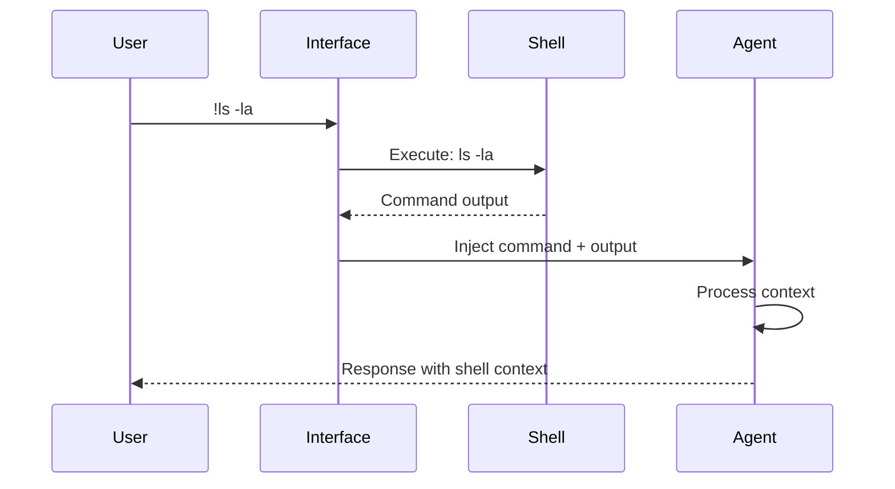

## Problem
When an AI agent interacts with a local development environment, it often needs to execute shell commands (e.g., run linters, check git status, list files) and then use the output of these commands as context for its subsequent reasoning or actions. Manually copying and pasting command output into the prompt is tedious and error-prone.

## Solution
Provide a dedicated mechanism within the agent's interface (e.g., a special prefix like `!` or a specific command mode) that allows the user to directly issue a shell command to be executed in the local environment. Crucially, both the command itself and its full output (stdout and stderr) are automatically captured and injected into the agent's current conversational or working context.

This ensures that the agent is immediately aware of the command that was run and its results, allowing it to seamlessly incorporate this information into its ongoing tasks without requiring manual data transfer by the user.

## Example (shell integration flow)

## Example
-   In Claude Code, typing `!ls -la` would execute `ls -la` locally, and both the command `!ls -la` and its output would be added to Claude's context.

## References
-   Based on the `!` (Exclamation mark) keybinding for Bash mode in "Mastering Claude Code: Boris Cherny's Guide & Cheatsheet," section V.

[Source](https://www.nibzard.com/claude-code)