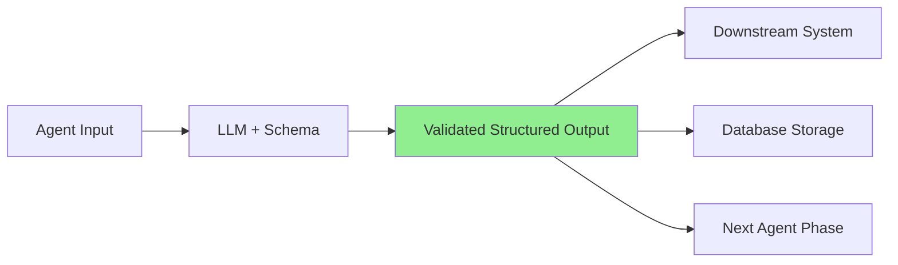

## Problem

Free-form agent outputs are difficult to validate, parse, and integrate with downstream systems. When agents return unstructured text, you face:

- Unpredictable output formats requiring complex parsing
- Difficult validation and error handling
- Brittle integration with automated workflows
- Inconsistent categorization and classification
- Manual post-processing to extract structured data

This makes it nearly impossible to build reliable multi-step workflows where one agent's output feeds into another system or agent.

## Solution

Constrain agent outputs using deterministic schemas that enforce structured, machine-readable results. Instead of allowing free-form text responses, specify exact output formats using type systems, JSON schemas, or framework-specific structured output APIs.

**Core approach:**

**Define explicit output schemas:**

- Use TypeScript interfaces, JSON Schema, or Pydantic models
- Specify required fields, types, and constraints
- Define enumerations for categorical outputs
- Document field semantics and validation rules

**Leverage framework structured output APIs:**

- OpenAI's structured outputs with JSON schema
- Anthropic's tool use for structured results
- Vercel AI SDK's `generateObject` function
- LangChain's output parsers

**Validate at generation time:**

- Framework ensures LLM adheres to schema
- Type errors caught before reaching application code
- Guaranteed parseable outputs

**Example implementation:**

```typescript
import { generateObject } from 'ai';
import { z } from 'zod';

// Define strict output schema
const LeadQualificationSchema = z.object({
  qualification: z.enum(['qualified', 'unqualified', 'needs_review']),
  confidence: z.number().min(0).max(1),
  companySize: z.enum(['enterprise', 'mid-market', 'smb', 'unknown']),
  estimatedBudget: z.string().optional(),
  nextSteps: z.array(z.string()),
  reasoning: z.string()
});

// Agent returns structured, validated output
const result = await generateObject({
  model: openai('gpt-4'),
  schema: LeadQualificationSchema,
  prompt: `Analyze this lead: ${leadData}`
});

// TypeScript knows exact structure
if (result.object.qualification === 'qualified') {
  await sendToSalesTeam(result.object);
}
```

**Integration benefits:**



## How to use it

**When to apply:**

- Multi-phase agent workflows requiring structured handoffs
- Classification and categorization tasks
- Data extraction and transformation
- Integration with databases or APIs
- Compliance and audit requirements
- Quality assurance and validation

**Implementation steps:**

**1. Identify output requirements:**

- What decisions does the agent make?
- What data must be extracted?
- What downstream systems consume this output?

**2. Design schema:**

```python
from pydantic import BaseModel, Field
from typing import Literal

class AbuseAnalysis(BaseModel):
    content_type: Literal['spam', 'abuse', 'legitimate', 'unclear']
    severity: Literal['critical', 'high', 'medium', 'low']
    recommended_action: Literal['remove', 'warn', 'ignore', 'escalate']
    confidence_score: float = Field(ge=0, le=1)
    evidence: list[str]
    requires_human_review: bool
```

**3. Integrate with agent framework:**

```python
result = client.generate(
    model="gpt-4",
    response_format=AbuseAnalysis,
    messages=[{"role": "user", "content": abuse_report}]
)

# result is guaranteed to match schema
if result.requires_human_review:
    await send_to_human(result)
else:
    await auto_execute(result.recommended_action)
```

**4. Handle validation failures:**

- Retry with clarified prompt
- Fallback to human review
- Log schema violations for prompt improvement

**Prerequisites:**

- Agent framework with structured output support
- Clear understanding of downstream data requirements
- Schema validation library (Zod, Pydantic, JSON Schema)

## Trade-offs

**Pros:**

- **Reliability:** Guaranteed parseable outputs eliminate parsing errors
- **Type safety:** Compile-time checking in typed languages
- **Integration:** Seamless connection to databases, APIs, workflows
- **Validation:** Built-in constraint enforcement
- **Maintainability:** Explicit contracts between system components
- **Testability:** Easy to verify output correctness

**Cons:**

- **Rigidity:** Schema changes require coordinated updates
- **Complexity:** Requires upfront schema design effort
- **Expressiveness limits:** May constrain useful free-form outputs
- **Framework dependency:** Relies on LLM provider schema support
- **Over-specification:** Too strict schemas may cause generation failures
- **Evolution friction:** Adapting schemas as requirements change

**Mitigation strategies:**

- Include optional `additional_context` field for free-form notes
- Version schemas and support graceful degradation
- Use union types for evolving classifications
- Balance structure with flexibility (required vs optional fields)

## References

- [Vercel: What We Learned Building Agents](https://vercel.com/blog/what-we-learned-building-agents-at-vercel) - Lead qualification using structured categorization
- [OpenAI Structured Outputs](https://platform.openai.com/docs/guides/structured-outputs) - JSON schema enforcement
- [Vercel AI SDK generateObject](https://sdk.vercel.ai/docs/reference/ai-sdk-core/generate-object) - TypeScript-native structured generation
- [Anthropic Tool Use](https://docs.anthropic.com/claude/docs/tool-use) - Structured outputs via tool calling
- Related patterns: [Discrete Phase Separation](discrete-phase-separation.md), [Human-in-the-Loop Approval Framework](human-in-loop-approval-framework.md)
