## Problem
Large multi-file tasks blow out the main agent's context window and reasoning budget.

## Solution
Let the main agent **spawn focused sub-agents**, each with its own fresh context, to work in parallel on shardable subtasks. Aggregate their results when done.

## Example (YAML front-matter refactor)

```mermaid
sequenceDiagram
  MainAgent->>GlobTool: "*.md"
  MainAgent->>TaskTool: spawn 4 sub-agents with 9 files each
  loop per SubAgent
      SubAgent->>Files: update front-matter
      SubAgent->>Git: commit
  end
  MainAgent->>Git: merge branches ➜ single PR
```

## References

* Raising An Agent - Episode 6: Claude 4 Sonnet edits 36 blog posts via four sub-agents.

[Source](https://www.nibzard.com/ampcode)