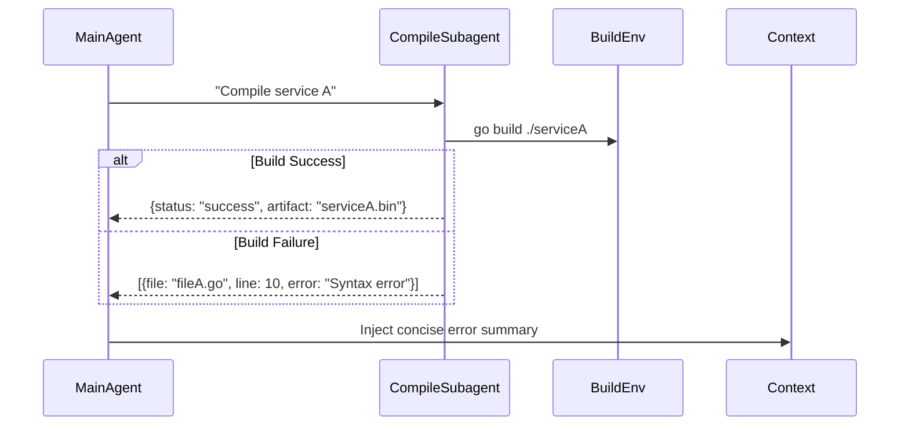

## Problem

Large coding tasks often involve multiple independent components (e.g., microservices, libraries). Having the **main agent** handle compilation and error checking for every component in-context:

- **Blows Up Context Length:** Including entire build logs or bytecode in the prompt is impractical.
- **Slows Down Inference:** Sending full build commands and parsing verbose output in-context uses excessive tokens.

Additionally, when the agent's single "compile-and-run" step fails, it's hard to pinpoint which submodule caused the error without a more granular approach.

## Solution

Spawn **specialized "Compilation Subagents"** to independently build and verify each code submodule, reporting back only:

**1. Error Summary:** File paths, line numbers, and error messages.
**2. Binary Artifacts (if needed):** Reference IDs (e.g., paths to compiled object files) rather than raw binaries.

**Workflow:**
- **Main Agent Request:** "Compile module `auth-service`."
- **Spawn `CompileSubagent(auth-service)`**
  - Subagent runs `mvn clean install` or `go build ./auth-service`.
  - Returns a structured error list or location of compiled artifact.
- **Main Agent:** Updates its context with the **concise error report** (e.g., `[{file: "auth_controller.go", line: 85, error: "undefined: UserModel"}]`).

## Example

## How to use it

- **Subagent Definition:** Each subagent is a lightweight container or process with the appropriate runtime (e.g., JVM for Java code, Node for JavaScript).
- **Integration in RL Loop:** Treat each subagent invocation as a **tool call** within the RL environment.
- **Error-Driven Reward:** If the error list is non-empty, assign a negative reward proportional to the number of errors (e.g., `reward = −len(error_list)`), to encourage the agent to fix compile errors quickly.

## Trade-offs

- **Pros:**
  - **Modular Isolation:** The main agent never needs to load entire build logs into its context.
  - **Parallel Builds:** Multiple subagents can compile different modules in parallel, speeding up end-to-end workflow.
- **Cons/Considerations:**
  - **Infrastructure Overhead:** Requires a mechanism to spin up and tear down multiple build environments.
  - **Subagent Synchronization:** If one module depends on another's build artifact, coordination policies must ensure the correct build order.

## References

- Inspired by "Subagent Spawning" for code-related subtasks in the Open Source Agent RL talk (May 2025).
- Will Brown's note on decoupling long I/O-bound steps from the main model's inference to avoid context explosion.