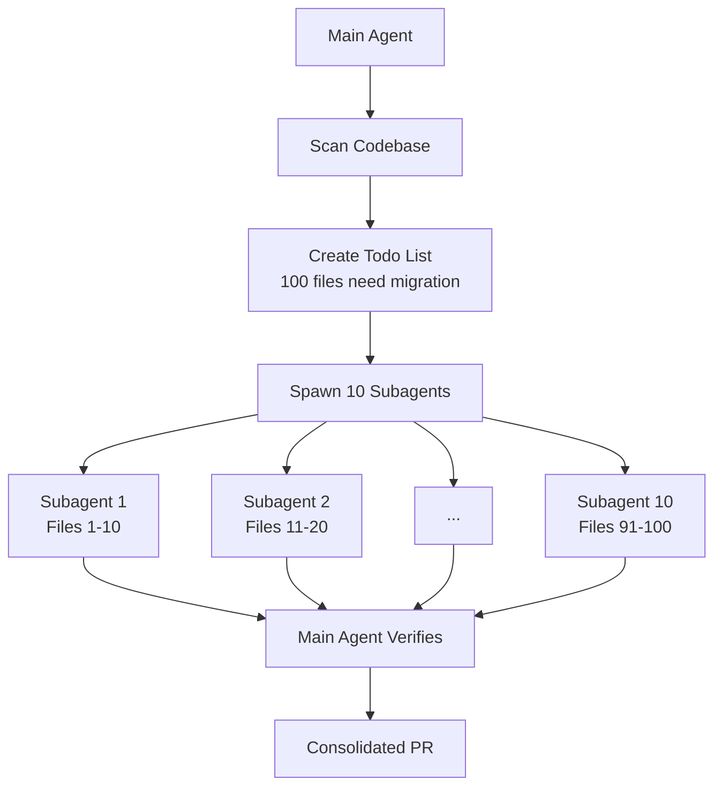

## Problem

Large-scale code migrations are time-consuming when done sequentially:

- **Framework upgrades** (e.g., testing library A → testing library B)
- **Lint rule rollouts** across hundreds of files
- **API migrations** when dependencies change
- **Code modernization** (e.g., class components → hooks)
- **Refactoring patterns** across the codebase

Humans doing these manually is tedious; single agents doing them sequentially is slow.

## Solution

Use a **swarm architecture** where the main agent orchestrates 10+ parallel subagents working simultaneously on independent chunks of the migration.

**Pattern:**

1. **Main agent creates migration plan**: Enumerate all files/targets needing migration
2. **Create todo list**: Break work into parallelizable chunks
3. **Spawn subagent swarm**: Start 10+ agents concurrently, each taking N items
4. **Map-reduce execution**: Each subagent migrates its chunk independently
5. **Verification**: Main agent validates results, may spawn additional agents for fixes
6. **Consolidation**: Combine results (single PR or coordinated merge)



## How to use it

**Implementation approach:**

```pseudo
# Main agent orchestration
main_agent.prompt = """
1. Find all files matching pattern (e.g., *.test.js using old framework)
2. Create todo list with file paths
3. Divide into batches of 10 files each
4. For each batch, spawn subagent with instructions:
   
- Migrate these specific files
   - Follow migration guide at docs/migration.md
   - Run tests after each change
   - Commit if tests pass
5. Monitor all subagents
6. Verify all todos completed
"""

# Spawn swarm
for batch in batches:
    spawn_subagent(
        task=f"Migrate {batch.files} from Framework A to B",
        context=migration_guide,
        auto_commit=True
    )
```

**Real-world usage at Anthropic:**

> "There's an increasing number of people internally at Anthropic that are using a lot of credits every month. Spending like over a thousand bucks every month. And this percent of people was growing actually pretty fast. The common use case is code migration... The main agent makes a big to-do list for everything and then just kind of map reduces over a bunch of subagents. You instruct Claude like, yeah, start 10 agents and then just go 10 at a time and just migrate all the stuff over." —Boris Cherny

**Common migration types:**

- **Lint rule enforcement**: Apply new ESLint/Biome rules across files
- **Framework migration**: Jest → Vitest, Mocha → Jest, etc.
- **API updates**: Update to new library versions
- **Code modernization**: var → const/let, callbacks → async/await
- **Import path changes**: Relative → absolute paths

## Trade-offs

**Pros:**

- **Massive parallelization**: 10x+ speedup vs. sequential migration
- **Easy verification**: Each subagent handles tractable chunk
- **Fault isolation**: One subagent failing doesn't break others
- **Cost-effective for scale**: $1000 for migrations that would take weeks manually
- **Reproducible**: Same migration applied consistently across all files

**Cons:**

- **High token cost**: Running 10+ agents simultaneously
- **Coordination complexity**: Main agent must track all subagents
- **Merge conflicts**: Parallel changes might conflict
- **Requires independence**: Only works if migration targets are separable
- **Verification burden**: Need to validate 10+ agent outputs

**Prerequisites:**

- **Atomic migrations**: Each file can be migrated independently
- **Clear specification**: Migration rules must be unambiguous
- **Good test coverage**: Automated verification of correctness
- **Sandbox environment**: Safe to run many agents simultaneously

**Optimization tips:**

- **Batch size tuning**: Start with 10 files per agent, adjust based on complexity
- **Staged rollout**: Migrate 10% first, verify, then do the rest
- **Failure handling**: Have main agent retry failed batches with refined instructions
- **Resource limits**: Cap parallel agents to avoid overwhelming infrastructure

## References

* Boris Cherny: "There's an increasing number of people internally at Anthropic using a lot of credits every month. Spending over a thousand bucks. The common use case is code migration. Framework A to framework B. The main agent makes a big to-do list for everything and map reduces over a bunch of subagents. Start 10 agents and go 10 at a time and migrate all the stuff over."
* Boris Cherny: "Lint rules... there's some kind of lint rule you're rolling out, there's no auto fixer because static analysis can't really—it's too simplistic for it. Framework migrations... we just migrated from one testing framework to a different one. That's a pretty common one where it's super easy to verify the output."
* [AI & I Podcast: How to Use Claude Code Like the People Who Built It](https://every.to/podcast/transcript-how-to-use-claude-code-like-the-people-who-built-it)
