## Problem

Complex AI agents often struggle with unstructured inputs and need a systematic way to process information before taking action. Without a clear separation of concerns, agents can become monolithic and difficult to debug, extend, or optimize. Additionally, mixing perception, processing, and action logic makes it hard to swap out components or scale different parts of the system independently.

## Solution

Implement a three-stage pipeline architecture that cleanly separates an agent's workflow into distinct phases:

1. **Perception Stage**: Handles all input gathering and normalization
   - Receives raw inputs (text, images, audio, structured data)
   - Performs initial processing (OCR, speech-to-text, format conversion)
   - Normalizes data into a common internal representation

2. **Processing Stage**: Performs reasoning and decision-making
   - Analyzes normalized inputs using appropriate models
   - Applies business logic and reasoning
   - Makes decisions about what actions to take
   - Can involve multiple sub-agents or reasoning steps

3. **Action Stage**: Executes decisions in the environment
   - Translates decisions into concrete actions
   - Interfaces with external systems and APIs
   - Handles error recovery and retries
   - Reports results back to the system

## Example

```python
class ThreeStageAgent:
    def __init__(self):
        self.perception = PerceptionPipeline()
        self.processor = ProcessingPipeline()
        self.action = ActionPipeline()
    
    async def run(self, raw_input):
        # Stage 1: Perception
        perceived_data = await self.perception.process(raw_input)
        
        # Stage 2: Processing
        decisions = await self.processor.analyze(perceived_data)
        
        # Stage 3: Action
        results = await self.action.execute(decisions)
        
        return results

class PerceptionPipeline:
    def __init__(self):
        self.handlers = {
            'text': TextHandler(),
            'image': ImageHandler(),
            'audio': AudioHandler(),
            'structured': StructuredDataHandler()
        }
    
    async def process(self, raw_input):
        input_type = self.detect_input_type(raw_input)
        handler = self.handlers[input_type]
        
        # Normalize to common format
        normalized = await handler.normalize(raw_input)
        
        # Extract features
        features = await handler.extract_features(normalized)
        
        return {
            'type': input_type,
            'normalized': normalized,
            'features': features,
            'metadata': handler.get_metadata(raw_input)
        }

class ProcessingPipeline:
    def __init__(self):
        self.reasoning_engine = ReasoningEngine()
        self.decision_maker = DecisionMaker()
    
    async def analyze(self, perceived_data):
        # Apply reasoning based on input type and features
        analysis = await self.reasoning_engine.reason(perceived_data)
        
        # Make decisions based on analysis
        decisions = await self.decision_maker.decide(
            analysis,
            context=self.get_context()
        )
        
        # Validate decisions
        validated = await self.validate_decisions(decisions)
        
        return validated

class ActionPipeline:
    def __init__(self):
        self.executors = {
            'api_call': APIExecutor(),
            'database': DatabaseExecutor(),
            'file_system': FileSystemExecutor(),
            'notification': NotificationExecutor()
        }
    
    async def execute(self, decisions):
        results = []
        
        for decision in decisions:
            executor = self.executors[decision.action_type]
            
            try:
                result = await executor.execute(decision)
                results.append({
                    'decision': decision,
                    'status': 'success',
                    'result': result
                })
            except Exception as e:
                # Handle errors gracefully
                recovery_result = await self.attempt_recovery(decision, e)
                results.append(recovery_result)
        
        return results
```

```mermaid
flowchart LR
    subgraph "Perception Stage"
        A[Raw Input] --> B[Type Detection]
        B --> C[Normalization]
        C --> D[Feature Extraction]
        D --> E[Structured Data]
    end
    
    subgraph "Processing Stage"
        E --> F[Reasoning Engine]
        F --> G[Analysis]
        G --> H[Decision Making]
        H --> I[Validation]
        I --> J[Action Plan]
    end
    
    subgraph "Action Stage"
        J --> K[Executor Selection]
        K --> L[Action Execution]
        L --> M[Error Handling]
        M --> N[Results]
    end
    
    N --> O[Feedback Loop]
    O --> F
    
    style A fill:#ffebee,stroke:#c62828,stroke-width:2px
    style J fill:#e8f5e9,stroke:#2e7d32,stroke-width:2px
    style N fill:#e3f2fd,stroke:#1565c0,stroke-width:2px
```



## Benefits

- **Modularity**: Each stage can be developed, tested, and scaled independently
- **Flexibility**: Easy to swap implementations for different stages
- **Debugging**: Clear boundaries make it easier to identify where issues occur
- **Reusability**: Stages can be shared across different agent types
- **Scalability**: Different stages can be scaled based on their computational needs

## Trade-offs

**Pros:**
- Clean separation of concerns
- Easier to maintain and extend
- Better error isolation
- Enables specialized optimization per stage
- Facilitates team collaboration (different teams per stage)

**Cons:**
- Additional complexity for simple tasks
- Potential latency from stage transitions
- Requires careful interface design between stages
- May introduce overhead for data transformation between stages

## References

- [Software Architecture Patterns](https://www.oreilly.com/library/view/software-architecture-patterns/9781491971437/)
- [Pipeline Pattern in ML Systems](https://ml-ops.org/content/mlops-principles)