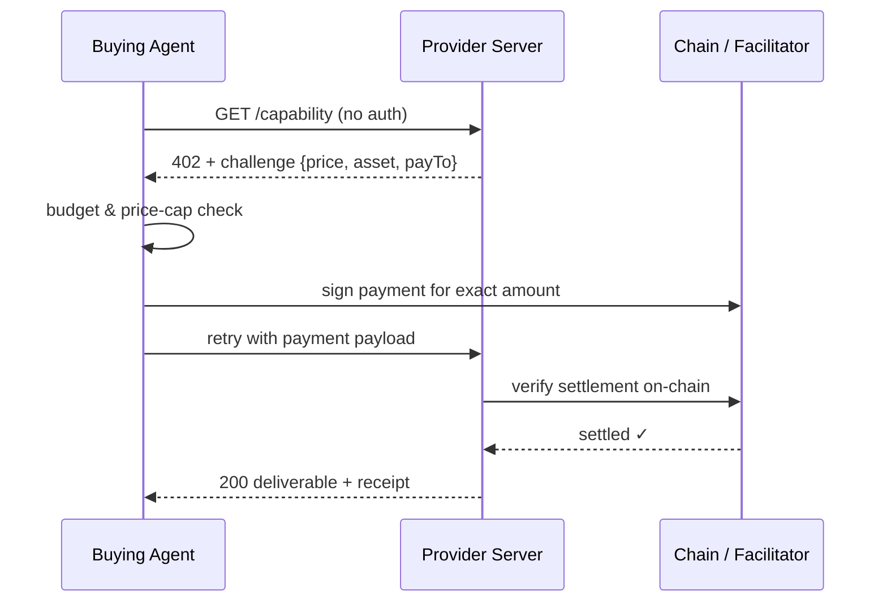

## Problem

An autonomous agent mid-task often needs a capability it does not have — summarize a long document, extract entities from a contract, fetch a paywalled dataset. The standard ways to sell that capability all assume a human in the loop:

- **API keys / subscriptions** require a registration flow, a dashboard, and a payment method on file. An agent cannot sign up mid-task.
- **Free tiers with rate limits** don't scale to real workloads and give the provider no revenue.
- **Invoice-after-work** is a non-starter between strangers: the provider does the work with no guarantee of payment; the buyer pre-commits to an unknown price.

The provider's core fear is doing work for an unpaid stranger. The buyer-agent's core fear is committing to an unknown price or unbounded spend. A machine-to-machine purchase path needs to solve both at once, without any human-readable signup.

## Solution

Invert the request flow using the long-dormant **HTTP 402 (Payment Required)** status code as the negotiation primitive: the server *quotes before it works*, and the client *pays only after seeing the price*.

**Roles:**

- **Provider server** — exposes a capability endpoint. Never performs paid work without settlement proof.
- **Buying agent** — holds a chain wallet and a task-level budget. Will not pay above a price cap.
- **Settlement layer** — a blockchain (e.g., USDC on Base) and optionally a facilitator service that verifies/settles payments so neither side writes chain code.

**Flow:**

1. **Probe.** The buying agent calls the endpoint normally (no credentials — there are none).
2. **Challenge.** The server returns `402 Payment Required` with a machine-readable challenge: exact price, asset, recipient address, scheme, and expiry. Crucially, *no work was done* and *no money moved*.
3. **Budget check.** The agent parses the challenge, compares the quoted price against its per-call cap and remaining budget, and declines cleanly if it doesn't fit. This is the control point that makes autonomous spending safe.
4. **Pay.** The agent signs a payment authorization for the exact quoted amount (an ERC-3005-style transfer-with-authorization, or a direct transfer) and retries the request with the payment attached.
5. **Verify-then-work.** The server verifies settlement **on-chain** (itself or via a facilitator) *before* performing the work, then returns the deliverable plus a signed/verifiable receipt.

```pseudo
# Provider
handle(request):
    if not has_valid_payment(request):
        return 402, challenge(price, asset, pay_to, scheme)
    if not verify_on_chain(payment):          # settle BEFORE working
        return 402, challenge(...)
    result = do_work(request)
    return 200, result, receipt(payment_hash)

# Buyer
r = get(endpoint)
if r.status == 402:
    quote = parse_challenge(r)
    if quote.price > budget.remaining(): return decline()
    r2 = get(endpoint, headers=payload(sign(quote)))
return r2.deliverable, record_receipt(r2)
```



The contract has three properties that make it work between strangers:

- **Atomicity of trust:** the provider gives zero work pre-payment; the buyer commits zero funds pre-quote.
- **Price discovery is per-call:** challenges are generated live, so prices can vary by load, input size, or customer — the agent always sees the current price first.
- **Receipts close the loop:** every successful call maps to an on-chain settlement, giving both sides an auditable spend log (which doubles as the agent's budget ledger).

## Evidence

- **Evidence Grade:** `medium`
- **Most Valuable Findings:** The x402 protocol implements this pattern in production on Base mainnet (Coinbase's facilitator settles USDC payments; SDKs exist for TypeScript/Python); ecosystem indexes now crawl 402-emitting origins and route real paid traffic to them. Independent measurement shows protocol volume is real but highly concentrated — a long tail of sellers earns little, so treat this as a working *mechanism*, not a proven *revenue model*.
- **Unverified / Unclear:** willingness-to-pay for commodity capabilities (vs. unique data or goods) at per-call granularity; cold-start friction of funding agent wallets remains the main adoption blocker.

## How to use it

- Use it when a capability decomposes into small, bounded, independently priced units (one summary, one extraction, one report) and buyers are programs rather than people.
- Provider-side prerequisites: a deterministic pricing function, a wallet for receiving, and either a facilitator integration or your own on-chain verification step. Publish a well-known manifest describing endpoints and prices so indexers can list you.
- Buyer-side prerequisites: a funded wallet, a hard per-task budget, and a per-call price cap passed alongside every purchase decision — never let the model decide spending policy inline without guardrails.
- Implementation considerations: include an expiry in challenges; make payment verification idempotent (retries must not double-charge); return structured errors when settlement fails so agents can re-probe instead of crashing.
- A human-in-the-loop variant works when wallets aren't available: keep the same 402-first contract but route settlement through an asynchronous storefront (e.g., a GitHub issue verified against the chain), which preserves quote-before-work while a human executes the transfer.

## Trade-offs

**Pros:**

- No accounts, API keys, or sign-up flows — any agent with a wallet can transact immediately.
- Providers never do unpaid work; buyers never commit blind to a price.
- Per-call economics enable usage-based competition; price caps give agents a clean safety mechanism.

**Cons:**

- Cold-start problem: agents need pre-funded wallets, which today usually means a human top-up step.
- Adds chain latency (~seconds) and settlement cost to every call; uneconomical below ~$0.01 unless batched.
- Refunds/disputes are awkward once settlement is on-chain — quality guarantees need escrow or reputation layers on top.
- Ecosystem liquidity is still early; discovery surfaces for payable endpoints are nascent.

## References

- [x402 protocol specification and SDKs](https://github.com/x402-foundation/x402) — canonical implementation of the pattern (Coinbase).
- [Reference seller implementation: seller-side on-chain verification, priced manifests, and an asynchronous storefront variant](https://github.com/bettergraininfo-rgb/x402-agent-economy-lab) — includes a worked tutorial with captured 402 challenges and receipts ([tutorial](https://github.com/bettergraininfo-rgb/x402-agent-economy-lab/blob/master/docs/tutorial-first-machine-payment.md)).
- [RFC 9110 §15.5.2 — 402 Payment Required](https://httpwg.org/specs/rfc9110.html#STATUS.402) — the reserved status code this pattern activates.
