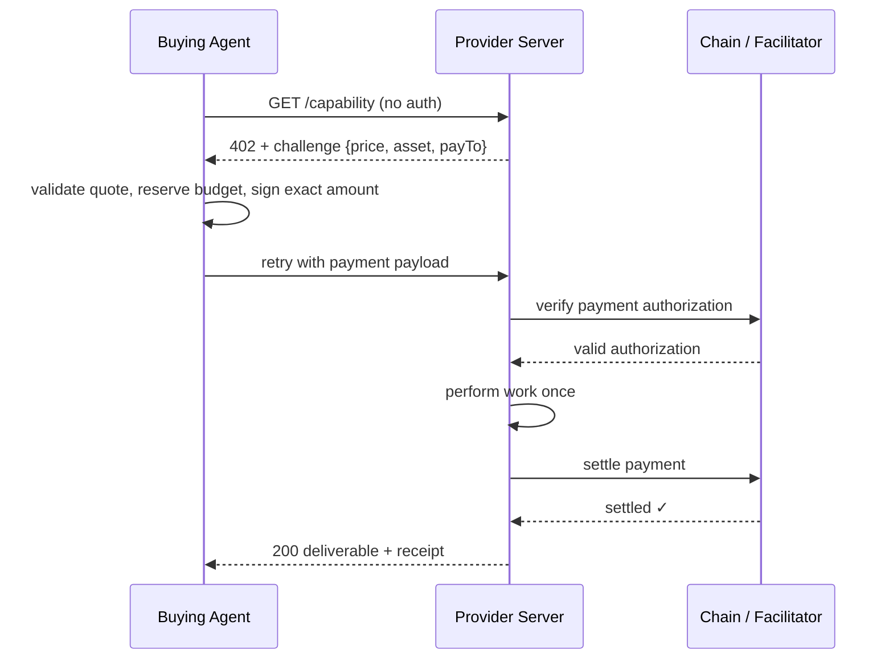

## Problem

An autonomous agent mid-task often needs a capability it does not have — summarize a long document, extract entities from a contract, fetch a paywalled dataset. The standard ways to sell that capability all assume a human in the loop:

- **API keys / subscriptions** require a registration flow, a dashboard, and a payment method on file. An agent cannot sign up mid-task.
- **Free tiers with rate limits** don't scale to real workloads and give the provider no revenue.
- **Invoice-after-work** is a non-starter between strangers: the provider does the work with no guarantee of payment; the buyer pre-commits to an unknown price.

The provider's core fear is doing work for an unpaid stranger. The buyer-agent's core fear is committing to an unknown price or unbounded spend. A machine-to-machine purchase path needs to solve both at once, without any human-readable signup.

## Solution

Invert the request flow using the long-dormant **HTTP 402 (Payment Required)** status code as the negotiation primitive: the server *quotes before it works*, and the client *pays only after seeing the price*.

**Roles:**

- **Provider server** — exposes a capability endpoint. Verifies payment authorization before work and settles before releasing the deliverable; may choose a settlement-first policy.
- **Buying agent** — holds a chain wallet and a task-level budget. Will not pay above a price cap.
- **Settlement layer** — a blockchain (e.g., USDC on Base) and optionally a facilitator service that verifies/settles payments so neither side writes chain code.

**Flow:**

1. **Probe.** The buying agent calls the endpoint normally (no credentials — there are none).
2. **Challenge.** The server returns `402 Payment Required` with a machine-readable challenge: exact price, asset, recipient address, scheme, and expiry. Crucially, *no work was done* and *no money moved*.
3. **Budget check.** The agent parses the challenge, compares the quoted price against its per-call cap and remaining budget, and declines cleanly if it doesn't fit. Atomically reserve the quote and bounded fees in a durable ledger before signing, so concurrent purchases cannot all spend the same remaining budget. Validate the asset, network, recipient and expiry against trusted policy.
4. **Pay.** The agent signs a payment authorization for the exact quoted amount (an ERC-3009-style transfer-with-authorization, or a direct transfer) and retries the request with the payment attached.
5. **Verify, work, settle, then deliver.** The server validates the signed authorization, performs the work, settles the payment (itself or via a facilitator), and returns the deliverable with settlement metadata. This is the cited x402 flow: verification is not settlement. A provider may instead require confirmed settlement before work; that is a stricter implementation policy with a paid-but-failed-work/refund risk.

```pseudo
# Provider: operation id binds the request, payment, and cached result.
handle(request):
    bind_or_reject_operation_id(request) # same id cannot authorize a different purchase
    if cached_result(request.operation_id): return cached_result(request.operation_id)
    if not verify_authorization(request.payment): return 402, challenge(...)
    result = do_work_once(request.operation_id, request)
    settlement = settle_once(request.operation_id, request.payment)
    persist_result_and_receipt(request.operation_id, result, settlement)
    return 200, result, receipt(settlement)

# Buyer: all concurrent purchases share this durable budget ledger.
operation_id = stable_purchase_id(endpoint, task_intent, request_args)
response = get(endpoint)
if response.status != 402: return handle_normal_response(response)
quote = parse_challenge(response)
validate_quote_against_trusted_policy(quote)
reservation = budget.reserve_atomically(operation_id, quote.price, fee_cap, per_call_cap)
if not reservation: return decline()
response = retry_with_same_operation_id(endpoint, payload(sign(quote)))
reconcile_reservation_with_settlement(reservation, response) # retain on uncertainty
return response.deliverable, record_receipt(response)
```


```mermaid
sequenceDiagram
    participant B as Buying Agent
    participant P as Provider Server
    participant C as Chain / Facilitator
    B->>P: GET /capability (no auth)
    P-->>B: 402 + challenge {price, asset, payTo}
    B->>B: validate quote, reserve budget, sign exact amount
    B->>P: retry with payment payload
    P->>C: verify payment authorization
    C-->>P: valid authorization
    P->>P: perform work once
    P->>C: settle payment
    C-->>P: settled ✓
    P-->>B: 200 deliverable + receipt
```

The contract has three properties that make it work between strangers:

- **Quote-before-commitment:** the buyer commits no funds before seeing the quote. This is not atomic exchange or escrow: the seller’s settlement ordering determines which side bears failed-work or failed-payment risk.
- **Price discovery is per-call:** challenges are generated live, so prices can vary by load, input size, or customer — the agent always sees the current price first.
- **Receipts close the loop:** every successful call maps to an on-chain settlement, giving both sides an auditable spend log. Track outstanding and uncertain reservations too; successful receipts alone cannot enforce a budget.

## Evidence

- **Evidence Grade:** `medium`
- **Most Valuable Findings:** The public x402 implementation documents machine-readable payment requirements, signed authorization, verification, fulfillment, and settlement. These sources support the mechanism; they do not establish seller revenue, ecosystem volume, or a universal minimum economic price.
- **Unverified / Unclear:** willingness-to-pay for commodity capabilities (vs. unique data or goods) at per-call granularity; cold-start friction of funding agent wallets remains the main adoption blocker.

## How to use it

- Use it when a capability decomposes into small, bounded, independently priced units (one summary, one extraction, one report) and buyers are programs rather than people.
- Provider-side prerequisites: a deterministic pricing function, a wallet for receiving, and either a facilitator integration or your own on-chain verification step. Publish a well-known manifest describing endpoints and prices so indexers can list you.
- Buyer-side prerequisites: a funded wallet, a hard per-task budget, and a per-call price cap passed alongside every purchase decision — never let the model decide spending policy inline without guardrails.
- Implementation considerations: include an expiry in challenges; bind a durable operation id to the request and payment, cache the deliverable, and make settlement and fulfillment idempotent or reconcilable (retries must not double-charge or repeat work); return structured errors when settlement fails so agents can re-probe instead of crashing.
- A human-in-the-loop variant works when wallets aren't available: keep the same 402-first contract but route settlement through an asynchronous storefront (e.g., a GitHub issue verified against the chain), which preserves quote-before-work while a human executes the transfer.

## Trade-offs

**Pros:**

- No accounts, API keys, or sign-up flows — any agent with a wallet can transact immediately.
- Buyers see a price before committing; providers can choose their payment-versus-work risk policy.
- Per-call economics enable usage-based competition; price caps give agents a clean safety mechanism.

**Cons:**

- Cold-start problem: agents need pre-funded wallets, which today usually means a human top-up step.
- Settlement latency, fees, and batching options depend on the payment scheme and network; measure unit economics for the intended workload.
- Refunds/disputes are awkward once settlement is on-chain — quality guarantees need escrow or reputation layers on top.
- Ecosystem liquidity is still early; discovery surfaces for payable endpoints are nascent.

## References

- [x402 protocol specification and SDKs](https://github.com/x402-foundation/x402) — canonical implementation of the pattern (Coinbase).
- [Reference seller implementation](https://github.com/bettergraininfo-rgb/x402-agent-economy-lab) — maintained by this pattern’s contributor, listed as an example rather than independent evidence.
- [RFC 9110 §15.5.2 — 402 Payment Required](https://httpwg.org/specs/rfc9110.html#STATUS.402) — the reserved status code this pattern activates.
- [ERC-3009 — Transfer With Authorization](https://eips.ethereum.org/EIPS/eip-3009) — signed transfer authorization for compatible tokens.
