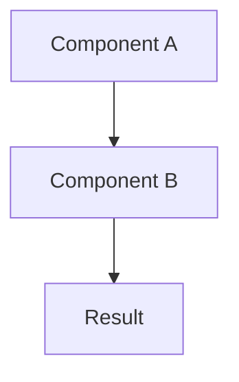

## Problem
Clearly state the problem this pattern solves. What challenge or limitation does it address? Be specific about the context where this problem occurs.

## Solution
Describe the core approach or technique this pattern uses. Include:

- Key components or roles
- How they interact
- The mechanism that solves the problem

If helpful, include a code snippet or pseudocode:

```pseudo
example_function() {
    // Show the pattern in action
}
```

For complex patterns, include a Mermaid diagram:



## How to use it
Provide practical guidance on when and how to implement this pattern. Include:

- Specific use cases or scenarios
- Prerequisites or requirements
- Implementation considerations

## Trade-offs
Be honest about the pros and cons:

* **Pros:** List the benefits and advantages
* **Cons:** List the drawbacks, complexity, or limitations

## References
* Link to original source, papers, or implementations
* Additional reading or related work

## Optional Sections

Add these sections after the required sections as needed:

### When to use
Specific scenarios where this pattern shines

### When not to use
Situations to avoid this pattern

### Signals
Indicators this pattern is a good fit

### Implementation checklist
Step-by-step guidance

### Variations
Adaptations and alternatives

### Pitfalls
Common mistakes to avoid

### Benchmarks
Performance data if available
