## Problem

LLM-based agent execution is expensive (both in costs and latency) and non-deterministic. Running the same workflow multiple times yields different results and incurs repeated LLM costs.

This creates several issues:

- **Cost explosion**: Every workflow run burns LLM tokens even for identical tasks
- **Non-determinism**: Same input produces different outputs across runs
- **No regression testing**: Impossible to verify fixes don't break existing workflows
- **Slow iteration**: Can't quickly test changes without paying LLM costs
- **No CI/CD integration**: Automated testing of agent workflows is impractical

## Solution

Record every action during execution with precise metadata (XPaths, frame indices, execution details), enabling deterministic replay without LLM calls. The cache captures enough information to replay actions even when page structure changes slightly.

### Core Approach

**Action cache entries** store complete execution metadata:

```typescript
interface ActionCacheEntry {
  stepIndex: number;           // Order in workflow
  instruction: string;         // Natural language description
  elementId: string;           // Encoded frameIndex-backendNodeId
  method: string;              // click, fill, type, etc.
  arguments: string[];         // Method parameters
  frameIndex: number;          // Frame context for iframes
  xpath: string;               // Normalized XPath for element
  actionType: string;          // Action category
  success: boolean;            // Execution result
  message: string;             // Output or error message
}

interface ActionCacheOutput {
  actions: ActionCacheEntry[];
  finalState: {
    success: boolean;
    error?: string;
    duration: number;
  };
}
```

**Building cache entries during execution:**

```typescript
export const buildActionCacheEntry = ({
  stepIndex,
  action,
  actionOutput,
  domState,
}: {
  stepIndex: number;
  action: ActionType;
  actionOutput: ActionOutput;
  domState: A11yDOMState;
}): ActionCacheEntry => {
  const instruction = extractInstruction(action);
  const elementId = extractElementId(action);
  const method = extractMethod(action);
  const args = extractArguments(action);
  const frameIndex = extractFrameIndex(elementId);
  const xpath = normalizeXPath(
    domState.xpathMap?.[encodedId] || extractXPathFromDebug(actionOutput)
  );

  return {
    stepIndex,
    instruction,
    elementId,
    method,
    arguments: args,
    frameIndex,
    xpath,
    actionType: action.type,
    success: actionOutput.success,
    message: actionOutput.message,
  };
};
```

**Replay with intelligent fallback:**

```typescript
// Replay from cache with XPath retry and LLM fallback
const replay = await page.runFromActionCache(cache, {
  maxXPathRetries: 3,           // Retry XPath resolution up to 3 times
  fallbackToLLM: true,          // Use LLM if XPath resolution fails
  debug: true,
});

// Replay flow:
// 1. Try cached XPath directly
// 2. If fails, retry with normalized XPath variations
// 3. If still fails, invoke LLM for element resolution
// 4. Update cache with successful resolution
```

**Generate standalone scripts:**

```typescript
// Export cached workflow as TypeScript
const script = generateScriptFromCache(cache);

// Produces runnable code:
// import { chromium } from 'playwright';
// const page = await chromium.newPage();
// await page.click('div[data-testid="login-button"]');
// await page.fill('input[name="email"]', 'user@example.com');
// ...
```

### Architecture

```mermaid
graph TB
    subgraph "First Run (LLM-Powered)"
        A[User Request] --> B[Agent with LLM]
        B --> C[Action 1: Click Login]
        C --> D[Build Cache Entry #1]
        D --> E[Action 2: Fill Email]
        E --> F[Build Cache Entry #2]
        F --> G[Complete]
    end

    subgraph "Subsequent Runs (Cache-Powered)"
        H[User Request] --> I{Cache Exists?}
        I -->|Yes| J[Load Action Cache]
        J --> K[Replay Action 1]
        K --> L{XPath Works?}
        L -->|Yes| M[Replay Action 2]
        L -->|No| N[LLM Fallback]
        N --> M
        M --> O{XPath Works?}
        O -->|Yes| P[Complete - Zero LLM Cost]
        O -->|No| Q[LLM Fallback]
        Q --> P
    end

    style B fill:#f9f,stroke:#333
    style P fill:#9f9,stroke:#333
```



## How to use it

### 1. Enable Action Caching

Most agent frameworks have caching options. Enable them during execution:

```typescript
const agent = new HyperAgent(browser);
const cache = await agent.executeTask("Login and navigate to dashboard", {
  enableActionCache: true,
});
```

### 2. Persist Cache

Save the cache for later use:

```typescript
import fs from 'fs';

fs.writeFileSync(
  'workflows/login-cache.json',
  JSON.stringify(cache, null, 2)
);
```

### 3. Replay from Cache

```typescript
const savedCache = JSON.parse(
  fs.readFileSync('workflows/login-cache.json', 'utf-8')
);

const result = await page.runFromActionCache(savedCache, {
  maxXPathRetries: 3,
  fallbackToLLM: true,
});
```

### 4. CI/CD Integration

```typescript
// test.js - Automated regression test
describe('User Login Flow', () => {
  it('should login successfully', async () => {
    const cache = JSON.parse(readFileSync('workflows/login-cache.json'));
    const result = await page.runFromActionCache(cache);

    expect(result.finalState.success).toBe(true);
  });
});
```

### 5. Script Generation

Export workflows as standalone scripts for manual debugging or CI:

```bash
# Generate TypeScript script from cache
npx hyperagent script workflows/login-cache.json > login.test.ts
```

## Trade-offs

**Pros:**

- **Dramatic cost reduction**: Replay costs near-zero (no LLM calls) if XPaths work
- **Deterministic regression testing**: Verify fixes don't break existing workflows
- **Performance**: Cached replays are 10-100x faster than LLM execution
- **Debugging**: Cache provides complete execution history
- **Script generation**: Export workflows as standalone automation scripts
- **Graceful degradation**: LLM fallback handles page structure changes

**Cons:**

- **Cache management overhead**: Need to store, version, and invalidate caches
- **Brittle to significant UI changes**: Major redesigns break XPaths
- **Initial LLM cost**: First run still requires full LLM execution
- **Storage complexity**: Caches accumulate and need cleanup
- **Not universal**: Only works for deterministic workflows

**Mitigation strategies:**

- Implement cache versioning and automatic expiration
- Use LLM fallback with cache update for failed replays
- Store caches alongside workflow definitions in version control
- Set up automated cache validation in CI pipelines

## References

- [HyperAgent GitHub Repository](https://github.com/hyperbrowserai/HyperAgent) - Original implementation
- [HyperAgent Documentation](https://docs.hyperbrowser.ai/hyperagent/introduction) - Usage guide
- Related patterns: [Structured Output Specification](structured-output-specification.md), [Schema Validation Retry](schema-validation-retry-cross-step-learning.md)
