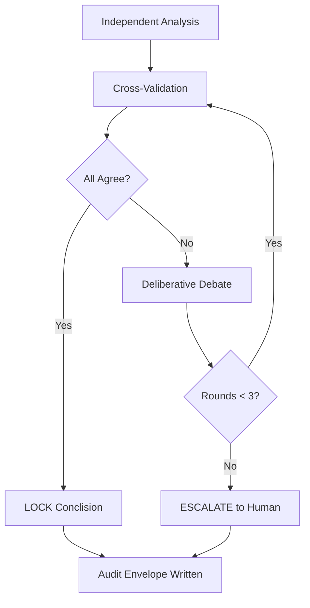

## Problem

Multi-agent systems produce outputs with no accountability:

- **Single-agent blind spots**: one agent analyzing data alone has no one to challenge its reasoning
- **No audit trail**: you can't trace which assumptions drove which conclusions
- **False consensus**: agents that collaborate too eagerly paper over disagreements
- **Uncontrolled escalation**: disagreements grow without a structured resolution process

Existing guardrails focus on input/output filtering (prompt injection, toxicity), not on *reasoning quality* between agents.

## Solution

**Adversarial Consensus Governance** — each agent analyzes independently, then reviews the other agents' findings as an adversary, trying to find flaws. Disagreements escalate through structured debate rounds. Conclusions are LOCKED only after all agents agree.

### Core Protocol (CHP Workflow)

```
EXPLORING → PROVISIONAL_LOCK → LOCKED
```

1. **DISPATCH** — Each agent produces independent findings from the same data
2. **REVIEW** — Each agent reads the other agents' findings as an adversary
3. **DELIBERATE** — If any two agents disagree, escalate to structured debate (max 3 rounds)
4. **LOCK** — All agents must agree before conclusion is marked LOCKED
5. **AUDIT** — Full reasoning chain recorded in payload envelope

```pseudo
# Consensus Hardening Protocol — Minimal Implementation

WORKSPACE=/research/$TICKET/

# Phase 1: Independent analysis
echo "DISPATCH" > $WORKSPACE/status
agent-a analyze --output $WORKSPACE/agent-a-findings.md
agent-b analyze --output $WORKSPACE/agent-b-findings.md
agent-c analyze --output $WORKSPACE/agent-c-findings.md

# Phase 2: Cross-validation
echo "REVIEW" > $WORKSPACE/status
agent-a critique $WORKSPACE/agent-b-findings.md $WORKSPACE/agent-c-findings.md
agent-b critique $WORKSPACE/agent-a-findings.md $WORKSPACE/agent-c-findings.md
agent-c critique $WORKSPACE/agent-a-findings.md $WORKSPACE/agent-b-findings.md

# Phase 3: Conflict resolution
for round in 1 2 3; do
  if consensus_reached(); then
    echo "LOCKED" > $WORKSPACE/status
    exit 0
  fi
  echo "DELIBERATE (round $round)" > $WORKSPACE/status
  escalate_debate()
done

# If no consensus after 3 rounds → human escalation
echo "ESCALATED" > $WORKSPACE/status
```



## When to Use

| Use Case | Why CHP Wins |
|----------|-------------|
| Financial analysis | Independent agents cross-check numbers — catches accounting errors |
| SEC filing review | No single agent's interpretation goes unchallenged |
| Competitive intelligence | Different agents find different threat vectors |
| Code review | Agent A writes, Agent B finds bugs, Agent C validates fixes |
| Compliance audits | Adversarial review catches what deference misses |
| Strategic planning | Bull/bear/base perspectives independently validated |

## Key Insights

- **Adversary beats collaborator**: agents asked to find flaws in each other's work produce better results than agents asked to collaborate. The friction is the feature
- **Record disagreements even after resolution**: the audit trail showing "Agent A disagreed, resolved after debate with new source data" builds more trust than a consensus that papered over differences
- **3 agents is the minimum viable panel**: 2 agents can deadlock. 3 allows 2:1 majority to escalate
- **The audit envelope is the product**: being able to show exactly how every conclusion was reached is more valuable than the conclusion itself in regulated environments

## Related Patterns

- [Cross-Cycle Consensus Relay](./cross-cycle-consensus-relay.md) — state handoff between cycles using consensus documents
- [Stigmergic Swarm Coordination](./stigmergic-swarm-coordination.md) — coordination via shared markers (complements CHP)
- [Versioned Constitution Governance](./versioned-constitution-governance.md) — rule-based agent governance
- [Cryptographic Governance Audit Trail](./cryptographic-governance-audit-trail.md) — integrity verification for audit logs
