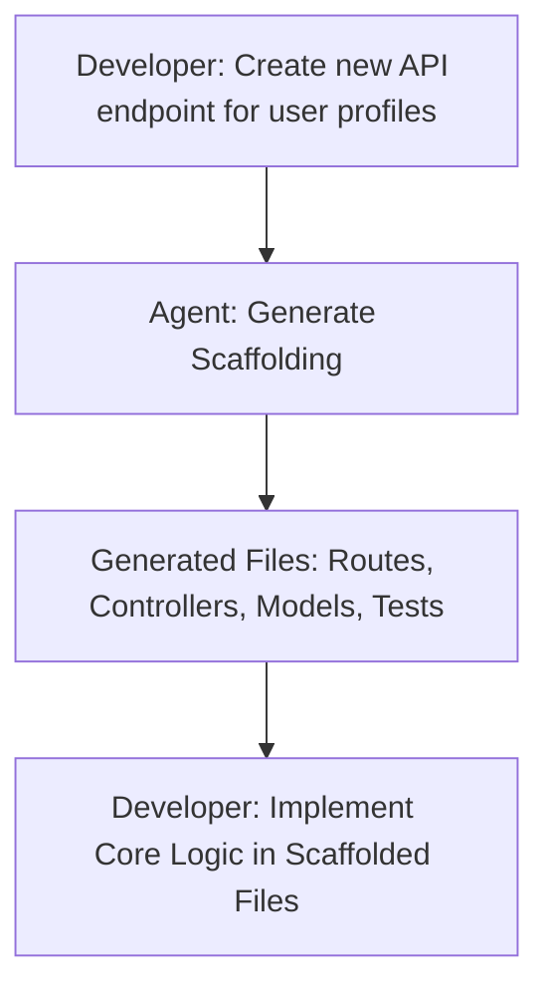

## Problem
Starting a new feature, module, or codebase often involves writing a significant amount of boilerplate or foundational code. This can be time-consuming and repetitive for developers.

## Solution
Utilize an AI agent to generate the initial structure, boilerplate code, or layout for new software components. The developer provides a high-level description of the desired feature or component, and the agent "scaffolds" out the basic files, functions, classes, and directory structures.

This allows developers to:

-   Quickly get a new part of the system started.
-   Focus on the core logic rather than repetitive setup tasks.
-   Ensure consistency in initial project structure.

**Critical for Future AI Agent Work**: The scaffolded structure becomes crucial context for subsequent AI agent interactions. Well-structured scaffolding with clear file organization, naming conventions, and architectural patterns helps future agents understand the codebase layout and make more informed decisions when implementing features or making modifications.

The agent acts as a "kickstarter" for new development efforts while simultaneously enriching the repository's structural context for future AI-assisted development.

## Example

## References
- Lukas Möller (Cursor) mentions this at 0:03:40: "So I think for like initially laying out some code base, some new feature, it's very, very useful to just like use the agent feature to kind of get that started."