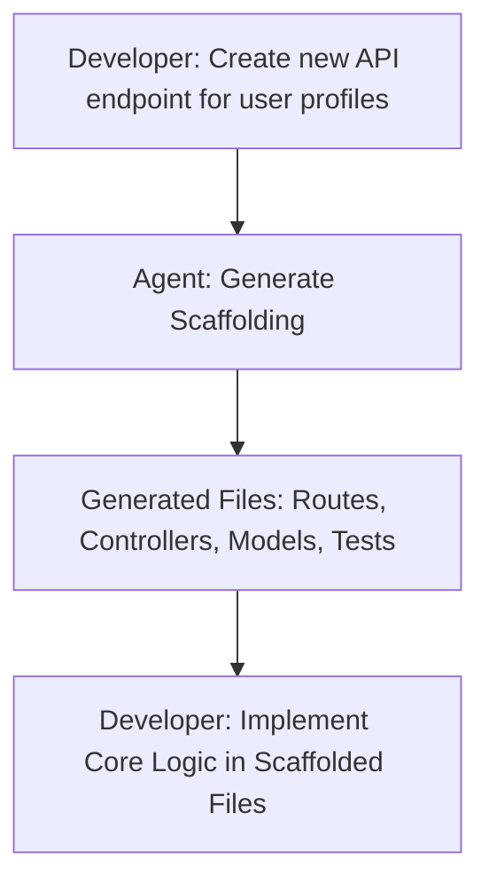

## Problem

Starting a new feature, module, or codebase often involves writing a significant amount of boilerplate or foundational code. This can be time-consuming and repetitive for developers.

## Solution

Utilize an AI agent to generate the initial structure, boilerplate code, or layout for new software components. The developer provides a high-level description of the desired feature or component, and the agent "scaffolds" out the basic files, functions, classes, and directory structures.

This allows developers to:

-   Quickly get a new part of the system started.
-   Focus on the core logic rather than repetitive setup tasks.
-   Ensure consistency in initial project structure.

**Scaffolding Modes:**

-   **Text-to-code:** Natural language descriptions generate code structure
-   **Design-to-code:** Figma, PSD, or design sketches convert to layouts (tools achieve ~92% layout accuracy)
-   **Repository-aware:** Agents read existing codebases to scaffold compatible structures

**Critical for Future AI Agent Work**: The scaffolded structure becomes crucial context for subsequent AI agent interactions. Well-structured scaffolding with clear file organization, naming conventions, and architectural patterns helps future agents understand the codebase layout and make more informed decisions when implementing features or making modifications.

The agent acts as a "kickstarter" for new development efforts while simultaneously enriching the repository's structural context for future AI-assisted development.

## Example

```mermaid
flowchart TD
    A[Developer: Create new API endpoint for user profiles] --> B[Agent: Generate Scaffolding]
    B --> C[Generated Files: Routes, Controllers, Models, Tests]
    C --> D[Developer: Implement Core Logic in Scaffolded Files]
```

## How to use it

**Best suited for:**

-   New feature or module development
-   Greenfield projects and prototyping
-   Standardized frameworks (React, Express, etc.)
-   Repetitive boilerplate generation

**Less effective for:**

-   Legacy system integration (10+ year-old codebases)
-   Highly regulated environments with strict compliance
-   Complex business logic requiring deep domain expertise

**Core practice:** "AI scaffolds, you refine details"—review generated code at checkpoints before proceeding.

## Trade-offs

* **Pros:** Faster time to first code, consistent project structure, reduced boilerplate.
* **Cons:** Code reliability issues (36% of developers report problems), requires human review, struggles with legacy integration. Scaffolding is essential—without it, configurations lead to "massive overengineering" (SANER 2026).

## References

- Lukas Möller (Cursor) mentions this at 0:03:40: "So I think for like initially laying out some code base, some new feature, it's very, very useful to just like use the agent feature to kind of get that started."

- Primary source: https://www.youtube.com/watch?v=BGgsoIgbT_Y

- "Biscuit: Scaffolding LLM-Generated Code" (2024). arXiv:2404.07387v1 - Explores scaffolding users to guide code generation and trust in AI-powered tools.

- "Scratch Copilot: Supporting Youth Creative Coding with AI" (2025). arXiv:2505.03867v1 - Implements supportive scaffolding mechanisms for real-time ideation, code generation, and debugging.

- "App.build: Scaffolding Environment-Aware Multi-Agent Systems" (2026). SANER 2026 Industrial Track, arXiv:2509.03310v2 - Ablation studies show configurations without scaffolding lead to "massive overengineering."
