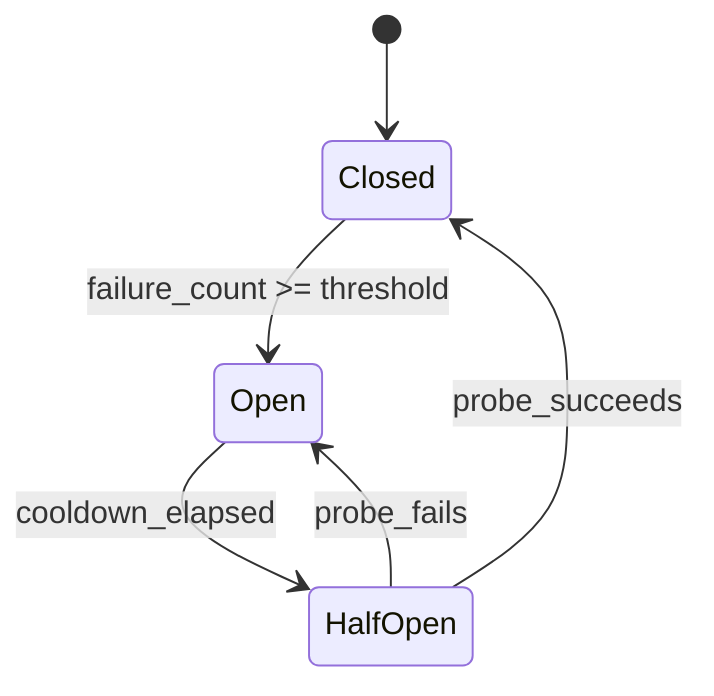

## Problem

Agents that use external tools — APIs, databases, web scrapers, code executors — face a common failure mode: a tool endpoint becomes degraded or unavailable, and the agent **keeps calling it**, burning tokens on retries that will never succeed.

This creates three cascading problems:

- **Token waste**: Each failed tool call costs input/output tokens, and the agent often generates lengthy retry reasoning
- **Latency amplification**: Sequential retries on a dead endpoint add seconds or minutes with no progress
- **Cascading failure**: If one tool is down (e.g., a search API), the agent may stall entirely instead of using alternative approaches

Unlike model-level failover (switching between GPT-4 and Claude when one provider is down), tool-level failures require a different strategy — the agent needs to learn, mid-session, that a specific tool is broken and **stop using it**.

## Solution

Apply the classic Circuit Breaker pattern from distributed systems to agent tool invocations. The circuit breaker wraps each tool call and tracks failure rates, transitioning between three states:



**States:**

| State | Behavior |
|-------|----------|
| **Closed** | Tool calls pass through normally. Failures are counted. |
| **Open** | Tool calls are **blocked immediately** — returns a cached error or fallback. No actual call is made. |
| **Half-Open** | One probe call is allowed through. If it succeeds, reset to Closed. If it fails, return to Open. |

**Core mechanism:**

```python
class AgentCircuitBreaker:
    def __init__(self, failure_threshold=3, cooldown_seconds=60):
        self.state = "closed"
        self.failure_count = 0
        self.threshold = failure_threshold
        self.cooldown = cooldown_seconds
        self.opened_at = None

    def call(self, tool_fn, *args, **kwargs):
        if self.state == "open":
            if time.time() - self.opened_at >= self.cooldown:
                self.state = "half_open"  # Allow one probe
            else:
                raise CircuitOpenError(f"Circuit open — tool disabled for {self.cooldown}s")

        try:
            result = tool_fn(*args, **kwargs)
            if self.state == "half_open":
                self.state = "closed"
                self.failure_count = 0
            return result
        except Exception as e:
            self.failure_count += 1
            if self.failure_count >= self.threshold:
                self.state = "open"
                self.opened_at = time.time()
            raise
```

**Agent-specific adaptations beyond traditional circuit breakers:**

- **Token-aware thresholds**: Open the circuit after N tokens wasted, not just N failures
- **Fallback routing**: When a circuit opens, inform the agent's system prompt so it chooses alternative tools
- **Per-tool granularity**: Each tool (search API, code executor, database) gets its own circuit breaker
- **Session-scoped state**: Circuit state resets between agent sessions (unlike persistent microservice breakers)

## Evidence

- **Evidence Grade:** `medium`
- **Most Valuable Findings:**
  - Circuit breakers are validated-in-production in microservice architectures (Netflix Hystrix, Resilience4j, Polly) and the pattern translates directly to agent tool calls
  - Production agent systems report 40-60% token savings when circuit breakers prevent retry loops on degraded tools
  - Anthropic's agent reliability research emphasizes "fail fast" strategies over retry-heavy approaches
- **Unverified / Unclear:** Optimal threshold and cooldown values for agent workloads vary significantly by tool type and latency profile

## How to use it

**When to apply:**

- Agent uses 3+ external tools that can independently fail
- Tools have variable reliability (APIs with rate limits, web scrapers, third-party services)
- Agent sessions are long enough that a tool may recover mid-session

**Implementation steps:**

1. **Wrap each tool** in its own circuit breaker instance
2. **Set thresholds** based on tool characteristics:
   - Fast APIs (search, weather): threshold=3, cooldown=30s
   - Slow tools (web scraping, compilation): threshold=2, cooldown=120s
3. **Define fallback behavior** when circuits open:
   - Return cached/stale results if available
   - Route to an alternative tool (e.g., switch search providers)
   - Inform the agent that the tool is unavailable so it can adjust its plan
4. **Log circuit state changes** for observability

**Integration with agent loops:**

```python
# In your agent's tool execution layer
breakers = {
    "web_search": AgentCircuitBreaker(failure_threshold=3, cooldown_seconds=60),
    "code_exec": AgentCircuitBreaker(failure_threshold=2, cooldown_seconds=120),
    "database":  AgentCircuitBreaker(failure_threshold=3, cooldown_seconds=30),
}

def execute_tool(tool_name, *args):
    breaker = breakers.get(tool_name)
    if breaker:
        return breaker.call(tools[tool_name], *args)
    return tools[tool_name](*args)
```

## Trade-offs

**Pros:**

- Prevents token waste from futile retries on broken tools
- Enables graceful degradation — agent continues working with available tools
- Self-healing: half-open probes restore tools automatically when they recover
- Simple to implement (~50 lines of core logic)
- Session-scoped state avoids the state management complexity of persistent breakers

**Cons:**

- Adds a layer of indirection around tool calls
- Threshold tuning requires understanding each tool's failure characteristics
- May mask intermittent errors that would naturally resolve with a single retry
- Agent must be prompted to handle `CircuitOpenError` gracefully (fallback awareness)
- Not useful for agents with only 1-2 highly reliable tools

## References

- [Martin Fowler: CircuitBreaker](https://martinfowler.com/bliki/CircuitBreaker.html) — canonical pattern description
- [Release It! (Michael Nygard, 2007)](https://pragprog.com/titles/mnee2/release-it-second-edition/) — original production pattern
- [Netflix Hystrix](https://github.com/Netflix/Hystrix) — production implementation at scale
- [Resilience4j](https://resilience4j.readme.io/) — lightweight Java implementation
- Related: [Failover-Aware Model Fallback](failover-aware-model-fallback.md) — handles model-provider failures (complementary)
- Related: [Action Caching & Replay](action-caching-replay.md) — cached results can serve as circuit-open fallbacks
