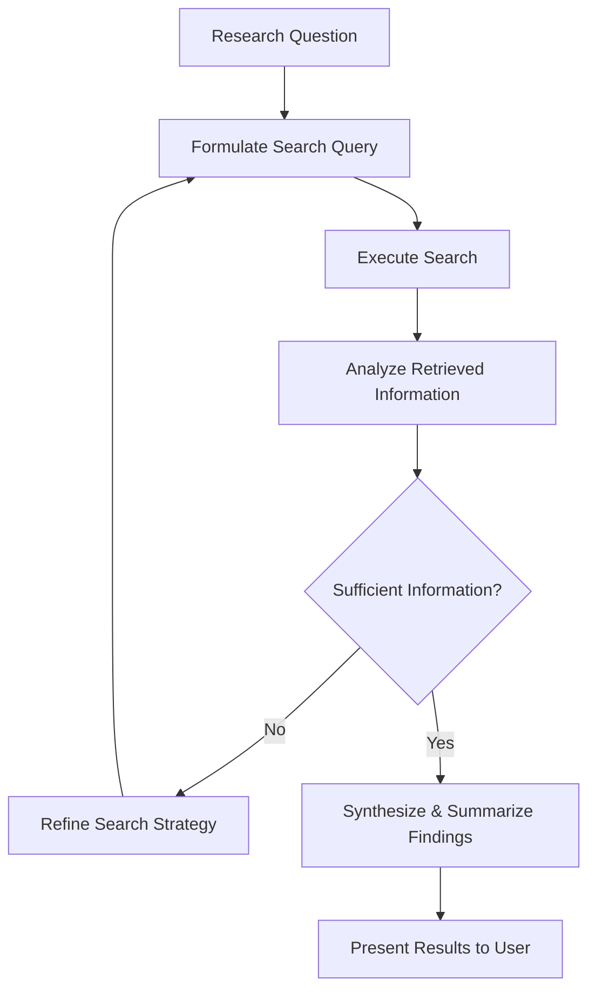

## Problem
Traditional information retrieval involves a user performing searches and then potentially using an AI to summarize the findings. This separation can be inefficient for complex research tasks where the search strategy itself needs to adapt based on intermediate results.

## Solution
Empower the AI agent to drive the entire research process. When given a research question, the agent autonomously:
1.  Formulates search queries (often as tool calls to search engines or databases).
2.  Executes these searches.
3.  Analyzes the retrieved information.
4.  Iteratively refines its search strategy, formulating new queries based on what it has learned.
5.  Continues this cycle until it deems the gathered information sufficient or meets predefined criteria.
6.  Finally, synthesizes and summarizes the findings for the user.

This pattern allows for a more dynamic and intelligent approach to information gathering, where the agent adapts its strategy in real-time.

## Example (flow)

## References
- Described in "How AI Agents Are Reshaping Creation": "That question goes to the agent, the agent formulates the searches in the form of tool calls. So it'll search the Web, it'll search some existing index or what have you, and it'll iterate until it's sort of satisfied with the amount of information that it gets, and then summarizes the output for you."

[Source](https://www.nibzard.com/silent-revolution)