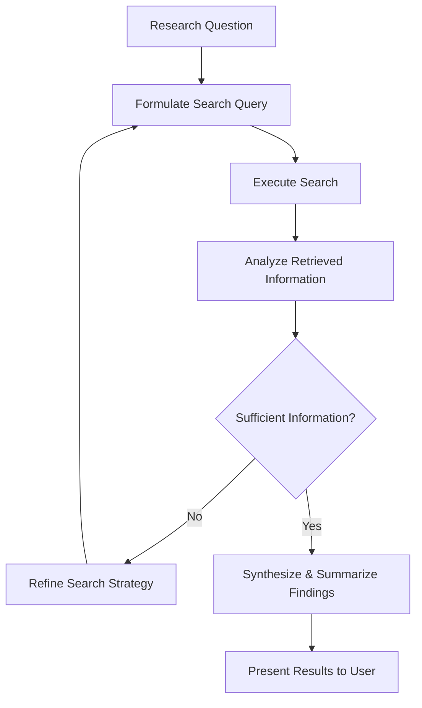

## Problem

Traditional research methods often lack the ability to adapt search strategies based on emerging results, limiting efficiency and potential discoveries. Complex research tasks require multi-round investigation, cross-source synthesis, and dynamic strategy adjustment that static retrieval systems cannot provide.

## Solution

Allow AI agents to independently conduct the entire research process. Given a research question, the agent:

- Creates its own search queries through dynamic planning.
- Executes the searches across multiple sources.
- Examines the data and evaluates quality/relevance.
- Reflects on whether sufficient information has been gathered.
- Adjusts its search strategy based on findings and gaps.
- Repeats until satisfaction criteria are met.
- Synthesizes findings into a comprehensive, well-sourced report.

The key mechanism is a self-reflective iteration loop: after each search cycle, the agent evaluates results against its research goals and autonomously determines the next exploration direction. Production implementations typically combine four subsystems: planning (task decomposition), memory (context + vector store), action (tool orchestration), and reflection (quality evaluation).

A common variant uses parallel multi-agent teams, where different agents simultaneously pursue different research angles and later synthesize findings.

## Example (flow)

```mermaid
flowchart TD
    A[Research Question] --> B[Formulate Search Query]
    B --> C[Execute Search]
    C --> D[Analyze Retrieved Information]
    D --> E{Sufficient Information?}
    E -->|No| F[Refine Search Strategy]
    F --> B
    E -->|Yes| G[Synthesize & Summarize Findings]
    G --> H[Present Results to User]
```

## How to use it

- Use for open-ended research requiring strategy adaptation and multi-source synthesis.
- Use when tasks need explicit control flow between planning, execution, and fallback.
- Define clear termination conditions (satisfaction-based or resource-limited).
- Design for multi-source integration (web, databases, documents).
- Combine with reflection loop for self-correction; with agentic RAG for document retrieval.

## Trade-offs

* **Pros:** Enables autonomous multi-round investigation; adapts strategy based on findings; produces comprehensive, well-sourced outputs; superior for complex analytical tasks.
* **Cons:** Higher token cost (5-10x vs. single-round retrieval); increased latency from multiple LLM calls; planning stability challenges; orchestration complexity adds states to debug.

## References

- "How AI Agents Are Reshaping Creation": "That question goes to the agent, the agent formulates the searches in the form of tool calls. So it'll search the Web, it'll search some existing index or what have you, and it'll iterate until it's sort of satisfied with the amount of information that it gets, and then summarizes the output for you."

- ReAct (Reasoning + Acting): Foundational pattern establishing the Thought → Action → Observation loop; Yao et al., Princeton University & Google Research, ICLR 2023

- "The AI Scientist: Towards Fully Automated Open-Ended Scientific Discovery": Automated research lifecycle from idea generation to manuscript writing; Sakana AI + Oxford + UBC, arXiv:2408.06292, 2024

- "From AI for Science to Agentic Science: A Survey on Autonomous Scientific Discovery": Survey of autonomous research agents and scientific discovery systems; Shanghai AI Lab, arXiv:2508.14111, 2025

- Tongyi DeepResearch: Open-source agent-driven research system with 60% inference cost reduction; Alibaba Tongyi Lab, arXiv:2510.24701, 2025

- Primary source: https://www.youtube.com/watch?v=u85G2aV_5rQ
