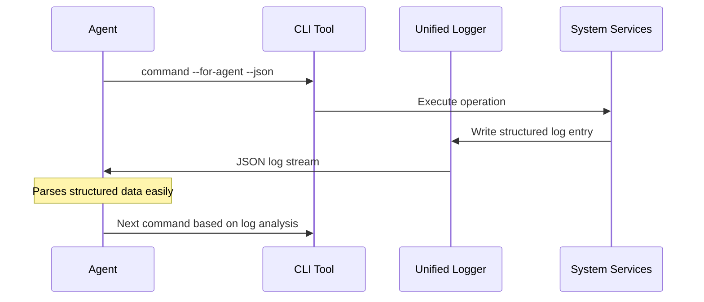

## Problem

Most developer tools, CLIs, and application logs are designed for human consumption. They use color-coded, multi-line, or summarized outputs that are easy for a person to scan but can be difficult for an AI agent to parse reliably. This "human-centric" design creates noise and ambiguity, forcing the agent to waste tokens and effort on interpreting output rather than acting on it.

## Solution

Consciously design and adapt tooling and logging to be "agent-first," prioritizing machine-readability over human ergonomics. The environment should cater to the agent's need for clear, structured, and unambiguous information.

- **Unified Logging:** Instead of multiple log streams (client, server, database), consolidate them into a single, unified log. This gives the agent a single source of truth to monitor.
- **Verbose, Structured Output:** Prefer verbose, structured formats like JSON lines over concise, human-readable text. An agent can parse structured data far more effectively and is not constrained by screen space.
- **Agent-Aware CLIs:** Design new tools or add flags to existing tools (`--for-agent`) that modify their output to be more explicit and less ambiguous for an AI. Assume the agent, not a human, is the primary consumer.

This shift in design philosophy acknowledges that as agents perform more development work, the tools they use must adapt to serve them directly. An agent-friendly environment is a prerequisite for reliable and efficient agent performance.

## Example

## How to use it

1. **Audit Current Tools:** Identify tools that produce human-centric output and either find agent-friendly alternatives or add structured output flags
2. **Implement Unified Logging:** Consolidate multiple log sources into a single, structured stream that agents can monitor
3. **Create Agent-Aware APIs:** When building new tools, prioritize machine-readable output formats and clear, unambiguous responses
4. **Use Structured Formats:** Default to JSON, YAML, or other structured formats instead of free-form text output

## Trade-offs

- **Pros:**
  - Dramatically improves agent parsing accuracy and speed
  - Reduces token waste on output interpretation
  - Enables more reliable automation and decision-making
  - Single source of truth for system state

- **Cons/Considerations:**
  - May sacrifice human readability and debugging convenience
  - Requires investment in tooling modifications
  - Teams need to maintain both human and agent interfaces
  - Learning curve for developers used to human-centric tools

## References

- From Thorsten Ball: "What we've seen people now do is well instead of having the client log and having the browser log and having the database log, let's have one unified log because then it's easier for the agent to just look at this log... You can just have like JSON line outputs and whatnot because the agent can understand it much better than a human can... This is not made for human consumption anymore. How can we optimize this for a genetic consumption?"